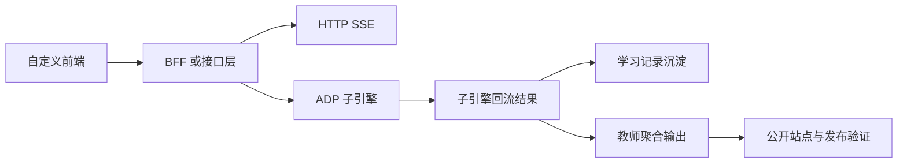

# P2 外部接入与产品后端架构设计

> 文档层级：子引擎层实施附录  
> 文档目的：说明 `P2` 作为一期并行工作线之一，如何把平台与子引擎安全接进真实前端/后端，并形成联调与发布闭环  
> 核心结论：`P2` 的目标不是重造平台，而是沿 `工作流联调 + 变量透传 + 检索绑定 + 产品接入 + 发布收口` 这条主线完成产品化准备与公开交付  
> 目标读者：技术负责人、接入实施者、联调负责人  
> 上游真源：[AI教师子引擎-技术方案.md](../AI教师子引擎-技术方案.md)、[AI主导学习平台-统一对象与接口契约.md](../../平台层/AI主导学习平台-统一对象与接口契约.md)、[AI教师子引擎-Agent工作流联调与验收手册.md](../AI教师子引擎-Agent工作流联调与验收手册.md)  
> 下游引用：部署脚本、回归样例、站点发布  
> 适用范围：`P2` 实施附录

## 1. 本工作线解决什么

`P2` 解决 3 件事：

1. 把平台和子引擎接进自己的前端或系统
2. 用产品后端 / `BFF` 或接口层承接密钥托管、上下文字段透传与请求代理
3. 把联调结果、发布链路和学习结果沉淀为后续可追踪、可复用的数据

当前主线能力：

- `HTTP SSE`
- 产品后端 / `BFF`
- 自定义前端
- 学习记录沉淀
- 工作流联调与发布收口

## 2. 在一期里，`P2` 的定位是什么

`P2` 是一期同步预埋并完成联调的工作流接入与产品化能力。

这一轮最重要的不是做出一个很重的后端，而是：

- 让 Agent 工作流有稳定变量接口
- 让知识库标签能绑定到检索
- 让发布链路跑通
- 让最终成果能从 GitHub 仓库公开访问

## 3. 本工作线不解决什么

- 不替代 ADP 内部 Agent 编排
- 不把后端做成一套独立 AI 平台
- 不把 `Redis / MQ / 微服务拆分` 强行写成 v1 依赖
- 不要求一轮内把所有业务后台都做完

## 4. 进入条件

- `P0` 学生主闭环稳定
- `P1` 的学生结果展示和教师运营摘要已有明确结构
- 已明确需要自定义前端或产品化接入，而不只是官方分享链接演示

## 5. 退出条件

- 可通过 `HTTP SSE` 或等效方式接入子引擎流式结果
- `AppKey` 由后端托管或发布链路安全隔离
- `visitor_biz_id` 与 `custom_variables` 能稳定透传
- 工作流、首页、仓库和 GitHub Pages 的发布收口一致

## 6. 与其他工作线的交接关系

### 6.1 依赖 `P0 / P1` 的什么

- `P0` 提供稳定主链路和结构化回流
- `P1` 提供学生展示对象和教师摘要结构

### 6.2 向最终交付输出什么

- 可复用的工作流变量约定
- 检索绑定规则
- 回归样例
- `master` 与 GitHub Pages 的公开发布结果

## 7. 主链路

## 8. 关键字段与接口

`P2` 至少要稳定承接：

- `AppKey`
- `visitor_biz_id`
- `custom_variables`
- `course_id`
- `module_id`
- `chapter_id`
- `role`
- `foundation_level`

一句人话：

> `P2` 最重要的不是“接上了没有”，而是“接上以后还是不是同一个学生、同一条学习链、同一份可沉淀结果”。

## 9. 本工作线的验收重点

- 路由变量与检索变量能透传
- 工作流回归样例能复跑
- 发布脚本能在 `master` 上成功执行
- GitHub Pages 对外地址可访问且首页入口正确

## 读完后你应该带走什么

- `P2` 在这一轮里不仅是“以后可接入”，而是必须同步完成联调和发布收口。
- `BFF`、`HTTP SSE`、检索绑定、回归样例和 GitHub Pages 验证需要一起看。
- `P2` 追求的是安全接入、连续沉淀和公开可交付，不是架构炫技。
