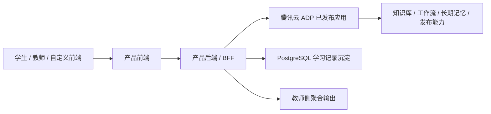
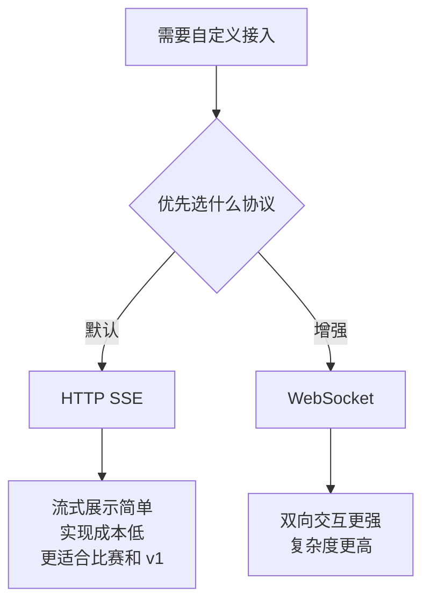
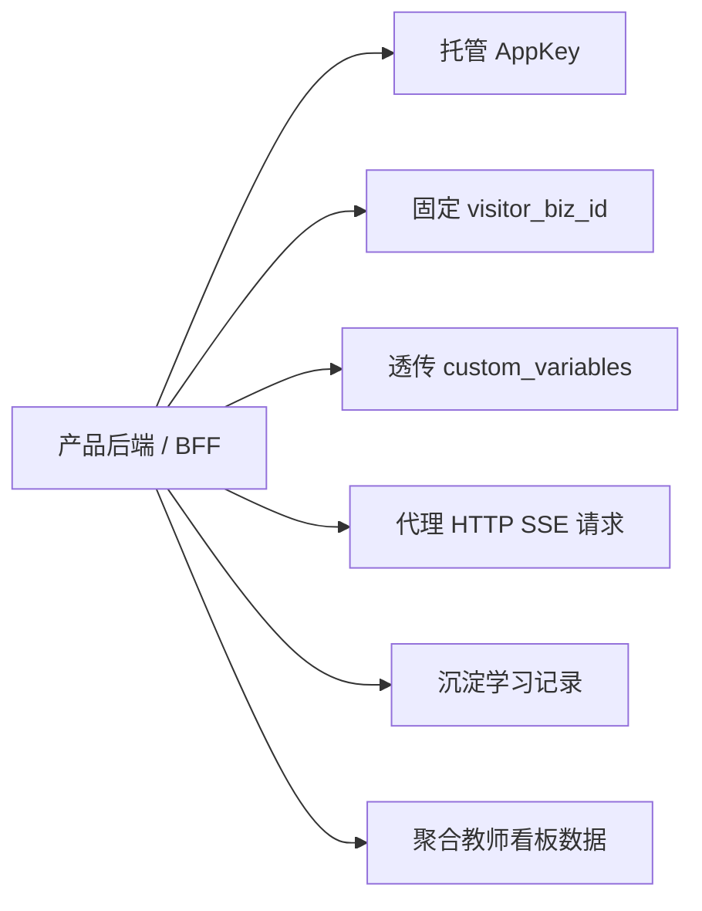
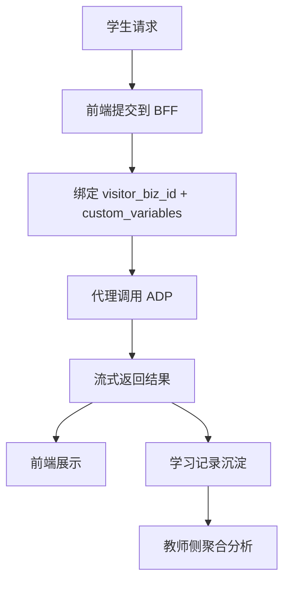
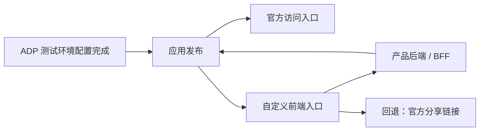

# P2 外部接入与产品后端架构设计

> 文档层级：子引擎层实施附录  
> 文档目的：补充说明 `P2` 阶段如何做产品化接入与后端代理  
> 目标读者：技术负责人、接入实施者  
> 上游真源：[AI教师子引擎-技术方案.md](../AI教师子引擎-技术方案.md)  
> 下游引用：无  
> 适用范围：`P2` 实施附录  
> 主线能力：`HTTP SSE 默认接入 + 产品后端/BFF + 学习记录沉淀 + 发布接入代理`

## 与其他文档的边界

本文是 `P2` 实施附录，只说明产品化接入增强。  
本文不重定义平台层边界，也不代替平台总体架构。

---

## 目录

1. 一页结论
2. P2 目标与进入条件
3. P2 产品化接入总图
4. 默认协议选择图
5. 产品后端职责图
6. 会话与数据沉淀图
7. 发布与访问链路图
8. 非目标与边界
9. 字段对照与接口约定
10. 验收与演示建议
11. 官方依据

---

## 1. 一页结论

`P2` 只回答一个问题：

`当你不满足于官方发布链接时，怎么把 AI 教师安全地接进自己的前端或系统。`

这一阶段的主结论是：

- 自定义接入默认协议选 `HTTP SSE`。
- 增加一个“产品后端/BFF”，但它的职责是接入和产品化，不是再造智能体平台。
- 业务库统一使用 `PostgreSQL`。
- `AppKey` 由后端托管，不直接暴露在前端。
- `visitor_biz_id` 和 `custom_variables` 由后端固定和透传。
- `pgvector` 只作 `P2` 可选增强，不进 `P0/P1` 主链路。

---

## 2. P2 目标与进入条件

### 2.1 P2 要达成什么

- 让作品可以接到你自己的前端页面、系统或展示端。
- 给系统增加稳定的上下文绑定和学习记录沉淀能力。
- 给教师侧聚合和后续产品化留下清晰接口层。

### 2.2 P2 的进入条件

- `P0` 主闭环稳定可发布。
- `P1` 的可视化和教师运营能力已有明确输出结构。
- 已明确需要自定义前端或系统接入，而不只是比赛演示。

### 2.3 P2 不做什么

- 不替代 ADP 的 Agent 编排和知识库能力。
- 不把后端做成一套独立 AI 平台。
- 不把 `Redis / MQ / 微服务拆分` 强行写成第一版依赖。

---

## 3. P2 产品化接入总图（图 1）

这张图想说明什么：

- P2 新增的不是“另一个主系统”，而是一层 `BFF`。
- 智能体核心仍然在 ADP 内。
- 前端、沉淀、教师聚合都通过产品后端与 ADP 对接。

---

## 4. 默认协议选择图（图 2）

这张图想说明什么：

- P2 的默认接入不是两条路平行开，而是有默认优先级。
- `HTTP SSE` 更适合第一版产品化接入。
- `WebSocket` 可以留给更强实时交互场景，但不作为 v1 前置。

---

## 5. 产品后端职责图（图 3）

这张图想说明什么：

- 后端的职责是“接入、保护、沉淀、聚合”。
- 这层后端不负责重写智能体逻辑，不负责替代 Agent 编排。
- 只要把这些职责做稳，P2 就已经有很强的产品化说服力。

### 5.1 产品后端固定职责表

| 职责 | 说明 |
| --- | --- |
| `AppKey` 托管 | 不把调用密钥暴露在前端 |
| `visitor_biz_id` 固定 | 保证同一学生连续命中长期记忆 |
| `custom_variables` 透传 | 保证课程、班级、章节、角色边界 |
| `HTTP SSE` 代理 | 给自定义前端提供流式回复 |
| 学习记录沉淀 | 基于 `PostgreSQL` 记录诊断、评分、错因、计划等结果 |
| 教师看板聚合 | 为教师侧页面提供聚合输出 |

---

## 6. 会话与数据沉淀图（图 4）

这张图想说明什么：

- P2 最大的价值之一是把“请求时上下文”固定下来。
- 另一个价值是让一次对话结果不只停留在当前页面，而是能沉淀为后续可用的数据。
- 教师看板和后续运营能力就是建立在这些沉淀数据之上。

### 6.1 PostgreSQL 与 pgvector

| 能力 | 定位 |
| --- | --- |
| `PostgreSQL` | `P2` 默认业务库，承接学习记录、运营数据、教师聚合数据 |
| `pgvector` | `P2` 可选增强，用于自建语义检索/相似案例召回，不进入当前主链路 |

---

## 7. 发布与访问链路图（图 5）

这张图想说明什么：

- 即使做了自定义前端，官方入口依然应该保留。
- 这样比赛时就同时拥有“产品化入口”和“官方入口”。
- 自定义前端如果出问题，可以立刻回退到官方分享链接。

---

## 8. 非目标与边界

### 8.1 v1 明确不做的事

| 项 | 处理方式 |
| --- | --- |
| `Redis` | 不作为 v1 前置 |
| `MQ` | 不作为 v1 前置 |
| 微服务拆分 | 不作为 v1 前置 |
| 自建知识库系统 | 不做，继续用 ADP |
| 自建工作流编排系统 | 不做，继续用 ADP |

### 8.2 为什么不做这些

- 因为它们会明显增加实现复杂度。
- 它们对比赛第一版的加分，不如稳定接入、会话连续和数据沉淀来得直接。
- P2 的正确目标是“安全接入 + 轻量产品化”，不是“架构炫技”。

---

## 9. 字段对照与接口约定

### 9.1 正文统一使用的字段

| 字段 | 说明 |
| --- | --- |
| `AppKey` | 应用调用密钥 |
| `visitor_biz_id` | 终端用户唯一 ID |
| `custom_variables` | 课程边界与角色边界参数 |
| `course_id` | 课程 ID |
| `class_id` | 班级 ID |
| `chapter_id` | 章节 ID |
| `role` | 学生 / 教师角色 |

### 9.2 与新版 V2 字段的对照

| 正文写法 | V2 常见写法 | 说明 |
| --- | --- | --- |
| `AppKey` | `AppKey` | 直接一致 |
| `visitor_biz_id` | `VisitorId` | 都是在说终端用户唯一 ID |
| `custom_variables` | `CustomVariables` | 都是在传课程和角色边界 |

---

## 10. 验收与演示建议

### 10.1 P2 验收表

| 项 | 通过标准 |
| --- | --- |
| 自定义前端接入 | 可通过产品前端访问 AI 教师能力 |
| 后端代理 | 能安全托管 `AppKey` 并代理 `HTTP SSE` |
| 会话绑定 | 能固定 `visitor_biz_id` 并保持上下文连续 |
| 参数透传 | 能透传 `course_id/class_id/chapter_id/role` |
| 学习记录沉淀 | 能基于 `PostgreSQL` 把关键学习结果存下来供后续聚合 |
| 回退能力 | 自定义前端故障时可退回官方入口 |

### 10.2 P2 对应 FR 范围

| 范围 | 对应内容 |
| --- | --- |
| `FR-12` | 发布接入、自定义接入、产品化增强 |

### 10.3 P2 演示建议

- 演示时优先展示“自定义前端 + 后端透传 + 连续记忆”。
- 如果时间允许，再展示“学习记录沉淀 -> 教师侧聚合”。
- 现场一定保留官方分享链接作为回退路径。

---

## 11. 官方依据

- 《应用发布概述》  
  https://cloud.tencent.com/document/product/1759/104209
- 《对话接口总体概述》  
  https://cloud.tencent.com/document/product/1759/109380
- 《对话端接口文档（HTTP SSE）》  
  https://cloud.tencent.com/document/product/1759/105561
- 《对话端接口文档V2（HTTP SSE）》  
  https://cloud.tencent.com/document/product/1759/129202
- 《长期记忆说明》  
  https://cloud.tencent.com/document/product/1759/122458
- 《知识检索相关设置》  
  https://cloud.tencent.com/document/product/1759/112704
