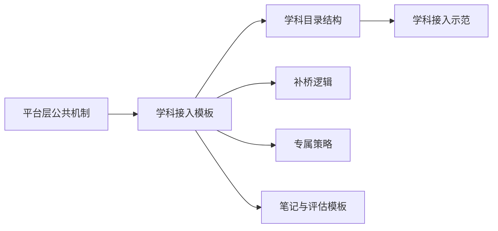
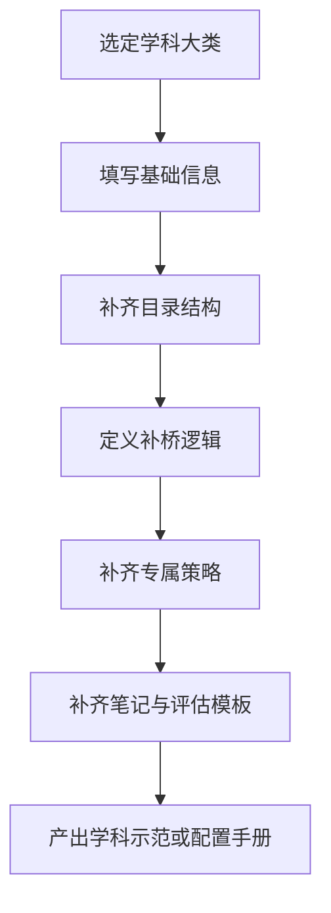

# 学科接入模板

> 文档层级：学科层  
> 文档目的：提供新增学科时可直接复用的最小模板，并把“学科接入模板”正式固定为平台统一对象  
> 核心结论：新增学科时不应该重写平台机制，只需要按统一模板补齐学科目录、补桥逻辑、专属策略和模板资产  
> 目标读者：学科设计者、产品协作者、后续扩科实施者  
> 上游文档：[AI主导学习平台-学科大类与接入规范.md](../平台层/AI主导学习平台-学科大类与接入规范.md)、[AI主导学习平台-学习生命周期与编排策略.md](../平台层/AI主导学习平台-学习生命周期与编排策略.md)  
> 下游文档：未来新增学科示范文档  
> 适用范围：所有拟接入 `AI主导学习平台` 的学科  

## 与其他文档的边界

本文只提供模板，不提供某一学科的实际内容。  
高等数学的真实填写示例见：[高等数学-平台接入示范.md](./高等数学-平台接入示范.md)。  

## 一句话先记住

> 新学科接入平台，不是再造一套产品，而是按统一模板把“这门课该补什么”填进去。  

## 1. 什么叫“学科接入模板”

一句人话

> 学科接入模板就是“新学科进入平台时必须交的最小合同”。  

它至少要讲清楚 4 件事：

1. 这门课属于哪个学科大类
2. 这门课的目录结构长什么样
3. 这门课的补桥逻辑是什么
4. 这门课要用什么专属策略、笔记模板和评估口径

### 图 1：学科接入模板在平台里的位置

## 2. 使用方式

新增学科时，只需要复制本模板并补全字段。  
原则是：不改平台总纲，不改平台主结构，只补本学科资产。  

## 3. 模板字段

### 3.1 基础信息

| 中文字段 | 填写说明 |
| --- | --- |
| 学科名称 | 例如：大学英语 / 数据结构 / 概率统计 |
| 学科大类 | `数学 / 语言 / 计算机/专业技能 / 考试/证书` |
| 学科定位 | 入门课 / 主线课 / 训练课 / 考证课 |
| 目标人群 | 至少写 2 类真实人群 |
| 第一阶段目标 | 第一阶段想先跑通什么学习结果 |

### 3.2 目录结构

统一按下面结构填写：

`学科大类 -> 学科 -> 阶段 -> 模块 -> 课节 -> 状态`

| 层级 | 填写说明 |
| --- | --- |
| 阶段 | 补桥阶段 / 主线阶段 / 综合训练阶段 |
| 模块 | 该阶段下的主题模块 |
| 课节 | 学生实际完成的最小学习单元 |
| 状态 | 未开始 / 进行中 / 待复习 / 已掌握 / 需回补 |

### 3.3 补桥逻辑

至少回答 3 个问题：

1. 学生通常在哪些前置能力上卡住
2. 什么时候允许继续前进
3. 没达标时回补到哪个节点

### 3.4 专属策略

| 中文字段 | 填写说明 |
| --- | --- |
| 教学资源偏好 | 文本、图像、音频、代码、题库等 |
| 讲解风格 | 定义拆解、案例驱动、任务驱动等 |
| 练习方式 | 单点题、变式题、任务题、口语练习等 |
| 评估方式 | 正误、步骤、表达、项目完成度等 |

### 图 2：学科接入填写流程

## 4. 笔记与评估模板

### 4.1 课节笔记

建议至少包含：

- 学科
- 阶段
- 模块
- 课节
- 本节核心概念
- 人话解释
- 关键示例
- 易错点
- 学生本节卡点
- 复习建议
- 下一步衔接

### 4.2 个人总复习本

建议至少包含：

- 学科目录索引
- 已学章节摘要
- 高频错因
- 待复习清单
- 已掌握清单
- 下一阶段目标

## 5. 与平台对象的对齐

本模板至少要和下面 3 个平台对象对齐：

- `当前任务卡`
- `子引擎回流结果`
- `学习会话`

换句话说，学科模板不是独立存在的，它必须能接住平台下发的任务，也必须能接住子引擎回流的结果。

## 读完后你应该带走什么

- 学科接入模板是扩科的统一入口，不是可选附件。
- 新学科要补的是学科资产，不是平台机制。
- 模板必须和当前任务卡、学习会话、子引擎回流结果保持兼容。

## 下一篇建议阅读

1. [高等数学-平台接入示范.md](./高等数学-平台接入示范.md)
2. [AI主导学习平台-学科大类与接入规范.md](../平台层/AI主导学习平台-学科大类与接入规范.md)
3. [AI主导学习平台-学习生命周期与编排策略.md](../平台层/AI主导学习平台-学习生命周期与编排策略.md)

## 本文不负责什么

- 不替平台决定类别结构
- 不替子引擎定义教学闭环
- 不提供某一学科的真实内容
- 不代替配置手册
