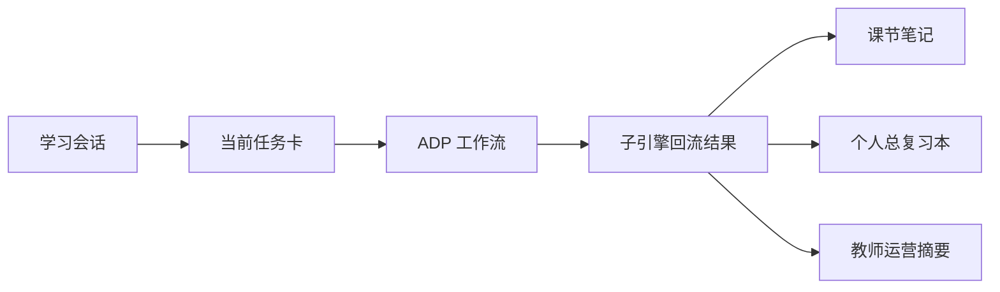

# 高等数学-ADP配置手册

> 文档层级：学科层  
> 文档目的：把高等数学示范学科需要的 ADP 配置收敛成一份实现手册  
> 核心结论：这份手册的重点不是“模型怎么配更炫”，而是“平台对象怎样稳定进入 ADP，ADP 结果怎样稳定回到平台、教师主线和接入主线”  
> 目标读者：配置实施者、技术协作者、演示准备者  
> 上游真源：[高等数学-平台接入示范.md](./高等数学-平台接入示范.md)、[AI教师智能体群引擎-技术方案.md](../子引擎层/AI教师智能体群引擎-技术方案.md)、[AI主导学习平台-统一对象与接口契约.md](../平台层/AI主导学习平台-统一对象与接口契约.md)  
> 下游引用：[01-P0-Multi-Agent学生主闭环-架构设计.md](../子引擎层/实施附录/01-P0-Multi-Agent学生主闭环-架构设计.md)  
> 适用范围：腾讯云 ADP 下的高等数学示范学科配置

## 与其他文档的边界

本文只定义高等数学在 ADP 中怎么配置。  
对象字段正式定义、阶段路线和平台角色分工不在本文重新定义。

## 一句话先记住

> ADP 配置不是从空白对话开始干活，而是承接平台已经装配好的学习对象与接入字段，再把结果沿统一对象链吐回去。

## 1. 一页结论

高等数学 ADP 配置固定围绕下面这条主链：

`学习会话 -> 当前任务卡 -> ADP 工作流 -> 子引擎回流结果 -> 课节笔记 / 个人总复习本 / 教师运营摘要`

当前固定口径：

- 学科大类：`数学`
- 学科：`高等数学`
- 实现主线：`ADP 应用开发 + Multi-Agent + 工作流编排`
- 访问方式：`官方发布链接` 或后续 `HTTP SSE` 接入

## 2. 应用级配置

| 配置项 | 建议值 |
| --- | --- |
| 应用名称 | `AI主导学习平台-高等数学示范` |
| 应用简介 | `数学大类下的高等数学示范学科，用于演示学生主线、教师主线与扩科主线` |
| 模式 | `Multi-Agent` |
| 协同方式 | `工作流编排` |
| 面向对象 | 学生主用，教师侧辅助 |

## 3. Agent 绑定建议

| Agent | 作用 | 推荐模型 |
| --- | --- | --- |
| `TeacherOrchestrator` | 调度与收口 | `Tencent HY 2.0 Think` |
| `DiagnosisAgent` | 判断层级、卡点、回补建议 | `DeepSeek-R1-0528` |
| `ExplanationAgent` | 中文讲解、图像化解释、步骤拆解 | `Tencent HY 2.0 Instruct` |
| `PracticeEvalAgent` | 出题、判题、达标判断 | `DeepSeek-V3.2` |
| `ReviewPlanAgent` | 错因归因、课节复盘、计划生成 | `DeepSeek-R1-0528` |
| `TeacherOpsAgent` | 高等数学班级趋势与风险分析 | `DeepSeek-R1-0528` |

## 4. 字段传递主线

### 图 1：对象与工作流主链

### 4.1 ADP 里要承接哪些对象

| 平台对象 | ADP 里对应的字段或环节 | 用途 |
| --- | --- | --- |
| 学习会话 | `sessionId`、当前阶段、历史摘要 | 锁定本轮上下文 |
| 当前任务卡 | `taskCardId`、当前目标、完成标准、回补条件 | 锁定本轮任务 |
| 子引擎回流结果 | `mastery`、`nextAction`、`notesDelta`、`riskFlag` | 回流平台推进、笔记和教师主线 |

## 5. 接入字段怎么进入配置链

### 5.1 固定意义

| 字段 | 在高数配置里的意义 |
| --- | --- |
| `visitor_biz_id` | 固定同一学生在高数中的连续学习身份 |
| `custom_variables` | 透传课程、班级、接入来源等业务上下文 |
| `AppKey` | 后端托管的调用能力，不在前端裸露 |
| `chapter_id` | 当前高数章节或课节边界 |
| `role` | 当前是学生视角还是教师视角 |

### 5.2 为什么这些字段必须进入正式配置链

- `visitor_biz_id` 解决“是不是同一个学生”
- `custom_variables` 解决“是不是同一门课、同一个班、同一个接入场景”
- `AppKey` 解决“能力怎样安全暴露”
- `chapter_id` 解决“检索和讲解是否锁在正确章节”
- `role` 解决“学生主线和教师主线用哪套视角”

## 6. 检索与资源边界

| 项 | 建议 |
| --- | --- |
| 知识源 | 教材、课堂讲义、课程 PPT、题库、典型错题、示意图资源 |
| 检索边界 | `subject_category=数学`、`course_id=高等数学`、`chapter_id`、`role` |
| 资源偏好 | 函数图像、极限图示、步骤化例题 |
| 课程隔离 | 高等数学知识不与其他课程混检索 |

## 7. 配置提醒

- 高数配置必须同时承接学生主线和教师主线
- `TeacherOpsAgent` 仅做教师侧增强，不阻塞学生主链路
- `HTTP SSE`、`AppKey`、`custom_variables`、`visitor_biz_id` 都应写入正式配置链说明，而不是藏在附注里

## 读完后你应该带走什么

- 高等数学 ADP 配置必须围绕平台对象传递，不是独立配置孤岛。
- `学习会话 -> 当前任务卡 -> ADP 工作流 -> 子引擎回流结果 -> 课节笔记 / 个人总复习本 / 教师运营摘要` 是最关键的配置主线。
- 接入字段现在是正式配置链的一部分，不是实现细枝末节。

## 下一篇建议阅读

1. [高等数学-平台接入示范.md](./高等数学-平台接入示范.md)
2. [../子引擎层/AI教师智能体群引擎-技术方案.md](../子引擎层/AI教师智能体群引擎-技术方案.md)
3. [../平台层/AI主导学习平台-统一对象与接口契约.md](../平台层/AI主导学习平台-统一对象与接口契约.md)

## 本文不负责什么

- 不定义平台总结构
- 不定义对象字段本体
- 不代替高等数学示范文档本身
- 不代替比赛答辩稿

