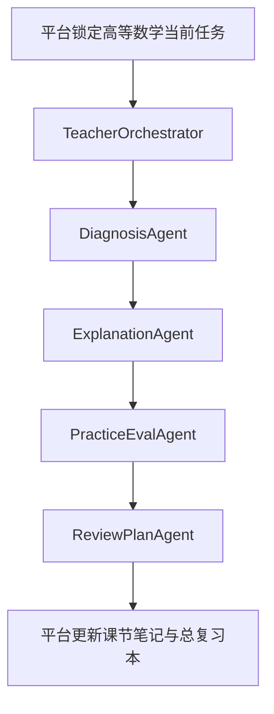

# 高等数学-ADP配置手册

> 文档层级：学科层  
> 文档目的：把高等数学示范学科需要的 ADP 配置收敛成一份实现手册  
> 核心结论：这份手册不是平台默认配置，而是把“高等数学如何把平台字段和子引擎工作流落到 ADP”讲清楚  
> 目标读者：配置实施者、技术协作者、演示准备者  
> 上游真源：[高等数学-平台接入示范.md](./高等数学-平台接入示范.md)、[AI教师子引擎-技术方案.md](../子引擎层/AI教师子引擎-技术方案.md)  
> 下游引用：[01-P0-Multi-Agent学生主闭环-架构设计.md](../子引擎层/实施附录/01-P0-Multi-Agent学生主闭环-架构设计.md)  
> 适用范围：腾讯云 ADP 下的高等数学示范学科配置

## 与其他文档的边界

本文只定义高等数学这门示范学科在 ADP 中怎么配置。  
本文不代表平台默认配置，也不替代平台总纲或子引擎技术方案。

## 一句话先记住

> 配置手册要解决的不是“模型怎么配得更炫”，而是“平台任务上下文怎样稳定传到 ADP，ADP 结果怎样稳定回到平台”。

## 1. 一页结论

这份手册只做一件事：

> 把“高等数学作为第一门示范学科”的配置项整理成可以直接落到 ADP 的学科手册。

当前固定口径：

- 学科大类：`数学`
- 学科：`高等数学`
- 实现主线：`ADP 应用开发 + Multi-Agent + 工作流编排`
- 访问方式：`官方发布链接` 或后续 `HTTP SSE` 接入
- 知识主线：高等数学教材、讲义、PPT、题库、典型错题

## 2. 应用级配置

| 配置项 | 建议值 |
| --- | --- |
| 应用名称 | `AI主导学习平台-高等数学示范` |
| 应用简介 | `数学大类下的高等数学示范学科，用于演示诊断-讲解-练习-测评-复盘闭环` |
| 模式 | `Multi-Agent` |
| 协同方式 | `工作流编排` |
| 面向对象 | 学生主用，教师侧辅助 |
| 默认输出风格 | 教师式、分层、步骤清晰、避免空泛鼓励 |

## 3. Agent 绑定建议

| Agent | 作用 | 推荐模型 |
| --- | --- | --- |
| `TeacherOrchestrator` | 调度与收口 | `Tencent HY 2.0 Think` |
| `DiagnosisAgent` | 判断层级、卡点、回补建议 | `DeepSeek-R1-0528` |
| `ExplanationAgent` | 中文讲解、图像化解释、步骤拆解 | `Tencent HY 2.0 Instruct` |
| `PracticeEvalAgent` | 出题、判题、达标判断 | `DeepSeek-V3.2` |
| `ReviewPlanAgent` | 错因归因、课节复盘、计划生成 | `DeepSeek-R1-0528` |
| `TeacherOpsAgent` | 高等数学班级趋势与风险分析 | `DeepSeek-R1-0528` |

## 4. 知识库与检索边界

| 项 | 建议 |
| --- | --- |
| 知识源 | 教材、课堂讲义、课程 PPT、题库、典型错题、示意图资源 |
| 检索边界 | `subject_category=数学`、`course_id=高等数学`、`chapter_id`、`role` |
| 资源偏好 | 优先包含函数图像、极限图示、步骤化例题 |
| 课程隔离 | 高等数学知识不与其他课程混检索 |

## 5. 工作流建议

关键点：

- 当前任务来自平台，不来自自由聊天
- 复盘结果要能回流到平台双层笔记
- `TeacherOpsAgent` 仅做教师侧增强，不阻塞学生主链路

### 5.1 字段传递主线

### 5.2 轻量路由与启动装配在 ADP 里的落点

一句人话

> ADP 不是从空白对话开始干活，而是承接平台已经装配好的上下文，再把结果按统一对象吐回去。  

`轻量路由与启动装配` 的正式定义见 [../平台层/AI主导学习平台-学习生命周期与编排策略.md](../平台层/AI主导学习平台-学习生命周期与编排策略.md)。  
本文只解释这些上游对象怎样进入 ADP 工作流。

| 平台动作项 | ADP 里对应的字段或环节 | 输出去向 |
| --- | --- | --- |
| 锁定学习会话 | `sessionId`、`studentProfile`、当前阶段 | 让工作流知道学生现在在哪条学习链路上 |
| 下发当前任务卡 | `taskCardId`、当前目标、完成标准、回补条件 | 让 TeacherOrchestrator 知道本轮到底要完成什么 |
| 推进日志续接 | 最近 1-2 轮 `推进日志`、课节摘要、待复习清单 | 让子引擎延续上轮状态，而不是每轮重新猜 |
| 生成下一步动作 | `nextAction`、是否回补、下一课节 | 回流给平台，用于更新目录树和任务推进 |
| 教师运营入口提示 | `teacherOpsHint`、风险标签、建议干预点 | 回流教师侧，不堵塞学生主链路 |

这也是为什么 ADP 配置手册里要显式承接这些中文字段：

- `学习会话编号`
- `当前任务卡编号`
- `下一步动作`
- `推进日志`
- `教师运营入口`

## 6. 高等数学专属配置提醒

- 图像资源要尽量中文化，便于答辩展示和学生理解
- 补桥模块优先准备“字母感、坐标感、图像感”
- 主线模块先以“函数与图像、极限与连续、导数、积分”为主
- 演示时优先展示“目录 -> 任务卡 -> 一轮闭环 -> 双层笔记”

## 读完后你应该带走什么

- 高等数学的 ADP 配置必须围绕平台对象传递，不是独立配置孤岛。
- `学习会话 -> 当前任务卡 -> ADP 工作流 -> 子引擎回流结果` 是最关键的配置主线。
- 图像资源和字段说明越中文化，现场展示越稳。

## 下一篇建议阅读

1. [高等数学-平台接入示范.md](./高等数学-平台接入示范.md)
2. [../子引擎层/AI教师子引擎-技术方案.md](../子引擎层/AI教师子引擎-技术方案.md)
3. [../子引擎层/实施附录/01-P0-Multi-Agent学生主闭环-架构设计.md](../子引擎层/实施附录/01-P0-Multi-Agent学生主闭环-架构设计.md)

## 7. 本文不负责什么

- 不定义平台总结构
- 不定义 AI教师子引擎通用策略
- 不代替高等数学示范文档本身
- 不代替比赛答辩稿
