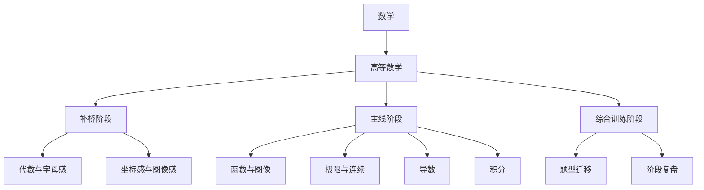

# 高等数学-平台接入示范

> 文档层级：学科层  
> 文档目的：展示高等数学如何作为第一门完整示范学科承接平台主线  
> 核心结论：高等数学的价值不是替平台定义全部内容，而是同时证明学生主线、教师主线、学科接入与扩科主线都能在一门真实学科中跑通  
> 目标读者：产品负责人、配置协作者、研发协作者、答辩准备者  
> 上游真源：[AI主导学习平台-角色主线与阶段地图.md](../平台层/AI主导学习平台-角色主线与阶段地图.md)、[AI主导学习平台-统一对象与接口契约.md](../平台层/AI主导学习平台-统一对象与接口契约.md)、[AI主导学习平台-学科大类与接入规范.md](../平台层/AI主导学习平台-学科大类与接入规范.md)  
> 下游引用：[高等数学-知识库接入与落库方案.md](./高等数学-知识库接入与落库方案.md)、[高等数学-ADP配置手册.md](./高等数学-ADP配置手册.md)  
> 适用范围：`数学 -> 高等数学` 的平台接入示范

## 与其他文档的边界

本文只说明高等数学如何接进平台并承接平台主线。  
平台正式角色、对象字段和扩科边界不在本文重新定义。

## 一句话先记住

> 高等数学不是平台角色入口，但它必须同时把学生学习主线、教师运营主线、学科接入与扩科主线演出来。

## 1. 一页结论

高等数学当前固定定义为：

> `数学` 学科大类下的第一门完整示范学科。

这份示范要同时证明：

- 学生主线能从目录、任务卡到双层笔记真实跑通
- 教师主线能接住高数学习中的风险、停滞与干预建议
- 学科接入模板和扩科主线不是空话，能在真实学科中落位

## 2. 高等数学如何承接 3 条主线

| 平台主线 | 高等数学怎么承接 |
| --- | --- |
| 学生学习主线 | 用补桥阶段、主线阶段、综合训练阶段组织学生推进 |
| 教师运营主线 | 用高频错因、停滞点、风险学生和干预建议承接教师摘要 |
| 学科接入与扩科主线 | 用学科接入模板、图像资源、补桥逻辑和示范章节证明扩科方式 |

## 3. 学科接入接口

| 接口项 | 高等数学当前定义 |
| --- | --- |
| 学科大类 | `数学` |
| 学科定位 | 平台第一门完整示范学科 |
| 目标人群 | 大一高等数学入门学生、基础薄弱自学者、专升本数学备考学生 |
| 目录结构 | 补桥阶段 / 主线阶段 / 综合训练阶段 |
| 补桥逻辑 | 当符号感、图像感、极限直觉不足时优先回补 |
| 专属策略 | 图像化讲解、步骤拆解、概念补桥、数形结合 |
| 教师运营重点 | 风险学生、高频错因、停滞阶段、干预建议 |

## 4. 学生主线示范

### 4.1 学习目录

### 4.2 当前任务卡示范

| 字段 | 内容示例 |
| --- | --- |
| 当前目标 | 建立“函数是输入输出规则”的最小理解 |
| 安排原因 | 当前图像感不足，若不先补这一层，后续极限和导数会持续卡住 |
| 完成标准 | 能解释函数图像表示什么，并完成 1-2 道基础题 |
| 回补条件 | 仍分不清自变量、因变量或图像含义时回到“坐标感与图像感” |
| 下一步衔接 | 进入“函数与图像”的图像判读与简单变式 |

## 5. 教师主线示范

高等数学教师主线固定要能承接：

- 哪些学生长期卡在图像感和符号感
- 哪些学生在极限、导数等关键阶段停滞
- 哪些错因属于群体共性问题
- 教师应优先做什么干预

### 图 1：教师主线在高数中的位置

## 6. 对象主链示范

高等数学示范必须沿下面这条对象链工作：

`学习会话 -> 当前任务卡 -> 子引擎回流结果 -> 课节笔记 -> 个人总复习本 -> 教师运营摘要`

### 6.1 课节笔记示范

| 字段 | 示例 |
| --- | --- |
| 学科 | 高等数学 |
| 模块 | 函数与图像 |
| 课节 | 函数的基本直觉 |
| 本节核心概念 | 函数是输入与输出之间的规则 |
| 人话解释 | 给一个数，就按固定规则得到另一个数 |
| 易错点 | 把图像当作“算式装饰”，而不是规则表达 |
| 学生本节卡点 | 变量意义不清、图像坐标感不足 |
| 复习建议 | 回看图像与坐标的对应关系，再做 2 道基础判读题 |

### 6.2 个人总复习本增量

- 已学章节摘要：函数与图像基本直觉
- 高频错因：图像感不足、变量意义不清
- 待复习清单：函数图像判读、坐标与函数关系
- 下一阶段目标：进入极限与连续前先稳定图像直觉

## 7. 为什么它是扩科样板

高等数学之所以适合作为第一门示范学科，是因为它既能展示：

- 学生主线里的补桥与推进
- 教师主线里的风险和干预
- 学科接入主线里的模板化接入与资产复用

它不是因为“高数最能代表平台全部”，而是因为“高数最适合第一轮把平台主线演完整”。

## 读完后你应该带走什么

- 高等数学是第一门完整示范学科，不是平台本体。
- 它必须同时承接学生主线、教师主线和扩科主线。
- 高数的意义在于验证平台，而不是替代平台。

## 下一篇建议阅读

1. [高等数学-知识库接入与落库方案.md](./高等数学-知识库接入与落库方案.md)
2. [高等数学-ADP配置手册.md](./高等数学-ADP配置手册.md)
3. [../平台层/AI主导学习平台-知识库结构与契约.md](../平台层/AI主导学习平台-知识库结构与契约.md)

## 本文不负责什么

- 不定义平台角色与阶段地图
- 不定义统一对象字段本体
- 不替代高等数学 ADP 配置手册
- 不代替比赛答辩稿
