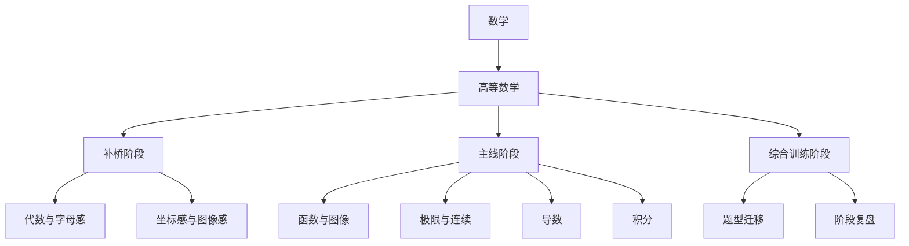
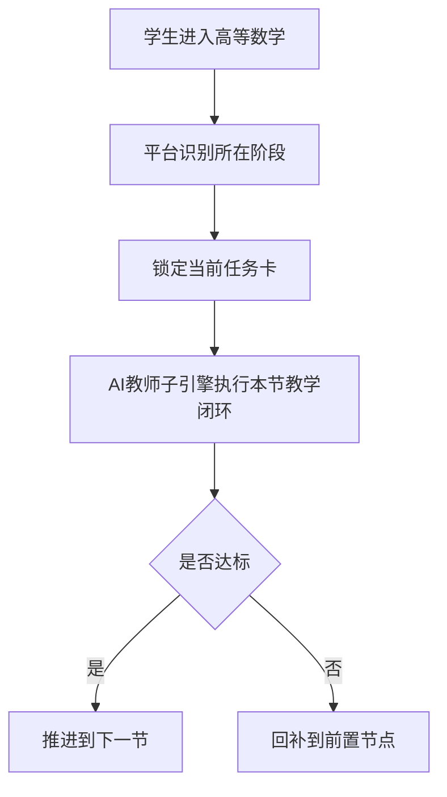

# 高等数学-平台接入示范

> 文档层级：学科层  
> 文档目的：展示高等数学如何作为第一门完整示范学科接入平台  
> 核心结论：高等数学这份示范的价值，不是替平台定义全部内容，而是证明平台的目录树、当前任务卡、主动推进和双层笔记机制可以真实跑通  
> 目标读者：产品负责人、学科设计者、答辩准备者、配置协作者  
> 上游真源：[AI主导学习平台-产品总纲.md](../平台层/AI主导学习平台-产品总纲.md)、[AI主导学习平台-学习生命周期与编排策略.md](../平台层/AI主导学习平台-学习生命周期与编排策略.md)、[AI教师子引擎-教学策略设计.md](../子引擎层/AI教师子引擎-教学策略设计.md)  
> 下游引用：[高等数学-ADP配置手册.md](./高等数学-ADP配置手册.md)  
> 适用范围：`数学 -> 高等数学` 的平台接入示范

## 与其他文档的边界

本文只说明高等数学这一门课如何接进平台。  
本文不替平台定义跨学科公共机制，也不替子引擎定义通用教学闭环。

## 一句话先记住

> 高等数学不是平台本体，但它必须把平台最关键的 4 个能力都演出来：目录树、当前任务卡、主动推进、双层笔记。

## 1. 一页结论

高等数学不再被写成“整个平台”，而是被定义为：

> `数学` 学科大类下的第一门完整示范学科。

这份示范要证明的不是“AI 怎么讲一节高数”，而是：

- 高等数学怎么被放进平台统一结构里
- 平台怎么按目录、任务卡和回补逻辑持续推进
- 学完每节后怎么沉淀成双层笔记

## 2. 学科接入接口

| 接口项 | 高等数学当前定义 |
| --- | --- |
| 学科大类 | `数学` |
| 学科定位 | 平台第一门完整示范学科 |
| 目标人群 | 大一高等数学入门学生、基础薄弱自学者、专升本数学备考学生 |
| 目录结构 | 补桥阶段 / 主线阶段 / 综合训练阶段 |
| 补桥逻辑 | 学生在符号感、图像感、极限直觉不足时优先回补 |
| 专属策略 | 图像化讲解、步骤拆解、概念补桥、数形结合 |
| 笔记/评估模板 | 对齐平台双层笔记和阶段复习接口 |

## 3. 学生可见学习目录

### 3.1 目录树

### 3.2 状态表示例

| 阶段 | 模块 | 状态 | 当前顺序 | 是否补桥 |
| --- | --- | --- | --- | --- |
| 补桥阶段 | 代数与字母感 | 已完成 | 1 | 是 |
| 补桥阶段 | 坐标感与图像感 | 进行中 | 2 | 是 |
| 主线阶段 | 函数与图像 | 待开始 | 3 | 否 |
| 主线阶段 | 极限与连续 | 未开始 | 4 | 否 |
| 主线阶段 | 导数 | 未开始 | 5 | 否 |
| 主线阶段 | 积分 | 未开始 | 6 | 否 |

## 4. 当前任务卡示范

| 字段 | 内容示例 |
| --- | --- |
| 当前目标 | 建立“函数是输入输出规则”的最小理解 |
| 预计时长 | `15-20` 分钟 |
| 安排原因 | 当前图像感不足，若不先补这一层，后续极限和导数会持续卡住 |
| 完成标准 | 能解释函数图像表示什么，并完成 1-2 道基础题 |
| 回补条件 | 如果仍分不清自变量、因变量或图像含义，则回到“坐标感与图像感” |
| 下一步衔接 | 本节完成后进入“函数与图像”的图像判读与简单变式 |

## 5. 主动推进示范

这里的平台作用不是替高数讲完整门课，而是持续负责：

- 当前先学什么
- 为什么先学这个
- 没达标时回到哪里
- 学完后如何沉淀

## 6. 双层笔记示范

### 6.1 课节笔记

| 字段 | 示例 |
| --- | --- |
| 学科 | 高等数学 |
| 模块 | 函数与图像 |
| 课节 | 函数的基本直觉 |
| 本节核心概念 | 函数是输入与输出之间的规则 |
| 人话解释 | 给一个数，就按固定规则得到另一个数 |
| 关键例子 | `y=x`、`y=x^2` 的图像差异 |
| 易错点 | 把图像当作“算式装饰”，而不是规则表达 |
| 学生本节卡点 | 变量意义不清、图像坐标感不足 |
| 复习建议 | 回看图像与坐标的对应关系，再做 2 道基础判读题 |

### 6.2 个人总复习本增量

| 字段 | 示例 |
| --- | --- |
| 学科目录索引 | 数学 > 高等数学 > 主线阶段 > 函数与图像 |
| 已学章节摘要 | 已建立函数图像的最小直觉 |
| 高频错因 | 变量意义不清、图像判读弱 |
| 待复习清单 | 再看一次“坐标感与图像感”与基础图像题 |
| 下一阶段目标 | 进入极限与连续前，先稳定函数图像理解 |

## 7. 适配场景

高等数学当前兼容 3 类真实场景：

1. 大一高等数学入门
2. 基础薄弱的补桥型学习
3. 专升本数学备考

这里保留 `专升本`，是因为它是高等数学的真实适配场景之一；  
但它不再代表整个平台的唯一定位。

## 读完后你应该带走什么

- 高等数学是平台成立的第一门示范学科，不是整个平台的替身。
- 高等数学示范必须对齐平台对象和字段，而不是另起一套口径。
- 真正要让评委看见的是“平台机制如何在一门课里跑通”。

## 下一篇建议阅读

1. [高等数学-ADP配置手册.md](./高等数学-ADP配置手册.md)
2. [../平台层/AI主导学习平台-学习生命周期与编排策略.md](../平台层/AI主导学习平台-学习生命周期与编排策略.md)
3. [学科接入模板.md](./学科接入模板.md)

## 8. 本文不负责什么

- 不定义平台总结构和跨学科分类
- 不定义 AI教师子引擎公共教学策略
- 不提供 ADP 具体配置步骤
- 不代替比赛答辩稿
