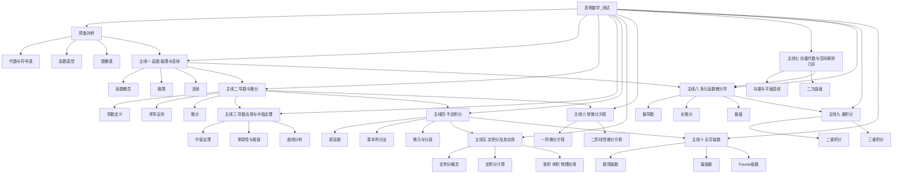

# 高等数学-知识库接入与落库规范

> 文档层级：学科层  
> 文档目的：给出高等数学如何按整门课程口径接入平台知识库，并形成可持续入库的正式规范  
> 核心结论：高等数学第一版不该只做几个零散问答，而应先按整门 `高数_测试` 建课程地图，再按 OCR、拆卡、标签、批次验收的规范逐步补齐正式知识资产  
> 目标读者：知识库实施者、OCR 负责人、课程负责人、研发协作者、答辩准备者  
> 上游真源：[AI主导学习平台-知识库结构与契约.md](../平台层/AI主导学习平台-知识库结构与契约.md)、[AI主导学习平台-统一对象与接口契约.md](../平台层/AI主导学习平台-统一对象与接口契约.md)、[高等数学-平台接入示范.md](./高等数学-平台接入示范.md)  
> 下游引用：[高等数学-ADP配置手册.md](./高等数学-ADP配置手册.md)、[高等数学-Agent提示词模板与分层教学规范.md](./高等数学-Agent提示词模板与分层教学规范.md)、课堂资料整理、知识库导入批次说明  
> 适用范围：`数学 -> 高等数学_测试` 的资料电子化、结构化拆分、入库顺序、标签设计与场景验收

## 与其他文档的边界

本文只负责回答：

- 高等数学整门课程应该拆成哪些模块
- 非电子版教材、试卷、讲义怎样变成可检索资产
- 每个模块需要哪些知识资产
- 学生问答、教师运营、课堂重构三类场景怎样落到高数知识库
- OCR 负责人到底该交什么

本文不重新定义平台角色、不重写统一字段本体，也不替代 ADP 页面里的具体点击配置。

## 一句话先记住

> 高等数学知识库要先做“课程地图 + 资料电子化 + 拆卡规范 + 标签规范 + 批次验收”，而不是先做“随便导几份 PDF 看能不能答题”。

## 1. 高等数学第一版的正式定位

高等数学当前建议固定定位为：

> `数学` 学科大类下的第一门完整示范课程知识库。

这意味着它要同时承担 3 件事：

- 证明学生可以沿整门课持续推进
- 证明教师可以看到高频错因和停滞点
- 证明知识库结构可以扩到别的数学课程甚至别的学科

## 2. 整门课程章节树与先修关系

### 图 1：高数 A 全课程章节与先修关系图

## 3. 全课程模块地图

| 模块编号 | 模块名称 | 先修依赖 | 当前教学目标 | 建议主资源类型 |
| --- | --- | --- | --- | --- |
| M00 | 预备补桥 | 无 | 稳定字母感、函数感、图像感 | 章节导学、知识点卡、基础例题、图像资源 |
| M01 | 函数、极限与连续 | M00 | 建立函数视角和极限连续直觉 | 知识点卡、例题讲解卡、课堂重构笔记 |
| M02 | 导数与微分 | M01 | 掌握导数定义、求导和微分 | 知识点卡、例题讲解卡、练习与标准答案 |
| M03 | 导数应用与中值定理 | M02 | 让导数进入判断、证明与分析 | 章节导学、例题讲解卡、错题与误区卡 |
| M04 | 不定积分 | M02 | 建立原函数视角与积分计算套路 | 知识点卡、例题讲解卡、练习与标准答案 |
| M05 | 定积分及其应用 | M04 | 把积分从公式计算拉回几何与物理意义 | 课堂重构笔记、知识点卡、例题讲解卡 |
| M06 | 常微分方程 | M02、M04 | 建立“关系式 -> 解函数”的视角 | 章节导学、例题讲解卡、标准答案 |
| M07 | 向量代数与空间解析几何 | M00 | 补空间直觉与解析表达 | 图像资源、知识点卡、课堂重构笔记 |
| M08 | 多元函数微分学 | M01、M02、M07 | 建立多变量偏导与极值分析 | 知识点卡、例题讲解卡、错题与误区卡 |
| M09 | 重积分 | M08 | 把积分拓展到区域与体积 | 课堂重构笔记、例题讲解卡、标准答案 |
| M10 | 无穷级数 | M01、M04 | 建立级数收敛与展开视角 | 知识点卡、例题讲解卡、错题与误区卡 |

## 4. 非电子版资料怎么处理

开发 2 负责的正式流程固定为下面 8 步：

1. 原始素材登记
2. 扫描或拍照
3. OCR 初稿
4. 公式、题号、图表人工校对
5. 拆分为可检索知识资产
6. 标签标注
7. 批次入库
8. 抽样问答验收

### 4.1 原始素材登记

至少记录：

- 素材名称
- 来源教师或来源课程
- 素材类型：教材 / 试卷 / 讲义 / PPT / 板书 / 课堂笔记
- 当前状态：待扫描 / 待 OCR / 待校对 / 待拆卡 / 已入库
- 负责人

### 4.2 扫描或拍照

要求：

- 单页清晰、裁边完整
- 公式区域无遮挡
- 试卷题号完整
- 图像与坐标图不变形

### 4.3 OCR 初稿

要求：

- 不求一次完美，但必须能进入人工校对
- 公式区域单独重点检查
- 题号、题干、选项和答案区分清楚

### 4.4 人工校对

必须重点校对：

- 公式符号
- 上下标
- 根号、积分号、极限符号
- 图表标题与坐标轴
- 试卷题号和小问序号

### 4.5 拆分为可检索知识资产

原则是：

- 不整章直接塞进知识库
- 不把整套试卷只当一个大文件
- 不把 OCR 原稿直接当最终成品

### 4.6 标签标注

每条知识资产都要补齐最小元数据字段，见本文第 6 节。

### 4.7 批次入库

每次入库按批次记录：

- 批次编号
- 模块范围
- 素材来源
- 资产条数
- 负责人
- 入库日期

### 4.8 抽样问答验收

至少检查：

- 模块是否命中正确
- 章节是否命中正确
- 学生向检索是否优先命中知识点卡和例题卡
- 教师向检索是否优先命中教师摘要和错因总结

## 5. 知识资产颗粒度固定规则

### 5.1 教材

- 不整章直接入库
- 按知识点拆卡
- 一个卡片只服务一个核心概念或一个紧密相关概念组

### 5.2 试卷

- 按题目或题组拆卡
- 复杂大题可拆为题干卡、解析卡、错因卡

### 5.3 讲义 / PPT

- 按课时主题拆成课堂重构笔记
- 需要时再抽取知识点卡与例题卡

### 5.4 错题

- 单独形成错题与误区卡
- 明确常见误判点与正确判断依据

## 6. 最小元数据字段

每条正式知识资产最低要有下面字段：

- `subject_category`
- `course_id`
- `module_id`
- `module_label`
- `chapter_id`
- `chapter_label`
- `resource_type`
- `role`
- `source_type`
- `source_ref`
- `keywords`
- `aliases`
- `difficulty`
- `status`

### 6.1 字段建议含义

| 字段 | 含义 | 示例 |
| --- | --- | --- |
| `subject_category` | 学科大类 | `数学` |
| `course_id` | 课程标识 | `高等数学_测试` |
| `module_id` | 模块编号 | `M02` |
| `module_label` | 模块名称 | `导数与微分` |
| `chapter_id` | 章节编号 | `CH02` |
| `chapter_label` | 章节名称 | `导数定义` |
| `resource_type` | 资源类型 | `知识点卡 / 例题讲解卡 / 课堂重构笔记` |
| `role` | 角色向 | `student / teacher` |
| `source_type` | 来源类型 | `textbook / exam / lecture_note / ppt / ocr_note` |
| `source_ref` | 来源引用 | `教材第2章`、`2024期中卷A` |
| `keywords` | 关键词 | `极限, 导数, 瞬时变化率` |
| `aliases` | 别名或常见说法 | `导函数, 变化率` |
| `difficulty` | 难度 | `basic / normal / advanced` |
| `status` | 当前状态 | `draft / reviewed / imported` |

## 7. 每个模块需要什么知识资产

| 模块 | 章节示例 | 必备资产类型 | 建议标签 | 命名示例 |
| --- | --- | --- | --- | --- |
| M00 预备补桥 | 函数直觉 | 课程总览、知识点卡、基础题 | `数学` `高等数学_测试` `M00` `函数直觉` `student` | `高等数学_测试-M00预备补桥-CH00函数直觉-知识点卡-函数是规则.md` |
| M01 函数极限连续 | 极限概念 | 章节导学、知识点卡、课堂重构笔记 | `数学` `高等数学_测试` `M01` `极限` `student` | `高等数学_测试-M01函数极限连续-CH01极限概念-课堂重构笔记-极限直觉.md` |
| M02 导数与微分 | 导数定义 | 知识点卡、例题讲解卡、标准答案 | `数学` `高等数学_测试` `M02` `导数定义` `student` | `高等数学_测试-M02导数与微分-CH02导数定义-例题讲解卡-差商到导数.md` |
| M03 导数应用 | 单调性极值 | 章节导学、错题与误区卡、例题 | `数学` `高等数学_测试` `M03` `极值` `student` | `高等数学_测试-M03导数应用-CH03极值判断-错题与误区卡-导数零点不等于极值点.md` |
| M04 不定积分 | 换元积分法 | 知识点卡、例题讲解卡、练习 | `数学` `高等数学_测试` `M04` `换元法` `student` | `高等数学_测试-M04不定积分-CH04换元积分-练习与标准答案-第一批基础题.md` |
| M05 定积分应用 | 面积体积 | 课堂重构笔记、知识点卡、例题 | `数学` `高等数学_测试` `M05` `面积` `student` | `高等数学_测试-M05定积分及其应用-CH05面积问题-知识点卡-面积为什么能用积分表示.md` |
| M06 常微分方程 | 一阶线性方程 | 章节导学、例题讲解卡、标准答案 | `数学` `高等数学_测试` `M06` `一阶微分方程` `student` | `高等数学_测试-M06常微分方程-CH06一阶线性-例题讲解卡-通解与特解.md` |
| M07 空间解析几何 | 平面与直线 | 图像资源、知识点卡、课堂重构 | `数学` `高等数学_测试` `M07` `空间解析几何` `student` | `高等数学_测试-M07向量与空间解析几何-CH07平面方程-知识点卡-法向量视角.md` |
| M08 多元微分学 | 偏导与极值 | 知识点卡、例题讲解卡、错题卡 | `数学` `高等数学_测试` `M08` `偏导数` `student` | `高等数学_测试-M08多元函数微分学-CH08偏导数-错题与误区卡-把全导和偏导混淆.md` |
| M09 重积分 | 二重积分 | 课堂重构笔记、例题、标准答案 | `数学` `高等数学_测试` `M09` `二重积分` `student` | `高等数学_测试-M09重积分-CH09二重积分-例题讲解卡-先定界后积分.md` |
| M10 无穷级数 | 收敛判别 | 知识点卡、例题讲解卡、错题卡 | `数学` `高等数学_测试` `M10` `级数收敛` `student` | `高等数学_测试-M10无穷级数-CH10收敛判别-知识点卡-为什么要先判收敛.md` |

## 8. 三类检索视角怎么落库

### 8.1 学生问答优先召回

优先命中：

- `知识点卡`
- `例题讲解卡`
- `错题与误区卡`
- `练习与标准答案`

### 8.2 教师运营优先召回

优先命中：

- `教师运营摘要`
- `错题与误区卡`
- `课堂重构笔记`

### 8.3 课堂重构优先召回

优先命中：

- `课堂重构笔记`
- `讲义 / PPT / OCR 课时稿`
- `知识点卡`
- `例题讲解卡`

### 8.4 三类场景对照表

| 场景 | 用户典型问题 | 必锁标签 | 预期输出 |
| --- | --- | --- | --- |
| 学生问答 | `导数定义为什么是极限` | `course_id + chapter_id + role=student` | 概念解释 + 步骤 + 例子 |
| 教师运营 | `哪些人卡在定积分面积意义` | `course_id + role=teacher` | 高频错因 + 补讲建议 |
| 课堂重构 | `把这一节积分应用课整理成复习笔记` | `course_id + module_id + chapter_id` | 课后可检索笔记与知识卡 |

## 9. 素材采集清单

| 素材类型 | 建议格式 | 用来做什么 | 优先级 |
| --- | --- | --- | --- |
| 教学大纲 | PDF / DOCX | 建课程总览与章节树 | 高 |
| 教材或讲义主本 | PDF / 扫描图 | 提炼知识点卡和章节导学 | 高 |
| 教师 PPT | PPT / PDF | 做课堂重构和图像化讲解 | 高 |
| 题库或作业 | DOCX / PDF / 扫描图 | 做练习与标准答案 | 高 |
| 典型错题 | 图片 / 文档 | 做错题与误区卡 | 高 |
| 板书照片 | 图片 | 补课堂直观解释 | 中 |
| 课堂录音 | 音频 | 课后重构“人话解释” | 中 |
| 教师补讲记录 | 文档 | 生成教师运营摘要 | 中 |
| 函数图像资源 | SVG / PNG | 讲解函数、极限、导数图像 | 中 |

当前仓库已经具备一批可直接复用的图像资源：

- [assets/高等数学/函数图像资源/function-y-equals-x.svg](./assets/高等数学/函数图像资源/function-y-equals-x.svg)
- [assets/高等数学/函数图像资源/function-y-equals-x-squared.svg](./assets/高等数学/函数图像资源/function-y-equals-x-squared.svg)
- [assets/高等数学/函数图像资源/function-y-equals-one-over-x.svg](./assets/高等数学/函数图像资源/function-y-equals-one-over-x.svg)

## 10. 分波次入库顺序

### 10.1 第一波

第一波虽然按整门课设计，但实际入库固定先补：

- `预备补桥`
- `函数、极限与连续`
- `导数与微分`
- `定积分及其应用`

目标：

- 函数直觉能讲清
- 极限和导数不飘
- 定积分能连接几何直觉
- 学生问答和课堂重构能开始共用一套知识资产

### 10.2 第二波

第二波再补：

- `导数应用与中值定理`
- `不定积分`
- `常微分方程`

### 10.3 第三波

第三波最后补：

- `向量代数与空间解析几何`
- `多元函数微分学`
- `重积分`
- `无穷级数`

## 11. 开发 2 的详细交付物

开发 2 在这一轮固定要交下面 6 类产物：

1. 素材台账
2. OCR 校对稿
3. 结构化知识资产
4. 标签规范表
5. 入库批次记录
6. 抽样验收记录

### 11.1 验收清单

每一批至少检查：

- 命名是否统一
- 元数据字段是否齐全
- 抽样问答是否命中正确模块
- 学生/教师角色是否隔离
- 错题与误区卡是否可被单独召回

## 12. 你现在的高等数学该怎么动手

结合当前仓库现状，最务实的动作顺序建议是：

1. 先不要急着导整本教材，先把全课程目录和模块编号定下来。  
2. 先利用现有高数文档与函数图像资源，补出 `M00` 和 `M01` 的正式骨架。  
3. 再围绕 `M02 导数与微分` 做第一批高质量知识点卡和例题卡，因为这是学生最常问、也最适合展示 AI 讲解能力的模块。  
4. 定积分模块优先做“面积 / 体积 / 应用”的课堂重构，因为它最适合比赛演示里的“课堂知识重构”链路。  
5. 教师侧不要等到最后才做，第一波就至少整理一份“高频错因 + 补讲建议”的教师摘要样板。  
6. 每批资产都按正式命名和字段整理后再导入 ADP，不要把原始 PDF 当成唯一知识库形态。  

## 读完后你应该带走什么

- 高等数学知识库应该先按整门 `高数_测试` 画出知识地图，再分波次落库。
- 纸质教材、试卷和讲义必须经过 OCR、校对、拆卡、标签和验收流程，不能直接当知识库成品。
- 学生问答、教师运营和课堂重构三类检索视角，必须在落库时就被设计进去。

## 下一篇建议阅读

1. [高等数学-Agent提示词模板与分层教学规范.md](./高等数学-Agent提示词模板与分层教学规范.md)
2. [高等数学-ADP配置手册.md](./高等数学-ADP配置手册.md)
3. [../平台层/AI主导学习平台-知识库结构与契约.md](../平台层/AI主导学习平台-知识库结构与契约.md)

## 本文不负责什么

- 不代替 OCR 工具开发本身
- 不代替 ADP 页面内的逐项点击配置
- 不替代统一对象字段真源
- 不代替比赛演示稿
