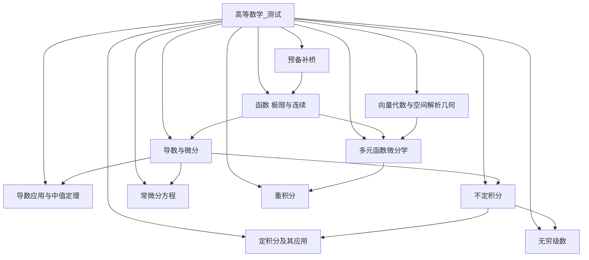

# 高等数学-知识库接入与落库方案

> 文档层级：学科层  
> 文档目的：作为平台知识治理主文档下的高等数学示例附录，说明首个示范学科如何按整门课程接入、校验、发布与回滚  
> 核心结论：高等数学不是“先导几份 PDF 看能不能答”，而是先定课程地图，再按资料电子化、声明抽取、可信度判断、补丁发布和批次验收逐步进入主教学知识区

## 与其他文档的边界

本文只负责回答：

- 高等数学整门课程应该拆成哪些模块
- 非电子版教材、试卷、讲义怎样变成可治理知识资产
- 哪些资料能进入 `candidate`，哪些能进入 `main`
- 高数示范学科怎样验证 Git 化知识治理成立

本文不替代平台统一字段本体，也不替代 ADP 页面配置细节。

## 1. 首个示范学科的定位

高等数学当前固定定位为：

> `数学` 学科大类下的第一门完整示范课程。

它要证明 3 件事：

1. 学生可以沿整门课持续推进
2. 新资料可以被平台可信地吸收
3. 知识治理结构可以扩到别的课程甚至别的学科

## 2. 全课程章节树与先修关系

## 3. 全课程模块地图

| 模块编号 | 模块名称 | 先修依赖 | 当前教学目标 | 建议主资源类型 |
| --- | --- | --- | --- | --- |
| M00 | 预备补桥 | 无 | 稳定字母感、函数感、图像感 | 章节导学、知识点卡、基础例题、图像资源 |
| M01 | 函数、极限与连续 | M00 | 建立函数视角和极限连续直觉 | 知识点卡、例题讲解卡、结构化笔记 |
| M02 | 导数与微分 | M01 | 掌握导数定义、求导和微分 | 知识点卡、例题讲解卡、练习与标准答案 |
| M03 | 导数应用与中值定理 | M02 | 让导数进入判断、证明与分析 | 章节导学、例题讲解卡、错题与误区卡 |
| M04 | 不定积分 | M02 | 建立原函数视角与积分计算套路 | 知识点卡、例题讲解卡、练习与标准答案 |
| M05 | 定积分及其应用 | M04 | 把积分从公式计算拉回几何与物理意义 | 结构化笔记、知识点卡、例题讲解卡 |
| M06 | 常微分方程 | M02、M04 | 建立“关系式 -> 解函数”的视角 | 章节导学、例题讲解卡、标准答案 |
| M07 | 向量代数与空间解析几何 | M00 | 补空间直觉与解析表达 | 图像资源、知识点卡、结构化笔记 |
| M08 | 多元函数微分学 | M01、M02、M07 | 建立多变量偏导与极值分析 | 知识点卡、例题讲解卡、错题与误区卡 |
| M09 | 重积分 | M08 | 把积分拓展到区域与体积 | 结构化笔记、例题讲解卡、标准答案 |
| M10 | 无穷级数 | M01、M04 | 建立级数收敛与展开视角 | 知识点卡、例题讲解卡、错题与误区卡 |

## 4. 非电子版资料怎么处理

正式流程固定为下面 8 步：

1. 原始素材登记
2. 扫描或拍照
3. OCR 初稿
4. 公式、题号、图表校对
5. 结构化拆分
6. 生成 `KnowledgePatch`
7. 进入候选区并校验
8. 发布与抽样验收

### 4.1 原始素材登记

至少记录：

- 素材名称
- 来源课程或来源教师
- 素材类型
- 当前状态
- 负责人

### 4.2 结构化拆分原则

- 不整章直接塞进知识库
- 不把整套试卷只当一个大文件
- 不把 OCR 原稿直接当最终成品
- 数学公式和标准答案必须单独抽成可校验声明

## 5. 高数示范学科的 Git 化治理

### 5.1 四个知识区

| 知识区 | 高数里的作用 |
| --- | --- |
| `raw` | 扫描稿、OCR 稿、原始课件 |
| `candidate` | 已切分、已打标签、待校验的高数知识条目 |
| `main` | 正式参与地图、评分和教学的高数知识 |
| `archive` | 冲突资料、低质量资料和历史版本 |

### 5.2 核心对象

- `KnowledgePatch`
- `KnowledgeCandidate`
- `KnowledgeConflict`
- `KnowledgeCommit`
- `KnowledgeRelease`
- `KnowledgeRollback`
- `ValidationReport`

## 6. 可信度评分与发布阈值

### 6.1 来源等级

| 等级 | 典型来源 |
| --- | --- |
| `A` | 正式教材、官方考试资料、平台主资产 |
| `B` | 教师讲义、PPT、课堂资料 |
| `C` | 学生笔记、截图、OCR 初稿、散装资料 |

### 6.2 校验重点

高数示范学科必须重点校验：

- 定义是否准确
- 公式是否规范
- 标准答案是否一致
- 变形步骤是否可回代验证
- 章节归属是否正确

### 6.3 发布门禁

- `>= 85` 且无硬冲突：可自动进入 `main`
- `70-84` 或存在软冲突：保留在 `candidate`
- `< 70` 或存在硬冲突：进入 `archive`

## 7. 最小元数据字段

每条正式知识资产最低要有下面字段：

- `subject_category`
- `course_id`
- `module_id`
- `module_label`
- `chapter_id`
- `chapter_label`
- `resource_type`
- `source_type`
- `source_grade`
- `difficulty`
- `publish_channel`
- `confidence_score`
- `status`

## 8. 每个模块需要什么知识资产

| 模块 | 必备资产类型 | 命名示例 |
| --- | --- | --- |
| M00 预备补桥 | 课程总览、知识点卡、基础题 | `高等数学_测试-M00预备补桥-CH00函数直觉-知识点卡-函数是规则.md` |
| M01 函数极限连续 | 章节导学、知识点卡、结构化笔记 | `高等数学_测试-M01函数极限连续-CH01极限概念-结构化笔记-极限直觉.md` |
| M02 导数与微分 | 知识点卡、例题讲解卡、标准答案 | `高等数学_测试-M02导数与微分-CH02导数定义-例题讲解卡-差商到导数.md` |
| M05 定积分应用 | 结构化笔记、知识点卡、例题 | `高等数学_测试-M05定积分及其应用-CH05面积问题-知识点卡-面积为什么能用积分表示.md` |
| M10 无穷级数 | 知识点卡、例题讲解卡、错题卡 | `高等数学_测试-M10无穷级数-CH10收敛判别-知识点卡-为什么要先判收敛.md` |

## 9. 三波次入库顺序

### 9.1 第一波

- `预备补桥`
- `函数、极限与连续`
- `导数与微分`
- `定积分及其应用`

目标：

- 先把最适合演示和最常见问答链路做稳
- 先把可信度门禁和回滚机制跑通

### 9.2 第二波

- `导数应用与中值定理`
- `不定积分`
- `常微分方程`

### 9.3 第三波

- `向量代数与空间解析几何`
- `多元函数微分学`
- `重积分`
- `无穷级数`

## 10. 当前最务实的动手顺序

1. 先固定课程目录和模块编号。  
2. 先围绕 `M00`、`M01`、`M02` 建立第一批高质量主资产。  
3. 再围绕 `M05` 建立最适合比赛演示的“直觉 + 应用”知识链。  
4. 每批资料都先走 `raw -> candidate -> main`，不要跳门禁。  
5. 每次发布后都记录影响域、抽样问答结果和是否需要回滚。  

## 11. 读完后你应该带走什么

- 高等数学从现在起是“首个示范学科”，不只是调试语料。
- 高数知识库必须按 Git 化补丁、候选分支、发布门禁和回滚记录来治理。
- 数学内容的正确性不能只靠大模型口头判断，必须有规则校验和版本门禁。
