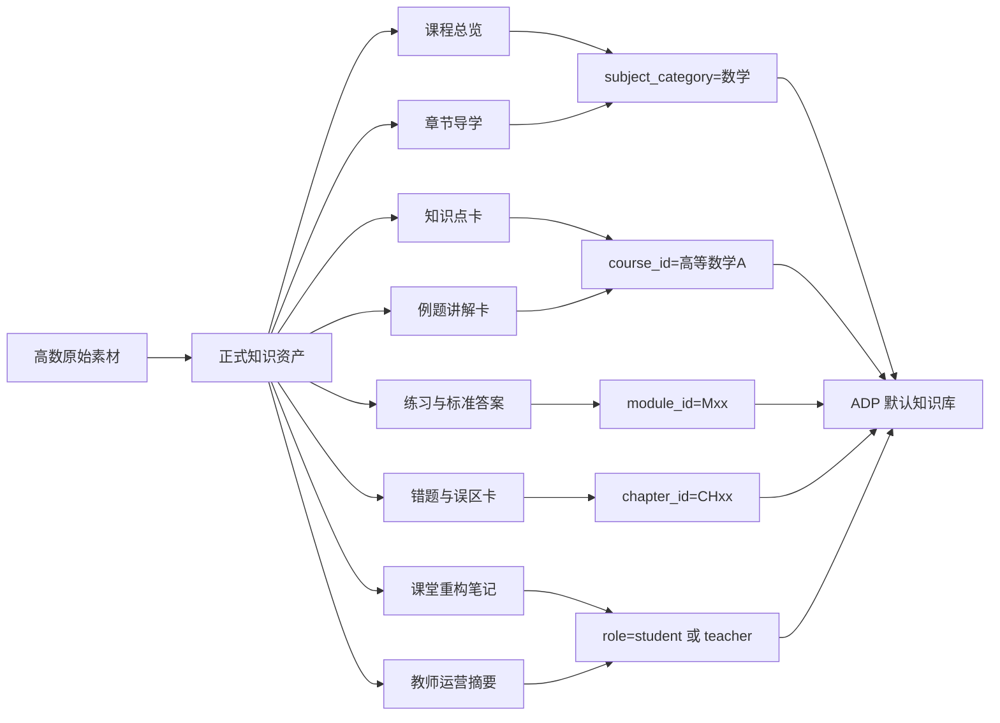

# 高等数学-知识库接入与落库方案

> 文档层级：学科层  
> 文档目的：给出高等数学如何按整门课程口径接入平台知识库，并形成可持续入库的实施方案  
> 核心结论：高等数学第一版不该只做几个零散问答，而应先按整门 `高数A` 建课程地图，再按优先波次逐步补齐正式知识资产  
> 目标读者：知识库实施者、课程负责人、答辩准备者、研发协作者  
> 上游真源：[AI主导学习平台-知识库结构与契约.md](../平台层/AI主导学习平台-知识库结构与契约.md)、[AI主导学习平台-统一对象与接口契约.md](../平台层/AI主导学习平台-统一对象与接口契约.md)、[高等数学-平台接入示范.md](./高等数学-平台接入示范.md)  
> 下游引用：[高等数学-ADP配置手册.md](./高等数学-ADP配置手册.md)、课堂资料整理、知识库导入批次说明  
> 适用范围：`数学 -> 高等数学A` 的知识库建设、导入顺序、标签设计与场景验收

## 与其他文档的边界

本文只负责回答：

- 高等数学整门课程应该拆成哪些模块
- 每个模块需要哪些知识资产
- 第一版该先补哪些内容，后补哪些内容
- 学生问答、教师运营、课堂重构三类场景怎样落到高数知识库

本文不重新定义平台角色、不重写统一字段本体，也不替代 ADP 页面里的具体点击配置。

## 一句话先记住

> 你现在的高等数学不该先做“能答几道题”，而该先做“整门课的知识地图 + 第一波优先模块 + 正式知识资产模板”，这样后面导入 ADP 才不会越堆越乱。

## 1. 高等数学第一版的正式定位

高等数学当前建议固定定位为：

> `数学` 学科大类下的第一门完整示范课程知识库。

这意味着它要同时承担 3 件事：

- 证明学生可以沿整门课持续推进
- 证明教师可以看到高频错因和停滞点
- 证明知识库结构可以扩到别的数学课程甚至别的学科

## 2. 整门课程章节树与先修关系

### 图 1：高数 A 全课程章节与先修关系图

## 3. 全课程模块地图

| 模块编号 | 模块名称 | 先修依赖 | 当前教学目标 | 建议主资源类型 |
| --- | --- | --- | --- | --- |
| M00 | 预备补桥 | 无 | 稳定字母感、函数感、图像感 | 章节导学、知识点卡、基础例题、图像资源 |
| M01 | 函数、极限与连续 | M00 | 建立函数视角和极限连续直觉 | 知识点卡、例题讲解卡、课堂重构笔记 |
| M02 | 导数与微分 | M01 | 掌握导数定义、求导和微分 | 知识点卡、例题讲解卡、练习与标准答案 |
| M03 | 导数应用与中值定理 | M02 | 让导数进入判断、证明与分析 | 章节导学、例题讲解卡、错题与误区卡 |
| M04 | 不定积分 | M02 | 建立原函数视角与积分计算套路 | 知识点卡、例题讲解卡、练习与标准答案 |
| M05 | 定积分及其应用 | M04 | 把积分从公式计算拉回几何与物理意义 | 课堂重构笔记、知识点卡、例题讲解卡 |
| M06 | 常微分方程 | M02、M04 | 建立“关系式 -> 解函数”的视角 | 章节导学、例题讲解卡、标准答案 |
| M07 | 向量代数与空间解析几何 | M00 | 补空间直觉与解析表达 | 图像资源、知识点卡、课堂重构笔记 |
| M08 | 多元函数微分学 | M01、M02、M07 | 建立多变量偏导与极值分析 | 知识点卡、例题讲解卡、错题与误区卡 |
| M09 | 重积分 | M08 | 把积分拓展到区域与体积 | 课堂重构笔记、例题讲解卡、标准答案 |
| M10 | 无穷级数 | M01、M04 | 建立级数收敛与展开视角 | 知识点卡、例题讲解卡、错题与误区卡 |

## 4. 每个模块需要什么知识资产

| 模块 | 章节示例 | 必备资产类型 | 建议标签 | 命名示例 |
| --- | --- | --- | --- | --- |
| M00 预备补桥 | 函数直觉 | 课程总览、知识点卡、基础题 | `数学` `高等数学A` `M00` `函数直觉` `student` | `高等数学A-M00预备补桥-CH00函数直觉-知识点卡-函数是规则.md` |
| M01 函数极限连续 | 极限概念 | 章节导学、知识点卡、课堂重构笔记 | `数学` `高等数学A` `M01` `极限` `student` | `高等数学A-M01函数极限连续-CH01极限概念-课堂重构笔记-极限直觉.md` |
| M02 导数与微分 | 导数定义 | 知识点卡、例题讲解卡、标准答案 | `数学` `高等数学A` `M02` `导数定义` `student` | `高等数学A-M02导数与微分-CH02导数定义-例题讲解卡-差商到导数.md` |
| M03 导数应用 | 单调性极值 | 章节导学、错题与误区卡、例题 | `数学` `高等数学A` `M03` `极值` `student` | `高等数学A-M03导数应用-CH03极值判断-错题与误区卡-导数零点不等于极值点.md` |
| M04 不定积分 | 换元积分法 | 知识点卡、例题讲解卡、练习 | `数学` `高等数学A` `M04` `换元法` `student` | `高等数学A-M04不定积分-CH04换元积分-练习与标准答案-第一批基础题.md` |
| M05 定积分应用 | 面积体积 | 课堂重构笔记、知识点卡、例题 | `数学` `高等数学A` `M05` `面积` `student` | `高等数学A-M05定积分及其应用-CH05面积问题-知识点卡-面积为什么能用积分表示.md` |
| M06 常微分方程 | 一阶线性方程 | 章节导学、例题讲解卡、标准答案 | `数学` `高等数学A` `M06` `一阶微分方程` `student` | `高等数学A-M06常微分方程-CH06一阶线性-例题讲解卡-通解与特解.md` |
| M07 空间解析几何 | 平面与直线 | 图像资源、知识点卡、课堂重构 | `数学` `高等数学A` `M07` `空间解析几何` `student` | `高等数学A-M07向量与空间解析几何-CH07平面方程-知识点卡-法向量视角.md` |
| M08 多元微分学 | 偏导与极值 | 知识点卡、例题讲解卡、错题卡 | `数学` `高等数学A` `M08` `偏导数` `student` | `高等数学A-M08多元函数微分学-CH08偏导数-错题与误区卡-把全导和偏导混淆.md` |
| M09 重积分 | 二重积分 | 课堂重构笔记、例题、标准答案 | `数学` `高等数学A` `M09` `二重积分` `student` | `高等数学A-M09重积分-CH09二重积分-例题讲解卡-先定界后积分.md` |
| M10 无穷级数 | 收敛判别 | 知识点卡、例题讲解卡、错题卡 | `数学` `高等数学A` `M10` `级数收敛` `student` | `高等数学A-M10无穷级数-CH10收敛判别-知识点卡-为什么要先判收敛.md` |

## 5. 三类检索场景怎么落库

### 5.1 学生问答

学生问答最常见的是：

- 这道题为什么这样做
- 这个概念到底什么意思
- 我为什么总在这里做错

对应召回应优先命中：

- `知识点卡`
- `例题讲解卡`
- `练习与标准答案`
- `错题与误区卡`

### 5.2 教师运营

教师运营最常见的是：

- 哪些学生长期卡在函数直觉
- 哪一章错误最多
- 下一次补讲该讲哪里

对应召回应优先命中：

- `教师运营摘要`
- `错题与误区卡`
- `课堂重构笔记`

### 5.3 课堂重构

课堂重构最常见的是：

- 用 PPT、讲义、录音、板书把一节课整理成课后复习资产
- 把老师课堂口头解释变成稳定的知识点说明
- 把课堂例题拆成可单独检索的例题卡

对应召回应优先命中：

- `课堂重构笔记`
- `知识点卡`
- `例题讲解卡`

### 5.4 三类场景对照表

| 场景 | 用户典型问题 | 必锁标签 | 预期输出 |
| --- | --- | --- | --- |
| 学生问答 | `导数定义为什么是极限` | `course_id + chapter_id + role=student` | 概念解释 + 步骤 + 例子 |
| 教师运营 | `哪些人卡在定积分面积意义` | `course_id + role=teacher` | 高频错因 + 补讲建议 |
| 课堂重构 | `把这一节积分应用课整理成复习笔记` | `course_id + module_id + chapter_id` | 课后可检索笔记与知识卡 |

## 6. 素材采集清单

| 素材类型 | 建议格式 | 用来做什么 | 优先级 |
| --- | --- | --- | --- |
| 教学大纲 | PDF / DOCX | 建课程总览与章节树 | 高 |
| 教材或讲义主本 | PDF | 提炼知识点卡和章节导学 | 高 |
| 教师 PPT | PPT / PDF | 做课堂重构和图像化讲解 | 高 |
| 题库或作业 | DOCX / PDF / XLSX | 做练习与标准答案 | 高 |
| 典型错题 | 图片 / 文档 | 做错题与误区卡 | 高 |
| 板书照片 | 图片 | 补课堂直观解释 | 中 |
| 课堂录音 | 音频 | 课后重构“人话解释” | 中 |
| 教师补讲记录 | 文档 | 生成教师运营摘要 | 中 |
| 函数图像资源 | SVG / PNG | 讲解函数、极限、导数图像 | 中 |

当前仓库已经具备一批可直接复用的图像资源：

- [学科层/assets/高等数学/函数图像资源/function-y-equals-x.svg](./assets/高等数学/函数图像资源/function-y-equals-x.svg)
- [学科层/assets/高等数学/函数图像资源/function-y-equals-x-squared.svg](./assets/高等数学/函数图像资源/function-y-equals-x-squared.svg)
- [学科层/assets/高等数学/函数图像资源/function-y-equals-one-over-x.svg](./assets/高等数学/函数图像资源/function-y-equals-one-over-x.svg)

这三份资源最适合优先挂到：

- M00 预备补桥
- M01 函数、极限与连续

## 7. 分波次入库顺序

### 7.1 第一波

第一波虽然按整门课设计，但实际入库固定先补：

- `预备补桥`
- `函数、极限与连续`
- `导数与微分`
- `定积分及其应用`

第一波的目标不是全覆盖，而是先把下面 4 条链路做实：

- 函数直觉能讲清
- 极限和导数不飘
- 定积分能连接几何直觉
- 学生问答和课堂重构能开始共用一套知识资产

### 7.2 第二波

第二波再补：

- `导数应用与中值定理`
- `不定积分`
- `常微分方程`

### 7.3 第三波

第三波最后补：

- `向量代数与空间解析几何`
- `多元函数微分学`
- `重积分`
- `无穷级数`

## 8. 高数知识资产到 ADP 标签映射

### 图 2：高数知识资产到 ADP 检索标签的映射图

## 9. 你现在的高等数学该怎么动手

结合你当前仓库现状，最务实的动作顺序建议是：

1. 先不要急着导整本教材，先把全课程目录和模块编号定下来。  
2. 先利用现有高数文档与函数图像资源，补出 `M00` 和 `M01` 的正式骨架。  
3. 再围绕 `M02 导数与微分` 做第一批高质量知识点卡和例题卡，因为这是学生最常问、也最适合展示 AI 讲解能力的模块。  
4. 定积分模块优先做“面积/体积/应用”的课堂重构，因为它最适合比赛演示里的“课堂知识重构”链路。  
5. 教师侧不要等到最后才做，第一波就至少整理一份“高频错因 + 补讲建议”的教师摘要样板。  
6. 每批资产都按正式命名和字段整理后再导入 ADP，不要把原始 PDF 当成唯一知识库形态。  

## 读完后你应该带走什么

- 高等数学应该先按整门 `高数A` 画出知识地图，再分波次落库
- 第一波先补 `预备补桥 + 极限连续 + 导数微分 + 定积分`
- 你仓库里已有的函数图像资源已经能直接支撑高数早期模块

## 下一篇建议阅读

1. [高等数学-ADP配置手册.md](./高等数学-ADP配置手册.md)
2. [高等数学-平台接入示范.md](./高等数学-平台接入示范.md)
3. [../平台层/AI主导学习平台-知识库结构与契约.md](../平台层/AI主导学习平台-知识库结构与契约.md)

## 本文不负责什么

- 不代替课堂素材采集本身
- 不代替 ADP 页面内的逐项点击配置
- 不替代统一对象字段真源
- 不代替比赛演示稿
