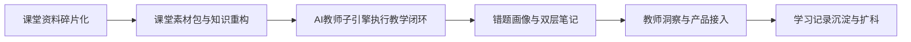
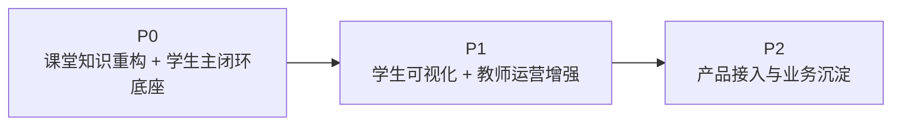

# AI主导学习平台-产品总纲

> 文档层级：平台层  
> 文档目的：给出平台的总叙事、边界、竞争力和对外交付映射  
> 核心结论：平台真正成立的关键，不是“某个 Agent 能答题”，而是“多角色能沿统一对象契约协作，把课堂知识重构、学习推进、结果沉淀、教师洞察与产品接入串成闭环”  
> 目标读者：评审、产品负责人、研发协作者、新成员  
> 上游真源：[AI主导学习平台-角色主线与阶段地图.md](./AI主导学习平台-角色主线与阶段地图.md)、[AI主导学习平台-统一对象与接口契约.md](./AI主导学习平台-统一对象与接口契约.md)  
> 下游引用：[AI主导学习平台-学习生命周期与编排策略.md](./AI主导学习平台-学习生命周期与编排策略.md)、[AI主导学习平台-总体架构设计.md](./AI主导学习平台-总体架构设计.md)、[AI主导学习平台-平台需求与验收.md](./AI主导学习平台-平台需求与验收.md)、[AI教师子引擎-PRD.md](../子引擎层/AI教师子引擎-PRD.md)、[高等数学-平台接入示范.md](../学科层/高等数学-平台接入示范.md)  
> 适用范围：项目总定位、公开说明、答辩主口径、实施总边界

## 与其他文档的边界

本文只回答：

- 平台是什么
- 为什么它是平台，而不是单学科作品或单轮问答页
- 多角色系统怎么分工
- 对外作品名和对内技术真源怎么对应

本文不展开对象字段细节、技术实现细节或某门学科的具体配置。

## 一句话先记住

> AI主导学习平台负责“持续组织学习”，AI教师子引擎负责“把这一轮真正教完”，高等数学负责“作为第一门完整示范学科证明平台成立”，对外比赛作品统一包装为 `知脉课堂`。

## 1. 一页结论

这份总纲固定 5 个判断：

1. 这不是单学科项目。  
   它是 `AI主导学习平台`，高等数学只是第一门完整示范学科。
2. 这不是单角色系统。  
   平台当前有学生、教师/运营者、平台系统、AI教师子引擎、产品前端/后端接入方 5 个正式角色。
3. 这不是只做 `P0` 的原型。  
   `P1` 的教师运营与学生可视化、`P2` 的产品后端/BFF、`HTTP SSE`、自定义前端、学习记录沉淀，都属于正式竞争力路线。
4. 这不是只靠聊天成立。  
   平台要靠课堂素材包、知识重构结果、学习会话、当前任务卡、掌握度快照、错题画像、双层笔记和教师洞察摘要一起成立。
5. 这不是对内外各讲一套完全不同的系统。  
   对外作品名统一为 `知脉课堂：面向高校课堂的全模态知识重构与自适应伴学智能体`，对内继续以平台、子引擎、学科示范三层真源承接。

### 图 1：平台价值链

## 2. 平台定位

### 2.1 平台要持续承担什么

平台的目标不是替代老师讲一节课，而是持续承担以下职责：

- 给学生建立学习档案
- 把课堂素材整理成 `课堂素材包` 和 `知识重构结果`
- 把学习组织成可见的目录、阶段、任务和回补路径
- 把每轮学习固定为学习会话，并锁定当前任务卡
- 把子引擎执行结果沉淀成掌握度快照、错题画像、课节笔记、个人总复习本和教师洞察摘要
- 让新学科按模板挂入，让外部前端/后端按统一接入字段稳定透传上下文

### 2.2 平台不退化成什么

- 不退化成单轮问答聊天页
- 不退化成单学科展示样例
- 不退化成只有 `P0` 主闭环、没有教师/产品/扩科路线的精简版架构
- 不退化成交付层口径驱动的比赛文案系统

### 2.3 对外作品映射

对外比赛场景统一使用以下说法：

- 作品名：`知脉课堂`
- 对外全称：`知脉课堂：面向高校课堂的全模态知识重构与自适应伴学智能体`
- 对内结构：`AI主导学习平台 + AI教师子引擎 + 高等数学示范学科`

一句人话：

> 评委看到的是知脉课堂，研发协作者落实的是平台真源；两者不是两套系统，而是一套系统的两种表达层次。

## 3. 正式角色与主场景

正式角色和阶段分工，以 [AI主导学习平台-角色主线与阶段地图.md](./AI主导学习平台-角色主线与阶段地图.md) 为准。  
本文只保留产品视角的人话解释。

| 角色 | 平台视角职责 | 典型主场景 |
| --- | --- | --- |
| 学生 | 接收任务、完成学习、查看课堂重构结果、复习沉淀资产 | 课堂伴学、错题复练、阶段复习 |
| 教师/运营者 | 识别风险、查看趋势、执行干预 | 课堂复盘、风险学生识别、补讲建议 |
| 平台系统 | 编排学习生命周期、沉淀结构化数据、转接主线 | 建档、任务锁定、推进/回补、知识重构 |
| AI教师子引擎 | 执行学生教学闭环与教师运营支持 | 诊断、讲解、练习、测评、复盘、运营分析 |
| 产品前端/后端接入方 | 承接前端展示、后端透传、学习记录沉淀 | 自定义前端、`BFF`、`HTTP SSE`、业务库沉淀 |

## 4. 当前竞争力结构

### 4.1 学生学习主线

平台当前固定主链为：

`课堂素材包 -> 知识重构结果 -> 学习会话 -> 当前任务卡 -> 子引擎教学闭环 -> 掌握度快照 -> 错题画像 -> 课节笔记 -> 个人总复习本`

### 4.2 教师运营主线

教师主线不是附属描述，而是正式竞争力：

`学习结果聚合 -> 风险识别 -> 趋势摘要 -> 干预建议 -> 教师运营入口`

### 4.3 学科接入与扩科主线

学科接入与扩科不再写成独立角色，而是平台能力主线：

`统一对象契约 -> 学科接入模板 -> 学科示范 -> 多学科扩展`

### 4.4 产品接入与外部集成主线

`P2` 竞争力固定保留：

- 产品前端 / 自定义前端
- 产品后端 / `BFF`
- `HTTP SSE`
- `AppKey` 托管
- `visitor_biz_id` 与 `custom_variables` 透传
- 学习记录沉淀与教师侧聚合

### 4.5 比赛版本工程承接

比赛版本固定推荐：

- 前端：`Vue 3 + TypeScript + Vite + Pinia + Naive UI + Tailwind CSS + VueUse Motion + ECharts`
- 后端：`Go 1.24 + Gin + pgx/sqlc + PostgreSQL 16`
- 接入：`腾讯 ADP + HTTP SSE V2`

这套工程栈是对 `P2` 产品接入主线的现实承接，不改变平台真源边界。

## 5. 为什么高等数学仍然重要，但不再压过平台主线

高等数学继续保留“第一门完整示范学科”定位，因为它能同时验证：

- 学生主线是否成立
- 教师主线是否能接住风险信号和干预建议
- 学科接入与扩科模板是否可复用

但它不再承担下面这些职责：

- 不代表平台全貌
- 不定义平台角色
- 不定义平台对象契约
- 不定义 `P2` 产品接入路线

## 6. 阶段路线为什么要完整保留

### 图 2：阶段路线

当前固定口径：

- `P0` 证明学生持续推进链路成立
- `P1` 证明平台不仅能教，还能看见风险、支持干预
- `P2` 证明平台不仅能演示，还能接进真实产品前后端体系

## 7. 成功标准

平台成立至少要同时满足：

- 学生不用先会提问，也能被持续推进
- 课堂素材能稳定转成可学习的知识重构结果
- 教师能看到风险与干预入口，而不是只看零散聊天记录
- 新学科能按模板挂入，而不是重做平台
- 产品接入方能稳定透传上下文、托管密钥、沉淀学习记录

## 读完后你应该带走什么

- 这是一套多角色平台系统，不是“平台 vs 子引擎”的二元关系。
- `知脉课堂` 是对外作品名，不替代平台真源。
- 高等数学是示范样板，不是角色入口。
- `P1 / P2` 是正式竞争力，不是附加彩蛋。

## 下一篇建议阅读

1. [AI主导学习平台-角色主线与阶段地图.md](./AI主导学习平台-角色主线与阶段地图.md)
2. [AI主导学习平台-统一对象与接口契约.md](./AI主导学习平台-统一对象与接口契约.md)
3. [AI主导学习平台-总体架构设计.md](./AI主导学习平台-总体架构设计.md)

## 本文不负责什么

- 不定义对象字段细节
- 不定义子引擎内部实现
- 不定义某一学科的章节细节
- 不代替比赛演示稿
