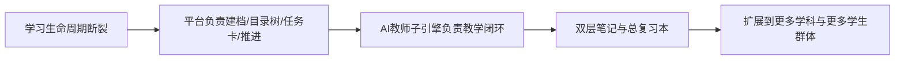
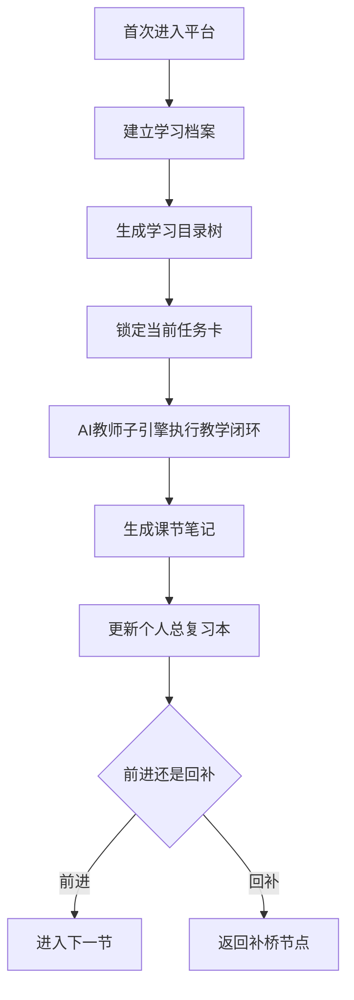

# AI主导学习平台-产品总纲

> 文档层级：平台层  
> 文档目的：给出项目的唯一总叙事，明确平台定位、边界、核心对象与主场景  
> 核心结论：平台真正成立的关键，不是“能答题”，而是“能管理学习生命周期、能沉淀学习资产、能扩展到更多学科”  
> 目标读者：评审、产品负责人、研发协作者、新成员  
> 上游真源：无  
> 下游引用：[AI主导学习平台-平台需求与验收.md](./AI主导学习平台-平台需求与验收.md)、[AI主导学习平台-学习生命周期与编排策略.md](./AI主导学习平台-学习生命周期与编排策略.md)、[AI主导学习平台-总体架构设计.md](./AI主导学习平台-总体架构设计.md)、[AI主导学习平台-学科大类与接入规范.md](./AI主导学习平台-学科大类与接入规范.md)、[AI教师子引擎-PRD.md](../子引擎层/AI教师子引擎-PRD.md)、[高等数学-平台接入示范.md](../学科层/高等数学-平台接入示范.md)  
> 适用范围：项目总定位、答辩主口径、实施总边界

## 与其他文档的边界

本文只回答“项目是什么、为什么是平台、平台和子引擎怎么分工”。  
本文不展开平台 FR/NFR/AC，不展开子引擎内部实现，也不展开具体学科内容。  

## 一句话先记住

> AI主导学习平台负责“怎么持续带着学生学”，AI教师子引擎负责“这一节具体怎么教”，高等数学负责“先证明这套平台成立”。

## 1. 一页结论

这份总纲先回答 4 个问题：

1. 这是不是单学科项目？  
   不是。它是 `AI主导学习平台`，高等数学只是第一门完整示范学科。
2. 平台和 AI教师是什么关系？  
   平台负责 `学习生命周期管理`，AI教师子引擎负责 `学科教学闭环执行`。
3. 平台是怎么组织学习的？  
   平台按 `学科大类 -> 学科 -> 阶段 -> 模块 -> 课节 -> 状态` 组织学习，并用任务卡、自动推进、双层笔记持续驱动。
4. 为什么这个方向更有比赛意义？  
   因为它不仅解决一门课的答疑问题，而是用同一平台机制服务更多学科和更多学生群体。

### 图 1：平台价值链

## 2. 平台定位与边界

### 2.1 平台定位

平台的目标不是替代老师“讲一节课”，而是持续承担以下职责：

- 给学生建学习档案
- 生成可见的学习目录树
- 主动锁定当前任务，而不是等待学生先会提问
- 在每一节结束后沉淀结构化学习资产
- 把学习过程转成后续复习、可视化与教师运营可用的数据

### 2.2 平台边界

| 层级 | 负责什么 | 不负责什么 |
| --- | --- | --- |
| 平台层 | 建档、目录树、任务卡、自动推进、双层笔记、阶段复习、学科接入 | 不直接替代某一节课的讲解与测评 |
| AI教师子引擎层 | 诊断、讲解、练习、测评、复盘、记忆更新、教师运营分析 | 不定义平台信息架构和跨学科机制 |
| 学科层 | 学科目录、补桥逻辑、专属策略、示例章节、模板资产 | 不定义跨学科公共能力 |
| 交付层 | 比赛对齐、答辩口径、演示脚本 | 不改写平台和子引擎真源定义 |

### 2.3 平台成功标准

- 学生不用先会提问题，也能被带进一条持续学习路径
- 学生始终知道“我在哪、我下一步学什么、为什么是这一节”
- 每学完一节，平台都能沉淀成可复习的结构化资产
- 新学科可以按统一接口接入，而不是重做整套产品

## 3. 角色与主场景

### 3.1 角色定义

| 角色 | 平台视角职责 |
| --- | --- |
| 学生 | 接收任务、完成学习、查看目录、复习资产 |
| AI教师子引擎 | 执行学科教学闭环 |
| 教师/运营者 | 查看风险、进度、笔记覆盖与干预入口 |
| 平台系统 | 编排学习生命周期、沉淀结构化学习数据 |

### 3.2 主场景

- `SCN-01` 首次进入：建档并生成学习目录树
- `SCN-02` 日常推进：平台锁定当前任务并调用 AI教师子引擎完成本节学习
- `SCN-03` 节后沉淀：自动生成课节笔记并更新个人总复习本
- `SCN-04` 阶段复习：抽取阶段重点并组织回看
- `SCN-05` 教师运营：识别风险学生、推进停滞点与干预建议

## 4. 平台如何组织学习

### 4.1 统一学习结构

平台固定按下面结构组织：

`学科大类 -> 学科 -> 阶段 -> 模块 -> 课节 -> 状态`

这个结构的意义：

- `学科大类`：回答平台覆盖什么范围
- `学科`：回答学生当前在学哪一门课
- `阶段`：回答是补桥、主线还是综合训练
- `模块/课节`：回答今天到底学什么
- `状态`：回答当前是否进行中、已掌握或需回补

### 4.2 学生主旅程

### 4.3 平台动作面

`平台动作面` 的正式定义见 [AI主导学习平台-总体架构设计.md](./AI主导学习平台-总体架构设计.md)。  
本文只从产品价值角度解释：为什么平台必须持续承担这些公共动作能力，而不能退化成普通聊天页。

| 平台动作项 | 作用 |
| --- | --- |
| 学习建档 | 固定学生当前起点、目标和初始上下文 |
| 目录组织 | 让学生看见完整学习路径与当前位置 |
| 当前任务卡 | 把“这一轮学什么、为什么学、怎么过关”讲清楚 |
| 自动推进 | 在学生不主动发问时仍能继续往前组织学习 |
| 双层笔记沉淀 | 把单节学习结果沉淀成课节笔记和总复习本 |
| 阶段复习 | 把多轮学习结果重新组织成阶段性回看入口 |
| 教师运营入口 | 把风险学生、停滞点和干预建议暴露给教师侧 |
| 学科接入 | 让新学科按统一模板补齐资产而不是重做平台 |

## 5. 平台为什么不是普通聊天页

平台默认首页优先展示的是：

1. 当前学科大类与当前学科
2. 学习目录树与当前位置
3. 当前任务卡
4. 最近一节课节笔记
5. 个人总复习本入口

也就是说，平台优先解决“如何持续学习”，而不是“如何开启一段随意聊天”。

## 6. 学科大类与第一门示范学科

平台当前固定 4 个一级学科大类：

1. `数学`
2. `语言`
3. `计算机/专业技能`
4. `考试/证书`

第一门完整示范学科固定为 `数学 -> 高等数学`。

这意味着：

- 高等数学是平台能力的验证样本
- 它不是平台全部内容
- 后续扩科时不需要改平台总纲，只需要补学科接入资产

## 7. 给评审讲的三句话

1. 我们做的不是单次答疑智能体，而是 AI主导学习平台。
2. 这个平台不要求学生先会提问，而是会先建档、先排目录、先推任务。
3. AI教师只是平台内部的教学执行子引擎，高等数学只是第一门完整示范学科。

## 读完后你应该带走什么

- 平台主角不是某个 Agent，而是整条学习组织链路。
- AI教师子引擎是执行层，不替代平台编排层。
- 高等数学的价值是“证明平台成立”，不是“代表平台全部”。

## 下一篇建议阅读

1. [AI主导学习平台-学习生命周期与编排策略.md](./AI主导学习平台-学习生命周期与编排策略.md)
2. [AI主导学习平台-总体架构设计.md](./AI主导学习平台-总体架构设计.md)
3. [../学科层/高等数学-平台接入示范.md](../学科层/高等数学-平台接入示范.md)

## 本文不负责什么

- 不列出平台全部需求项与验收项
- 不定义 AI教师子引擎 FR-01~FR-12
- 不展开高等数学的章节目录和案例
- 不代替比赛答辩稿与演示脚本
