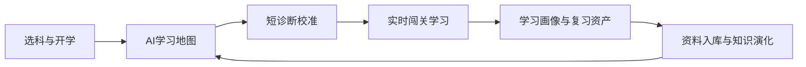

# AI主导学习平台-产品总纲

> 文档层级：平台层  
> 文档目的：统一平台总定位、竞争力结构和对外作品映射  
> 核心结论：平台成立的关键不是“会答题”，而是 AI 能不能持续主导学生的学习生命周期，并在学习中实时重排地图、沉淀资产、吸收新资料继续进化

## 一句话先记住

> AI主导学习平台负责持续组织学习，AI教师智能体群引擎负责执行诊断、重规划、教学、评分和笔记生成，高等数学负责作为第一门示范学科证明整套机制成立。

## 1. 平台的 5 个固定判断

1. 这不是单轮问答产品。  
   它默认先给学生学习地图，再把学生放进一条可继续推进的学习链上。
2. 这不是静态课程平台。  
   学习地图会根据学生状态实时演化。
3. 这不是只靠课程内容成立。  
   平台还要靠画像、笔记、思维导图、复习计划和知识演化一起成立。
4. 这不是只对学生说话。  
   平台管理者还能通过后台注入资料、观察演化和回看审计。
5. 这不是比赛包装和研发真源两套系统。  
   对外作品名与对内平台真源必须围绕同一套学习生命周期叙事。

## 2. 正式角色

| 角色 | 职责 |
| --- | --- |
| 学生 | 选科、闯关、作答、复习，接受 AI 全程推进 |
| 平台管理者 | 上传资料、观察知识演化、查看策略和异常 |
| 平台系统 | 建立学习启动会话、维护地图、记录画像、保存资产 |
| AI教师智能体群引擎 | 诊断、重规划、讲解、评分、画像更新、笔记生成、资料入库、策略优化 |

## 3. 价值链

## 4. 当前竞争力结构

### 4.1 学生主线

`选科 -> 学习启动会话 -> AI学习地图 -> 当前关卡 -> 作答反馈 -> 地图推进/补桥 -> 学习画像 -> 复习笔记包`

### 4.2 后台主线

`资料上传 -> 识别切分 -> 知识资产包 -> 知识演化记录 -> 策略分析与回滚`

### 4.3 学科与扩科主线

`统一对象契约 -> 学科目录与知识资产 -> 高数示范 -> 多学科扩展`

## 5. 为什么高数仍然重要

高等数学继续保留“第一门完整示范学科”定位，因为它能同时验证：

- 学习地图如何从零生成
- 补桥与回主线机制是否成立
- 思维导图和结构化笔记是否有用
- 多科并行与扩科机制是否可复用

## 6. 平台成立标准

平台至少要同时满足：

- 学生不用先会提问，也能被带入有效学习
- 学习地图能在学习中实时调整
- 每轮学习都能沉淀成复习资产
- 新资料进入后能改变知识资产和学习路径
- 单机架构就能支撑前台体验和后台自治

