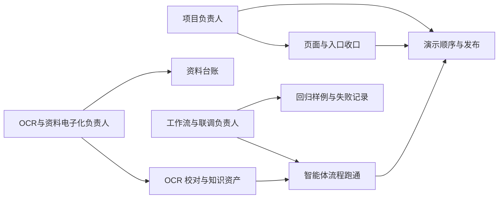

# AI主导学习平台-团队协作与分工

> 文档层级：平台层
> 文档目的：用比赛执行视角说明三类负责人分别抓什么、怎么交接、怎么一起把版本收口
> 核心结论：这套分工不是为了做组织架构展示，而是为了确保页面、知识内容、智能体流程和答辩口径能在同一版本里闭环
> 目标读者：项目负责人、OCR与资料电子化负责人、工作流与联调负责人、答辩准备者
> 推荐下一步：看完这篇后按岗位继续读三篇职责手册

## 与其他文档的边界

一句人话：这篇负责分工总览，不负责替岗位手册和技术真源发言。

本文只回答：

- 为什么当前要固定三类负责人
- 每个人的主责和交接关系是什么
- 比赛阶段到底看哪些产物算收口

对象字段、知识库规范、智能体职责和答辩口径，仍分别回到对应真源文档。

## 一句话先记住

一句人话：三个人不是各做一摊，而是共同把一个能演示、能解释、能发布的版本收出来。

> 项目负责人负责收口与发布，OCR与资料电子化负责人负责把资料变成可用知识资产，工作流与联调负责人负责把这些资产接进可运行的智能体流程。

## 1. 为什么要固定这三类负责人

一句人话：比赛周期短，最怕每个人都忙，但没人对最终版本负责。

## 2. 三个角色各自抓什么

一句人话：每个角色都有明确主责，但所有人都要对最终演示一致性负责。

| 角色 | 这一轮最重要的事 | 最终交付物 |
| --- | --- | --- |
| 项目负责人 | 收口首页、分类页、文档路线、演示顺序和发布 | 一个能打开就看懂的站点，一套统一讲法，一个可上线版本 |
| OCR与资料电子化负责人 | 把教材、讲义、试卷等原始资料整理成可检索、可追溯的知识资产 | 素材台账、OCR 校对稿、知识资产、标签与批次记录 |
| 工作流与联调负责人 | 把知识资产接进智能体流程，保证核心场景稳定可演示 | 跑通的场景清单、回归样例、失败说明和修复记录 |

## 3. 交接链路怎么走

一句人话：真正能收口的团队，不是分工清楚，而是交接清楚。

### 3.1 项目负责人 -> OCR与资料电子化负责人

- 这轮优先做哪些章节和资料
- 演示中必须优先支持的场景
- 命名方式、来源记录方式和最低交付标准

### 3.2 OCR与资料电子化负责人 -> 工作流与联调负责人

- 已清洗的知识资产
- 对应来源、标签、模块和章节信息
- 可以直接拿来做回归的示例问法

### 3.3 工作流与联调负责人 -> 项目负责人

- 已跑通的关键场景
- 当前失败点与影响范围
- 页面展示和答辩时必须呈现的结果

## 4. 比赛收口到底看什么

一句人话：最终看的是整站闭环，而不是谁单独做了多少条目。

| 收口项 | 最低要求 |
| --- | --- |
| 首页与入口 | 评委能快速看懂五大类入口 |
| 文档正文 | 平台、子引擎、学科、交付口径一致 |
| 知识资产 | 至少一条高质量高数示范链路可证明落地 |
| 智能体流程 | 核心场景可跑通并能解释失败边界 |
| 发布版本 | `npm run build` 通过，GitHub Pages 可访问 |

## 读完后你应该带走什么

- 这套分工的目标是把一个统一版本做出来，不是展示组织结构。
- 交接清晰比职责描述更重要。
- 如果站点入口、知识资产、流程演示和答辩话术对不上，就说明这套分工还没有真正收口。

## 本文不负责什么

- 不定义对象字段和知识库字段
- 不代替岗位职责手册细则
- 不代替智能体工作流联调手册
- 不代替最终答辩稿
