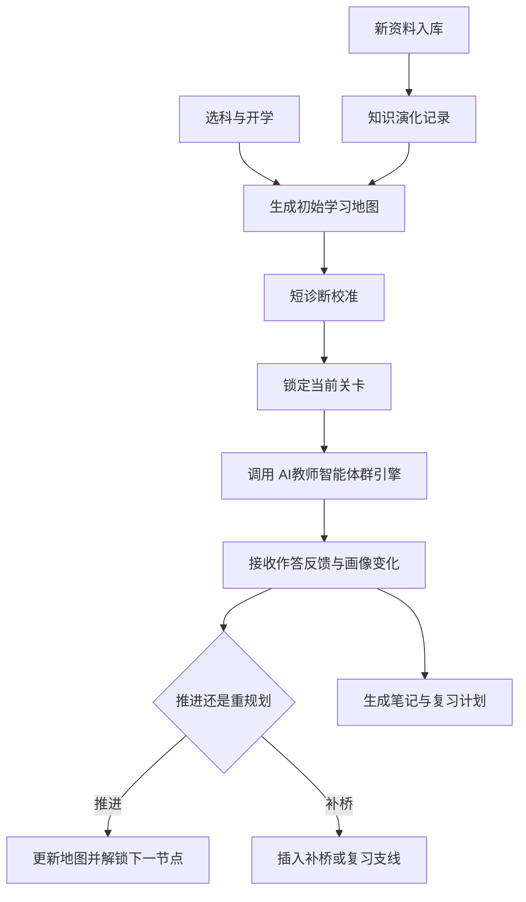

# AI主导学习平台-学习生命周期与编排策略

> 文档层级：平台层  
> 文档目的：定义平台如何组织选科、地图生成、闯关推进、重规划、画像回流和知识进化  
> 核心结论：平台编排不是简单推荐下一节课，而是持续决定“学生现在该打哪一关、什么时候补桥、什么时候回主线、什么时候沉淀复习资产”

## 1. 编排目标

平台编排固定要解决 6 件事：

1. 学生选科后如何快速开学
2. 初始学习地图如何生成
3. 短诊断如何校准起点
4. 学习中何时补桥、复习、挑战或回主线
5. 画像、笔记和复习计划如何回流
6. 新资料如何影响后续学习路径

## 2. 编排原则

| 原则 | 说明 |
| --- | --- |
| 地图先于自由问答 | 先给学习地图，再进入关卡学习 |
| 任务先于漫谈 | 默认锁定当前关卡，而不是无限自由聊天 |
| 回补优先于硬推 | 基础缺口出现时先补桥 |
| 调整必须可见 | 学生默认看到轻提示，展开可看完整原因 |
| 节点结束必须沉淀 | 每次关卡完成都要有反馈和笔记增量 |
| 新资料必须能回流 | 入库后的知识资产要影响后续地图 |

## 3. 主编排链路

## 4. 实时重规划规则

### 触发条件

- 连续错误
- 明显基础缺口
- 长时间卡住
- 重复追问同类问题
- 遗忘回落
- 兴趣下降信号

### 可执行动作

- 插入补桥节点
- 打开复习节点
- 降低任务难度
- 跳过已掌握节点
- 解锁挑战节点
- 接回主线

## 5. 正反馈回流

每次节点完成后，平台都要接收并回流：

- 通关结果
- 能力变化
- 地图推进结果
- 新节点解锁
- 下一步推荐

这些结果不仅展示给学生，也会继续影响后续任务安排。

## 6. 画像与笔记回流

平台固定依赖下面这些对象：

- 学习启动会话
- AI学习地图
- 闯关学习任务
- 学习画像
- 成长反馈事件
- 复习笔记包
- 知识演化记录

一句人话：

> 平台不是把历史聊天翻出来，而是把“你学过什么、卡在哪、补过什么、该复习什么”重新组织给下一轮学习。

