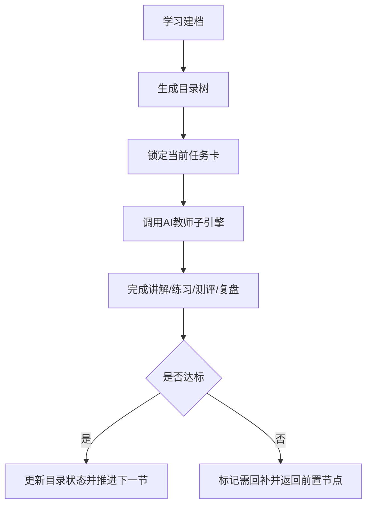
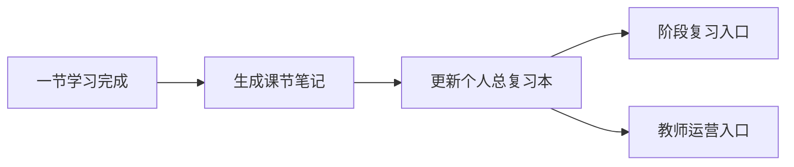

# AI主导学习平台-学习生命周期与编排策略

> 文档层级：平台层  
> 文档目的：定义平台如何组织学习生命周期，如何从目录树、任务卡走到双层笔记与阶段复习  
> 核心结论：平台编排不是“推荐内容”，而是要通过学习会话、当前任务卡、推进日志和双层笔记持续承担学习推进职责  
> 目标读者：产品设计者、研发协作者、学科设计者、答辩准备者  
> 上游真源：[AI主导学习平台-产品总纲.md](./AI主导学习平台-产品总纲.md)、[AI主导学习平台-平台需求与验收.md](./AI主导学习平台-平台需求与验收.md)  
> 下游引用：[AI主导学习平台-总体架构设计.md](./AI主导学习平台-总体架构设计.md)、[高等数学-平台接入示范.md](../学科层/高等数学-平台接入示范.md)、[学科接入模板.md](../学科层/学科接入模板.md)  
> 适用范围：平台学习编排、双层笔记、阶段复习机制

## 与其他文档的边界

本文只定义平台如何编排学习生命周期。  
AI教师子引擎内部的诊断、讲解、练习、测评、复盘细节由子引擎层负责。

## 一句话先记住

> 平台编排的核心，不是多给学生一些内容，而是让系统始终知道“学生现在在哪、这一轮学什么、下一步去哪”。

## 1. 一页结论

平台的学习编排核心不是“推荐一些内容”，而是让系统持续承担学习推进职责：

- 先建档，知道学生在哪
- 再排目录，让学生看见整体路径
- 再锁任务，告诉学生这一轮学什么
- 再调用子引擎完成本节教学闭环
- 最后沉淀成笔记、复习与后续推进依据

### 1.1 学习会话

本文是 `学习会话`、`当前任务卡`、`推进日志`、`会话与过程记录`、`轻量路由与启动装配` 的正式定义源。  

一句人话

> 如果没有“学习会话”这个统一对象，平台就很难把一轮学习真正组织起来。

学习会话至少要统一这些中文字段：

| 中文字段 | 说明 |
| --- | --- |
| 学习会话编号 | 当前这一轮学习的唯一编号 |
| 学生编号 | 当前学生的唯一标识 |
| 当前学科 | 这轮学习属于哪门课 |
| 当前阶段 | 补桥、主线还是综合训练 |
| 当前任务卡编号 | 这一轮绑定的是哪张当前任务卡 |
| 当前状态 | 进行中 / 暂停 / 已完成 / 回补中 |

## 2. 学习生命周期原则

| 原则 | 说明 |
| --- | --- |
| 先建档再推进 | 学生首次进入先形成学习档案和阶段判断 |
| 目录先于对话 | 学生先看见学习结构，再进入具体一节 |
| 任务先于自由问答 | 默认由系统给出当前任务卡，而不是完全等待学生发问 |
| 回补优先于硬推 | 学不动时先回补前置节点，而不是直接推进新章节 |
| 节后必有沉淀 | 每节结束后必须留下可复习资产 |
| 复习可以累积 | 单节笔记必须累计进总复习本和阶段复习入口 |

## 3. 统一学习结构

### 3.1 平台固定结构

`学科大类 -> 学科 -> 阶段 -> 模块 -> 课节 -> 状态`

### 3.2 字段口径

| 字段 | 含义 |
| --- | --- |
| 学科大类 | 数学 / 语言 / 计算机/专业技能 / 考试/证书 |
| 学科 | 例如高等数学、大学英语、程序设计 |
| 阶段 | 补桥阶段 / 主线阶段 / 综合训练阶段 |
| 模块 | 某一阶段下的主题模块 |
| 课节 | 学生实际完成的最小学习单元 |
| 状态 | 未开始 / 进行中 / 待复习 / 已掌握 / 需回补 |

## 4. 当前任务卡

这里继续沿用同一条平台编排主线，对 `当前任务卡` 给出正式定义。  

平台每一轮都应生成一张当前任务卡，至少包含：

| 字段 | 用途 |
| --- | --- |
| 当前目标 | 这一节到底要解决什么 |
| 预计时长 | 给学生时间预期 |
| 安排原因 | 为什么是这一节、为什么是现在 |
| 完成标准 | 怎样算本节过关 |
| 回补条件 | 没达标时回到哪里 |
| 下一步衔接 | 本节完成后预计进入什么内容 |

## 5. 自动推进机制

平台默认不采用“完全等学生来问”的原因：

- 很多学生不知道自己该问什么
- 基础薄弱学生更容易沉默，而不是更会表达问题
- 学习推进如果完全依赖主动提问，平台很难覆盖更多真实学生

### 5.1 推进日志

这里把 `推进日志` 作为 `会话与过程记录` 的正式组成部分固定下来。  

平台每推进或回补一次，至少要记清楚：

- 这一轮的学习会话编号
- 当前任务卡编号
- 本轮达标情况
- 为什么推进或为什么回补
- 下一轮要进入哪个节点

### 5.2 轻量路由与启动装配

这里正式把 `轻量路由与启动装配` 固定为平台编排术语。  
它指平台如何用最少的公共对象，把学生从建档一路稳定带进课节闭环，而不是让每一轮都重新决定从哪里开始。

| 启动装配环节 | 对应平台动作项 | 必须写入的过程记录 |
| --- | --- | --- |
| 学习建档 | 固定学生起点和阶段判断 | 学习会话编号、学生编号 |
| 目录树装配 | 把学科、阶段、模块、课节挂进统一结构 | 当前学科、当前阶段、当前位置 |
| 当前任务卡锁定 | 明确这一轮目标、完成标准和回补条件 | 当前任务卡编号、当前目标、回补条件 |
| 进入课节闭环 | 调用 AI教师子引擎执行本节教学 | 下一步动作、达标情况、推进理由 |

### 5.3 会话与过程记录

这里正式把 `会话与过程记录` 固定为平台编排术语。  
平台不是只保存“聊过什么”，而是要保存“这一轮为什么这样推进、推进后沉淀了什么”。

| 记录项 | 对应中文字段 | 用途 |
| --- | --- | --- |
| 学习会话 | 学习会话编号、当前状态 | 固定这一轮学习上下文 |
| 推进日志 | 达标情况、下一步动作、推进理由 | 记录为什么前进或回补 |
| 课节记录 | 课节笔记、复盘建议 | 沉淀单节学习结果 |
| 阶段沉淀 | 个人总复习本、阶段复习入口 | 把多轮结果重新组织起来 |

## 6. 双层笔记机制

### 6.1 课节笔记

课节笔记是每节结束后自动生成的一页学习卡，建议至少包含：

- 学科大类 / 学科 / 阶段 / 模块 / 课节
- 本节核心概念
- 人话解释
- 关键例子
- 易错点
- 学生本节卡点
- 复习建议
- 下一步衔接

### 6.2 个人总复习本

个人总复习本是平台为每个学生持续维护的动态学习资产，建议至少包含：

- 学科目录索引
- 已学章节摘要
- 高频错因
- 待复习清单
- 已掌握清单
- 下一阶段目标

### 6.3 双层关系

## 7. 阶段复习

阶段复习不是把历史聊天重新翻一遍，而是基于总复习本抽取：

- 当前最该回看的知识点
- 多轮重复出现的错因
- 尚未稳定掌握的课节
- 下一阶段前必须补齐的前置内容

## 8. 对学科层的约束

所有学科示范和模板都必须对齐下面 4 项公共接口：

1. 统一学习结构
2. 当前任务卡字段
3. 双层笔记字段
4. 阶段复习入口

## 读完后你应该带走什么

- `学习会话`、`当前任务卡`、`推进日志` 是平台编排层的 3 个关键对象。
- `会话与过程记录` 负责把这些对象真正串成一条可追踪、可回补、可复习的主链路。
- 学习编排的重点不是自由聊天，而是可持续推进。
- 学科层要接入平台，必须先对齐平台这套对象和字段。

## 下一篇建议阅读

1. [AI主导学习平台-总体架构设计.md](./AI主导学习平台-总体架构设计.md)
2. [../子引擎层/AI教师子引擎-PRD.md](../子引擎层/AI教师子引擎-PRD.md)
3. [../学科层/学科接入模板.md](../学科层/学科接入模板.md)

## 本文不负责什么

- 不定义 AI教师子引擎内部教学策略
- 不定义模型、工作流、知识库配置
- 不展开某一门学科的具体目录
- 不代替平台需求与验收文档
