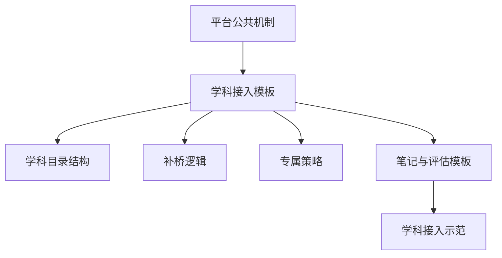

# AI主导学习平台-学科大类与接入规范

> 文档层级：平台层  
> 文档目的：定义平台的学科大类覆盖策略、统一接入接口和扩科边界  
> 核心结论：平台按学科大类扩展，是为了让目录树、当前任务卡、双层笔记和阶段复习可以跨学科复用，而不是为每门课重做一套机制  
> 目标读者：产品负责人、学科设计者、答辩准备者、后续扩科实施者  
> 上游文档：[AI主导学习平台-产品总纲.md](./AI主导学习平台-产品总纲.md)、[AI主导学习平台-总体架构设计.md](./AI主导学习平台-总体架构设计.md)  
> 下游文档：[高等数学-平台接入示范.md](../学科层/高等数学-平台接入示范.md)、[学科接入模板.md](../学科层/学科接入模板.md)  
> 适用范围：跨学科扩展与学科层接口设计  

## 与其他文档的边界

本文只定义“平台按哪些学科大类扩展、每门学科接入时要交什么接口”。  
本文不定义具体学科内容，也不替代高等数学示范或 AI教师子引擎策略。  

## 一句话先记住

> 平台扩学科时，最重要的不是多一门课，而是所有新学科都能继续复用平台的公共机制。  

## 1. 为什么要按学科大类组织

| 维度 | 按学科大类的好处 |
| --- | --- |
| 对学生 | 更容易理解自己当前学的是什么、平台未来还能学什么 |
| 对平台 | 能复用目录树、当前任务卡、双层笔记、阶段复习等公共机制 |
| 对学科设计 | 可以在统一模板下补充各学科的目录、补桥和专属策略 |
| 对比赛答辩 | 更容易说明“不是单学科 demo，而是可扩展的平台” |

### 图 1：为什么学科大类是平台级组织单位

## 2. 平台固定学科大类

| 学科大类 | 典型学科 | 为什么适合平台化管理 |
| --- | --- | --- |
| `数学` | 高等数学、线性代数、概率统计 | 概念递进清晰，补桥需求强，适合展示诊断、回补与图像化教学 |
| `语言` | 大学英语、日语、写作表达 | 需要长期积累、阶段复习和多轮反馈，适合双层笔记与阶段复盘 |
| `计算机/专业技能` | 程序设计、数据结构、办公技能 | 兼具概念理解与任务练习，适合任务卡与练习测评编排 |
| `考试/证书` | 四六级、计算机等级考试、教师资格证 | 目标清晰、周期明确，适合按阶段推进与专项复习管理 |

## 3. 学科接入统一接口

每门新学科接入平台时，至少提供 7 项接口：

| 中文接口项 | 说明 |
| --- | --- |
| 学科大类 | 该学科属于哪一个一级大类 |
| 学科定位 | 该学科在平台中的角色，是入门课、主线课、训练课还是证书课 |
| 目标人群 | 该学科主要面向谁，允许列多类人群 |
| 目录结构 | 至少补全 `阶段 -> 模块 -> 课节` 三级结构 |
| 补桥逻辑 | 学不动时回到哪里、什么情况下触发回补 |
| 专属策略 | 该学科最关键的教学风格、资源类型、评估方式 |
| 笔记与评估模板 | 该学科课节笔记字段、总复习本字段与阶段复习口径 |

### 图 2：学科接入的统一链路

## 4. 接入流程

1. 选定学科大类
2. 填写学科接入模板
3. 产出目录结构与补桥逻辑
4. 复用 AI教师子引擎公共教学闭环
5. 补充学科专属资源与示例章节
6. 做一份学科示范或轻量样例

## 5. 第一门示范学科

当前固定第一门完整示范学科为 `高等数学`，归属 `数学` 大类。  

原因：

- 它能清晰展示概念补桥与阶段推进
- 它能展示图像、公式、步骤化讲解等教学资产
- 它兼容基础薄弱学生、大学入门学生与应试场景学生

对应文档见：[高等数学-平台接入示范.md](../学科层/高等数学-平台接入示范.md)

## 6. 扩学科时不该做什么

- 不为每门学科重新发明目录树
- 不让某一门学科覆盖平台总纲
- 不把“人群差异”误写成“平台类别”
- 不把某一门学科的配置手册当成平台默认配置

## 读完后你应该带走什么

- 学科大类是平台组织单位，不是展示装饰。
- 新学科接入要复用平台机制，而不是重做平台。
- `学科接入模板` 是扩科的最小契约，必须和平台层对象保持兼容。

## 下一篇建议阅读

1. [学科接入模板.md](../学科层/学科接入模板.md)
2. [高等数学-平台接入示范.md](../学科层/高等数学-平台接入示范.md)
3. [AI主导学习平台-总体架构设计.md](./AI主导学习平台-总体架构设计.md)

## 本文不负责什么

- 不展开某一门学科的章节样例
- 不定义模型、知识库、工作流编排细节
- 不代替学科示范文档或配置手册
- 不代替比赛答辩稿
