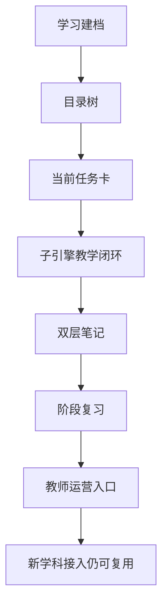

# AI主导学习平台-平台需求与验收

> 文档层级：平台层  
> 文档目的：把平台能力单独抽象为 FR / NFR / AC，并把对象级验收和边界级验收讲清楚  
> 核心结论：平台的最低成立条件不是“能回答问题”，而是能稳定组织 `建档 -> 目录树 -> 当前任务卡 -> 子引擎教学闭环 -> 双层笔记 -> 阶段复习 -> 教师运营入口 -> 学科接入` 这条链路  
> 目标读者：产品负责人、方案设计者、研发协作者、答辩准备者  
> 上游文档：[AI主导学习平台-产品总纲.md](./AI主导学习平台-产品总纲.md)  
> 下游文档：[AI主导学习平台-学习生命周期与编排策略.md](./AI主导学习平台-学习生命周期与编排策略.md)、[AI主导学习平台-总体架构设计.md](./AI主导学习平台-总体架构设计.md)、[AI教师子引擎-PRD.md](../子引擎层/AI教师子引擎-PRD.md)  
> 适用范围：平台层能力定义与验收口径  

## 与其他文档的边界

本文只定义平台能力，不定义 AI教师子引擎内部教学策略与模型选型。  
学科具体目录、补桥与样例由学科层文档负责。  

## 一句话先记住

> 平台验收看的是“学习链路是否成立”，不是“某一轮回答是否好听”。  

## 1. 一页结论

平台的最低成立条件不是“能回答问题”，而是能稳定组织完整学习生命周期：

`建档 -> 目录树 -> 当前任务卡 -> 子引擎教学闭环 -> 双层笔记 -> 阶段复习 -> 教师运营入口 -> 新学科接入`

平台验收看的是 8 类能力是否成立：

1. 建档
2. 学习目录树
3. 当前任务卡
4. 自动推进
5. 双层笔记
6. 阶段复习
7. 教师运营入口
8. 学科接入

### 图 1：平台验收主链路

## 2. 平台功能需求（PFR）

| 编号 | 能力 | 目标 | 关键输出 |
| --- | --- | --- | --- |
| `PFR-01` | 学习建档 | 记录学生初始水平、目标与学习上下文 | 学生学习档案、初始阶段判断 |
| `PFR-02` | 学习目录树 | 让学生始终看见整体路径和当前位置 | `学科大类 -> 学科 -> 阶段 -> 模块 -> 课节 -> 状态` |
| `PFR-03` | 当前任务卡 | 把本轮学习目标具体化，避免学生自己猜下一步 | 当前目标、预计时长、完成标准、回补条件 |
| `PFR-04` | 自动推进 | 学生不主动发问时也能被系统持续带着往前学 | 下一节推进或回补动作 |
| `PFR-05` | 双层笔记 | 每节结束后自动沉淀课节笔记，并累计到总复习本 | 课节笔记、个人总复习本增量 |
| `PFR-06` | 阶段复习 | 支持阶段性回看、抽取重点与复习编排 | 待复习清单、阶段复盘入口 |
| `PFR-07` | 教师运营入口 | 给教师或运营者提供轻量学情与干预入口 | 风险学生、卡住点、覆盖度、干预建议入口 |
| `PFR-08` | 学科接入 | 支持新学科按统一接口挂入平台，而不是重做产品 | 学科接入模板、学科分类、策略资产清单 |

## 3. 平台非功能需求（PNFR）

| 编号 | 类别 | 要求 |
| --- | --- | --- |
| `PNFR-01` | 边界清晰 | 平台层、子引擎层、学科层职责可明确区分 |
| `PNFR-02` | 可解释 | 学生能理解“为什么学这一节、学完去哪里” |
| `PNFR-03` | 可沉淀 | 每节学习都能形成可复习、可统计的结构化数据 |
| `PNFR-04` | 可扩展 | 新增学科时不重写平台主机制，只补学科资产 |
| `PNFR-05` | 可答辩 | 评委能在短时间内理解平台创新点与教育价值 |
| `PNFR-06` | 可落地 | 平台能力能被腾讯云 ADP 约束下的实现方案承接 |

## 4. 平台验收项（PAC）

| 编号 | 对应需求 | 通过标准 |
| --- | --- | --- |
| `PAC-01` | `PFR-01` | 学生首次进入后可形成学习档案，而不是直接丢给空白对话框 |
| `PAC-02` | `PFR-02` | 学生可见目录至少展示学科大类、学科、阶段、模块、课节、状态 |
| `PAC-03` | `PFR-03` | 每一轮学习都有明确任务卡，说明目标、完成标准与回补条件 |
| `PAC-04` | `PFR-04` | 学生不主动提问时，平台仍能推动至少一节学习向前完成 |
| `PAC-05` | `PFR-05` | 每节结束后自动生成课节笔记，并同步累计到总复习本 |
| `PAC-06` | `PFR-06` | 系统能从总复习本抽取阶段复习内容，而不是只保留原始聊天记录 |
| `PAC-07` | `PFR-07` | 教师侧至少能看到风险学生、卡点分布或学习推进停滞信息 |
| `PAC-08` | `PFR-08` | 高等数学以外的学科可依据接入模板补全接口，不需要改平台总纲 |

## 5. 对象级验收

### 图 2：对象级验收关系

对象级验收重点：

- `学习会话` 是否真的固定了当前这轮学习上下文
- `当前任务卡` 是否真的说明了目标、完成标准和回补条件
- `子引擎回流结果` 是否真的能驱动平台推进或回补
- `双层笔记` 是否真的能沉淀结构化资产

## 6. 平台与子引擎关系

| 对象 | 负责什么 | 不负责什么 |
| --- | --- | --- |
| 平台 | 建档、目录树、当前任务卡、自动推进、双层笔记、阶段复习、学科接入 | 不直接替代某一节课的教学执行 |
| AI教师子引擎 | 诊断、讲解、练习、测评、复盘、记忆更新、教师运营分析 | 不定义平台总结构、学科大类和跨学科扩展规则 |
| 学科层 | 目录结构、补桥逻辑、专属策略、资源模板 | 不定义跨学科公共机制 |

## 7. 推荐演示落点

答辩时平台层建议至少演示 4 个可视化结果：

1. 学生首次进入后的学习档案与目录树
2. 某一轮当前任务卡
3. 某一节结束后的双层笔记
4. 学科接入结构中“高等数学只是第一门示范”的位置

## 读完后你应该带走什么

- 平台验收首先验的是链路，其次才验某个单点功能。
- `学习会话`、`当前任务卡`、`子引擎回流结果` 是这次全文档统一口径里最关键的 3 个平台对象。
- 平台一旦能稳定跑通这条链路，扩学科就不是重做产品，而是补学科资产。

## 下一篇建议阅读

1. [AI主导学习平台-学习生命周期与编排策略.md](./AI主导学习平台-学习生命周期与编排策略.md)
2. [AI主导学习平台-总体架构设计.md](./AI主导学习平台-总体架构设计.md)
3. [../子引擎层/AI教师子引擎-PRD.md](../子引擎层/AI教师子引擎-PRD.md)

## 本文不负责什么

- 不定义 AI教师子引擎 FR-01~FR-12
- 不定义模型绑定和 ADP 配置细节
- 不展开高等数学章节内容本身
- 不代替比赛答辩稿
