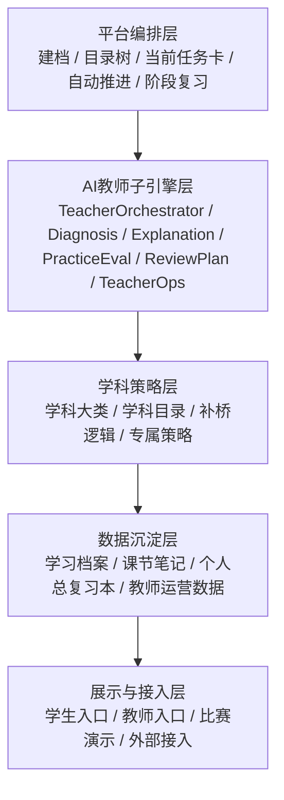
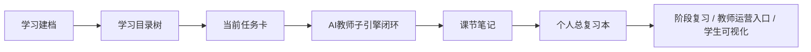
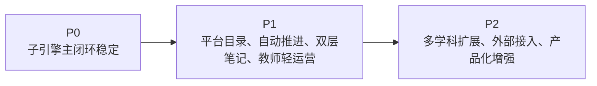

# AI主导学习平台-总体架构设计

> 文档层级：平台层  
> 文档目的：描述平台整体分层、关键对象和核心数据流  
> 核心结论：平台总体架构的关键，不是层数多，而是 `学习会话`、`当前任务卡`、`子引擎回流结果`、`学科接入模板` 这 4 个对象能否贯穿主链路  
> 目标读者：技术负责人、产品负责人、研发协作者、答辩准备者  
> 上游真源：[AI主导学习平台-产品总纲.md](./AI主导学习平台-产品总纲.md)、[AI主导学习平台-平台需求与验收.md](./AI主导学习平台-平台需求与验收.md)  
> 下游引用：[AI教师子引擎-技术方案.md](../子引擎层/AI教师子引擎-技术方案.md)、[高等数学-ADP配置手册.md](../学科层/高等数学-ADP配置手册.md)、[01-P0-Multi-Agent学生主闭环-架构设计.md](../子引擎层/实施附录/01-P0-Multi-Agent学生主闭环-架构设计.md)  
> 适用范围：平台级系统架构、数据对象与阶段路线

## 与其他文档的边界

本文只定义平台如何分层和流转数据。  
AI教师子引擎的内部实现与 ADP 细部配置由子引擎层、学科层文档负责。

## 一句话先记住

> 平台架构真正要回答的，不是“画多少层”，而是“哪些对象把整条学习链路串起来”。

## 1. 一页结论

平台总体架构分成 5 层：

1. 平台编排层：建档、目录树、任务卡、自动推进、阶段复习
2. AI教师子引擎层：诊断、讲解、练习、测评、复盘、教师运营分析
3. 学科策略层：学科大类下的具体学科目录、补桥逻辑、专属策略
4. 数据沉淀层：学习档案、课节笔记、个人总复习本、运营数据
5. 展示与接入层：学生侧页面、教师轻运营入口、比赛演示与外部接入

一句话：

> 平台负责“怎么带着学生学”，AI教师子引擎负责“这一节怎么教”，学科层负责“这门课接什么内容”，数据层负责“把学习沉淀下来”。

## 2. 总体分层

| 层 | 负责什么 |
| --- | --- |
| 平台编排层 | 组织学习生命周期的公共机制 |
| AI教师子引擎层 | 执行教学闭环 |
| 学科策略层 | 提供学科特有内容结构和策略 |
| 数据沉淀层 | 保存可复习、可分析、可扩展的数据资产 |
| 展示与接入层 | 服务学生、教师、比赛和系统接入 |

## 3. 关键对象

| 对象 | 用途 |
| --- | --- |
| `学习档案` | 定义学生初始阶段与学习上下文 |
| `学习会话` | 固定当前这一轮学习上下文 |
| `学习目录树` | 定义学科大类、学科、阶段、模块、课节和状态 |
| `当前任务卡` | 驱动当前一轮学习 |
| `子引擎回流结果` | 决定推进、回补和笔记沉淀 |
| `学科接入模板` | 保证新学科按统一契约进入平台 |
| `课节笔记` | 节后复习与数据沉淀 |
| `个人总复习本` | 多轮累计复习资产 |
| `教师运营摘要` | 风险学生、卡点和干预建议的聚合结果 |

## 4. 核心数据流

## 5. 平台与子引擎的连接点

平台主要通过下面 4 个连接点与子引擎协作：

1. 平台把当前任务和学科上下文交给子引擎
2. 子引擎返回本节学习结果与达标状态
3. 平台根据达标状态决定推进还是回补
4. 子引擎输出课节复盘结果，平台再沉淀成双层笔记

### 5.1 结构化连接点

建议平台与子引擎的连接点统一成下面 4 类对象：

- 学习会话
- 当前任务卡
- 子引擎回流结果
- 学科接入模板

## 6. 学科接入方式

每门新学科接入时，不重写平台层，只补以下内容：

- 学科所属大类
- 目录结构
- 补桥逻辑
- 专属策略
- 资源模板
- 示范章节或样例

## 7. 阶段路线

当前阶段结论：

- 子引擎闭环是平台成立的底座
- 平台化重点应放在目录树、任务卡、双层笔记和学科接入
- 高等数学先作为第一门学科跑通，再复制到其他学科大类

## 读完后你应该带走什么

- 平台架构的关键不只是分层，而是对象流转。
- `学习会话` 和 `子引擎回流结果` 是这次文档统一最需要补强的两个对象。
- 平台层、子引擎层、学科层必须通过统一对象和字段协作。

## 下一篇建议阅读

1. [AI主导学习平台-学习生命周期与编排策略.md](./AI主导学习平台-学习生命周期与编排策略.md)
2. [../子引擎层/AI教师子引擎-技术方案.md](../子引擎层/AI教师子引擎-技术方案.md)
3. [../学科层/学科接入模板.md](../学科层/学科接入模板.md)

## 本文不负责什么

- 不定义平台 FR/NFR/AC
- 不定义子引擎模型绑定和 ADP 具体配置
- 不展开某一门学科的详细目录
- 不代替比赛答辩稿
