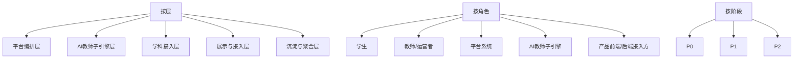
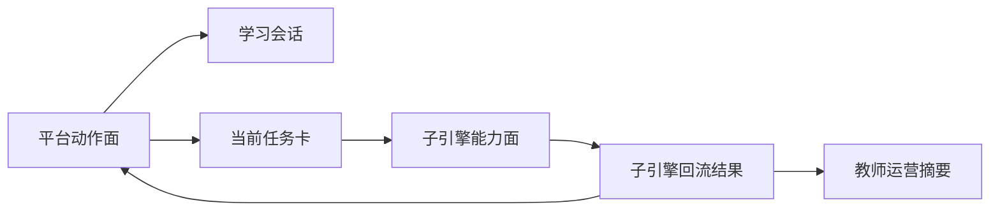
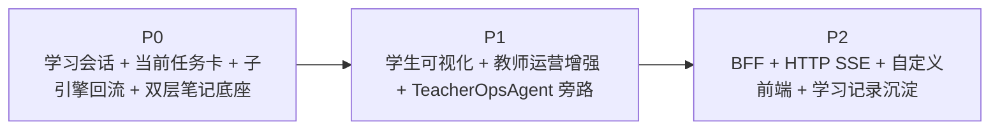

# AI主导学习平台-总体架构设计

> 文档层级：平台层  
> 文档目的：定义平台按层、按角色、按阶段的总体架构，以及平台动作面与子引擎能力面的边界  
> 核心结论：总体架构不只是“画几层”，而是说明“哪些角色沿哪些对象协作、不同阶段如何叠加、平台动作面与子引擎能力面怎样长期稳定分工”  
> 目标读者：技术负责人、产品负责人、研发协作者、公开读者  
> 上游真源：[AI主导学习平台-角色主线与阶段地图.md](./AI主导学习平台-角色主线与阶段地图.md)、[AI主导学习平台-统一对象与接口契约.md](./AI主导学习平台-统一对象与接口契约.md)  
> 下游引用：[AI教师子引擎-PRD.md](../子引擎层/AI教师子引擎-PRD.md)、[AI教师子引擎-技术方案.md](../子引擎层/AI教师子引擎-技术方案.md)、[高等数学-ADP配置手册.md](../学科层/高等数学-ADP配置手册.md)  
> 适用范围：平台总体分层、能力面边界、阶段叠加关系

## 与其他文档的边界

本文是 `平台动作面` 与 `子引擎能力面` 的唯一正式定义源。  
正式角色定义回到 [AI主导学习平台-角色主线与阶段地图.md](./AI主导学习平台-角色主线与阶段地图.md)，对象字段定义回到 [AI主导学习平台-统一对象与接口契约.md](./AI主导学习平台-统一对象与接口契约.md)。

## 一句话先记住

> 架构真正要回答的，不是“分几层”，而是“谁沿什么对象协作、哪个阶段叠加什么能力、平台负责什么、子引擎负责什么、接入层又把什么带进来”。

## 1. 三维架构视角

平台当前固定按 3 个维度理解：

1. 按层：系统分层与职责边界
2. 按角色：学生、教师/运营者、平台系统、AI教师子引擎、产品接入方如何协作
3. 按阶段：`P0 / P1 / P2` 如何从底座到产品化逐层成立

### 图 1：三维架构

## 2. 按层分工

| 层 | 负责什么 | 典型输出 |
| --- | --- | --- |
| 平台编排层 | 建档、会话、任务、推进、回补、阶段复习 | 学习档案、学习会话、当前任务卡 |
| AI教师子引擎层 | 学生教学执行线、教师运营支持线 | 子引擎回流结果、教师运营摘要 |
| 学科接入层 | 学科目录、补桥逻辑、模板资产、示范学科 | 学科接入模板、学科示范 |
| 展示与接入层 | 学生可视化、教师入口、自定义前端、`HTTP SSE` 接入 | 页面展示、接入请求、流式结果 |
| 沉淀与聚合层 | 课节笔记、个人总复习本、业务记录、教师聚合 | 双层笔记、学习记录沉淀、运营聚合 |

## 3. 平台动作面

`平台动作面` 固定回答“平台怎样持续组织学习、沉淀学习和扩科接入”。

| 平台动作项 | 作用 |
| --- | --- |
| 学习建档 | 固定学生起点与学习目标 |
| 目录与阶段装配 | 明确学生当前所处的大类、学科、阶段、模块、课节 |
| 学习会话续接 | 把当前学习轮次绑定到统一上下文 |
| 当前任务卡锁定 | 说明这一轮学什么、为什么是现在、达标标准是什么 |
| 推进与回补决策 | 决定下一轮继续前进还是返回前置节点 |
| 双层笔记沉淀 | 把单轮结果沉淀成课节笔记和个人总复习本 |
| 教师运营入口 | 把风险、趋势和干预建议暴露给教师/运营者 |
| 学科接入与扩科 | 用统一模板接入更多学科 |
| 产品接入与外部集成 | 通过 `BFF`、`HTTP SSE`、自定义前端维持上下文连续 |

## 4. 子引擎能力面

`子引擎能力面` 固定回答“AI教师子引擎怎样把这一轮真正教完，并向教师主线输出可用摘要”。

| 子引擎能力项 | 作用 |
| --- | --- |
| 学习诊断 | 判断学生当前层级、卡点和优先路径 |
| 分层讲解 | 输出适配学生层级的讲解结果 |
| 练习与测评 | 生成练习、判题、达标判断 |
| 错因归因 | 说明错误类型与纠偏方向 |
| 复盘与下一步建议 | 产出本轮总结、下一步动作和笔记增量 |
| 教师运营分析 | 聚合风险、趋势和干预建议，不阻塞学生主闭环 |

### 图 2：平台动作面与子引擎能力面

## 5. 按角色协作

正式角色定义以角色主线文档为准。  
总体架构只说明协作关系：

- 学生接收平台编排结果，并完成子引擎驱动的一轮学习
- 教师/运营者接收平台沉淀的风险与干预入口
- 平台系统负责让对象契约与阶段路线持续成立
- AI教师子引擎负责学生教学执行线与教师运营支持线
- 产品接入方负责把平台安全接入自己的前端/后端系统

## 6. 按阶段叠加

### 图 3：阶段叠加关系

固定口径：

- `P0` 只要求学生主闭环底座成立
- `P1` 增加教师主线与学生结果展示，但不替代 `P0`
- `P2` 增加产品接入与业务沉淀，但不重造平台和 ADP

## 7. 架构关键对象

字段级定义不在本文展开，但总体架构长期依赖下面这些对象贯穿主链：

- 学习档案
- 学习会话
- 当前任务卡
- 子引擎回流结果
- 课节笔记
- 个人总复习本
- 教师运营摘要
- 学科接入模板

## 8. 为什么 `P1 / P2` 是正式竞争力路线

因为平台不是只证明“AI 能教一轮”，还要证明：

- 学生能看见清晰结果
- 教师能识别风险并介入
- 产品接入方能安全透传上下文
- 学习结果能沉淀为后续可运营、可扩展的数据

## 读完后你应该带走什么

- 总体架构必须同时按层、按角色、按阶段理解。
- `平台动作面` 和 `子引擎能力面` 是长期稳定边界。
- `P1 / P2` 是正式主线，不是弱化附录。

## 下一篇建议阅读

1. [AI主导学习平台-角色主线与阶段地图.md](./AI主导学习平台-角色主线与阶段地图.md)
2. [AI主导学习平台-统一对象与接口契约.md](./AI主导学习平台-统一对象与接口契约.md)
3. [AI教师子引擎-技术方案.md](../子引擎层/AI教师子引擎-技术方案.md)

## 本文不负责什么

- 不定义对象字段细节
- 不展开某一学科的章节目录
- 不代替子引擎技术方案或配置手册
- 不代替比赛答辩稿
