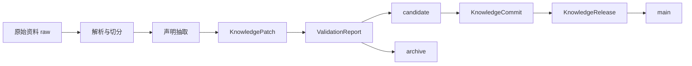

# AI主导学习平台-知识库结构与契约

> 文档层级：平台层  
> 文档目的：统一定义平台知识库的分层方式、知识版本契约、检索边界与更新流程  
> 核心结论：平台知识库不是“把资料都扔进 RAG”，而是按 `raw / candidate / main / archive` 四区治理、按统一字段约束、按 Git 化补丁和提交长期演化

## 与其他文档的边界

本文只负责回答：

- 平台知识库分几层、分几区
- 正式知识资产必须带哪些字段
- 新资料怎样从原始素材走到可发布主知识
- 学生主线和后台预览怎样检索不串区

本文不重新定义平台角色本体、不展开某门课的章节细节，也不替代某个 Agent 的提示词。

## 1. 一句话先记住

> 知识库真正要解决的不是“能不能回答”，而是“回答是否命中正确课程、正确章节、正确知识版本，并且能持续被维护、发布和回滚”。

## 2. 平台知识库的两层结构

### 2.1 内容层

| 层级 | 说明 |
| --- | --- |
| 平台知识库 | 平台规则、对象契约、接入规范、ADP 配置说明 |
| 学科教学知识库 | 课程总览、章节导学、知识点卡、例题卡、练习答案、错题卡、笔记资产 |
| 交付资料库 | 比赛口径、演示脚本、答辩资料 |

### 2.2 版本层

| 知识区 | 说明 |
| --- | --- |
| `raw` | 原始资料与 OCR 中间结果 |
| `candidate` | 候选知识区 |
| `main` | 主教学知识区 |
| `archive` | 归档与回滚区 |

## 3. 正式文档类型

| 文档类型 | 放在哪一层 | 是否进入学生主检索 |
| --- | --- | --- |
| 课程总览 | 学科教学知识库 | 是 |
| 章节导学 | 学科教学知识库 | 是 |
| 知识点卡 | 学科教学知识库 | 是 |
| 例题讲解卡 | 学科教学知识库 | 是 |
| 练习与标准答案 | 学科教学知识库 | 是 |
| 错题与误区卡 | 学科教学知识库 | 是 |
| 结构化笔记 | 学科教学知识库 | 是 |
| 思维导图资源 | 学科教学知识库 | 是 |
| 平台规则文档 | 平台知识库 | 否 |
| ADP 配置说明 | 平台知识库 | 否 |
| 比赛口径与演示稿 | 交付资料库 | 否 |

## 4. 字段契约

### 4.1 正式元数据字段

| 中文字段名 | 英文字段键 | 含义 |
| --- | --- | --- |
| 学科大类 | `subject_category` | 当前资产归属的大类 |
| 课程编号 | `course_id` | 当前课程正式标识 |
| 模块编号 | `module_id` | 课程模块边界 |
| 章节编号 | `chapter_id` | 当前章节正式标识 |
| 知识点编号 | `knowledge_point_id` | 当前资产主服务的知识点 |
| 资源类型 | `resource_type` | 文档属于哪种知识资产 |
| 难度 | `difficulty` | 资源适用层级 |
| 来源类型 | `source_type` | 当前文档从什么素材加工而来 |
| 来源等级 | `source_grade` | `A/B/C` 来源可信度等级 |
| 版本号 | `version` | 当前资产版本 |
| 发布通道 | `publish_channel` | `raw/candidate/main/archive` |
| 可信度分数 | `confidence_score` | 当前条目可信度 |
| 冲突等级 | `conflict_level` | `none/soft/hard` |
| 基线提交 | `base_commit_id` | 当前版本基于哪个提交演化 |

### 4.2 运行时字段

| 中文字段名 | 英文字段键 | 用途 |
| --- | --- | --- |
| 学生标识 | `VisitorId` | 锁定用户级连续性 |
| 学习会话 | `ConversationId` | 锁定本轮学习流 |
| 自定义变量 | `custom_variables.*` | 传递课程、节点、风险、知识范围 |
| 长期摘要记忆 | `SYS.Memory` | 只存画像摘要，不存业务真状态 |

## 5. 检索边界

### 5.1 学生正式检索

学生正式检索默认锁定：

- `subject_category`
- `course_id`
- `chapter_id`
- `publish_channel=main`

### 5.2 后台预览检索

后台预览检索可以额外读取：

- `publish_channel=candidate`
- 冲突说明
- 校验报告
- 影响域摘要

### 5.3 运行时原则

- `candidate` 可以参与后台预览和低风险参考
- `main` 才能参与正式学习地图、评分标准和关卡通过条件
- `raw` 和 `archive` 不进入学生正式检索

## 6. Git 化知识演化模型

### 6.1 核心对象

- `KnowledgePatch`
- `KnowledgeCandidate`
- `KnowledgeConflict`
- `KnowledgeCommit`
- `KnowledgeRelease`
- `KnowledgeRollback`
- `ValidationReport`
- `EvidenceBundle`

### 6.2 正式流程

### 6.3 门禁规则

- 高可信且无硬冲突：允许进入 `main`
- 中等可信或存在软冲突：停留在 `candidate`
- 低可信或存在硬冲突：进入 `archive`

## 7. ADP V1 映射方式

当前平台在腾讯 ADP 的第一版默认采用：

- 当前应用：`AI教师智能体`
- 当前主协同：`Multi-Agent + 工作流编排`
- 当前主接入：`HTTP SSE V2`
- 当前知识读取：主教学读 `main`，后台预览可读 `candidate`

V1 不额外引入自建 RAG 底座，但知识版本真源必须在平台外部维护。

## 8. 文档生命周期

1. 采集原始素材
2. 解析与切分
3. 声明抽取
4. 可信度与冲突判断
5. 进入候选区
6. 合并发布
7. 影响域重算
8. 回滚与归档

## 9. 验收标准

知识库结构成立至少要同时满足：

- 学生提问不会串到别的课程
- 正式学习链路只命中 `main`
- 新资料可以进入候选区而不污染主教学区
- 文档更新后能追溯版本、提交和回滚
- 受影响地图节点能局部重算，不会全库重建
