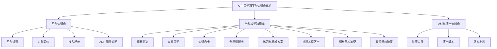
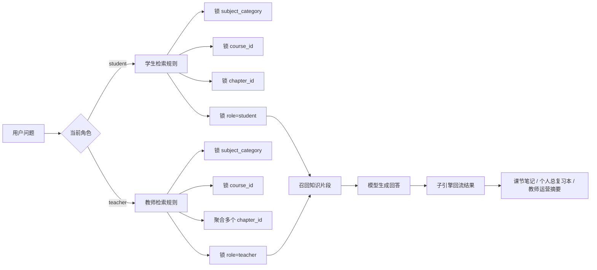

# AI主导学习平台-知识库结构与契约

> 文档层级：平台层  
> 文档目的：统一定义平台知识库的分层方式、文档类型、字段契约、检索边界与更新流程  
> 核心结论：平台知识库不是“把资料都扔进 RAG”，而是让平台层、学科层、教师侧与产品接入层沿同一套知识资产结构长期协作  
> 目标读者：产品负责人、知识库实施者、研发协作者、公开读者  
> 上游真源：[AI主导学习平台-统一对象与接口契约.md](./AI主导学习平台-统一对象与接口契约.md)、[AI主导学习平台-学科大类与接入规范.md](./AI主导学习平台-学科大类与接入规范.md)、[AI主导学习平台-学习生命周期与编排策略.md](./AI主导学习平台-学习生命周期与编排策略.md)  
> 下游引用：[高等数学-知识库接入与落库方案.md](../学科层/高等数学-知识库接入与落库方案.md)、[高等数学-ADP配置手册.md](../学科层/高等数学-ADP配置手册.md)、子引擎层实施文档、产品接入说明  
> 适用范围：平台知识库设计、ADP 入库策略、标签与字段约定、检索与验收

## 与其他文档的边界

本文只负责回答：

- 平台知识库应该分几层，分别放什么
- 每种知识文档的正式类型是什么
- 知识资产必须携带哪些字段
- 学生、教师与课堂重构场景怎样检索不串库
- 知识文档怎样从采集走到可维护的正式资产

本文不重新定义平台角色、对象字段本体、某一门学科的章节内容或某个 Agent 的内部提示词。

## 一句话先记住

> 知识库真正要解决的不是“能不能回答”，而是“回答是否命中正确课程、正确章节、正确角色语境，并且能持续被维护、扩科和回流”。

## 1. 为什么平台必须单独定义知识库结构

如果没有正式知识库结构，平台很容易退化成下面 3 种问题：

- 学生问答和比赛演示资料混检索，答案口径飘
- 章节边界不稳定，导数问题能串到积分或别的课程
- 教师运营、课堂重构、学生答疑各自堆一套资料，越做越难维护

当前平台已经有：

- 统一对象契约
- 学科接入模板
- ADP 接入路径

所以知识库层现在需要补的是：

- 统一的知识资产分层
- 统一的元数据字段
- 统一的命名和入库规范
- 统一的检索与回改规则

## 2. 知识库三层结构

### 图 1：知识库三层结构图

### 2.1 平台知识库

平台知识库回答“平台怎么工作、怎么接入、怎么维护”。

它主要服务：

- 研发协作者
- 配置实施者
- 新成员
- 公开说明阅读者

它不直接作为学生教学问答的课程知识来源。

### 2.2 学科教学知识库

学科教学知识库回答“这门课到底教什么、怎么学、怎么练、哪里容易错”。

它主要服务：

- 学生问答
- 课堂重构
- 教师运营
- 课后复习

这是 ADP 当前 `默认知识库` 里最应该优先完善的正式内容层。

### 2.3 交付与演示资料库

交付与演示资料库回答“比赛怎么讲、演示怎么跑、口径怎么统一”。

它主要服务：

- 比赛答辩
- 演示准备
- 对外口径整理

它不应参与正式学生教学检索，否则容易把“展示话术”混成“课程知识”。

## 3. 文档类型清单

| 文档类型 | 放在哪一层 | 解决什么问题 | 典型读者 | 是否进入学生问答 |
| --- | --- | --- | --- | --- |
| 课程总览 | 学科教学知识库 | 让学生和教师看清整门课结构 | 学生、教师 | 是 |
| 章节导学 | 学科教学知识库 | 解释每章目标、重点、难点 | 学生、教师 | 是 |
| 知识点卡 | 学科教学知识库 | 定义概念、条件、误区与例子 | 学生 | 是 |
| 例题讲解卡 | 学科教学知识库 | 提供步骤化讲解与变式 | 学生 | 是 |
| 练习与标准答案 | 学科教学知识库 | 提供训练、评分点与达标标准 | 学生、教师 | 是 |
| 错题与误区卡 | 学科教学知识库 | 聚焦常见错法与纠偏 | 学生、教师 | 是 |
| 课堂重构笔记 | 学科教学知识库 | 把录音、PPT、板书整理成课后可检索版本 | 学生、教师 | 是 |
| 教师运营摘要 | 学科教学知识库 | 输出风险、趋势、补讲建议 | 教师 | 教师侧是 |
| 平台规则文档 | 平台知识库 | 解释平台主线、对象、接入边界 | 研发、实施者 | 否 |
| ADP 配置说明 | 平台知识库 | 解释平台如何在 ADP 落地 | 实施者 | 否 |
| 比赛口径与演示稿 | 交付与演示资料库 | 统一展示表达 | 答辩准备者 | 否 |

## 4. 字段契约

### 4.1 正式元数据字段

| 中文字段名 | 英文字段键 | 含义 | 示例 | 是否必填 | 检索用途 |
| --- | --- | --- | --- | --- | --- |
| 学科大类 | `subject_category` | 当前资产归属的大类 | `数学` | 是 | 锁定大类边界 |
| 课程编号 | `course_id` | 当前课程的正式标识 | `高等数学_测试` | 是 | 锁定课程边界 |
| 模块编号 | `module_id` | 课程中的模块边界 | `M02-导数与微分` | 是 | 锁定模块范围 |
| 章节编号 | `chapter_id` | 当前章节或课节的正式标识 | `CH02-03` | 是 | 精准收敛章节检索 |
| 知识点编号 | `knowledge_point_id` | 当前资产主服务的知识点 | `KP-DERIVATIVE-LIMIT` | 是 | 命中具体知识点 |
| 资源类型 | `resource_type` | 文档属于哪种知识资产 | `知识点卡` | 是 | 控制召回类型 |
| 难度 | `difficulty` | 资源适用层级 | `基础` | 否 | 学生分层与练习推荐 |
| 角色 | `role` | 当前资源服务的主视角 | `student` / `teacher` | 是 | 学生教师检索隔离 |
| 来源类型 | `source_type` | 该文档从什么原始素材加工而来 | `教材整理` | 是 | 可信度与回溯 |
| 版本号 | `version` | 当前资产版本 | `v1.0` | 是 | 更新与回改跟踪 |
| 业务访问人编号 | `visitor_biz_id` | 同一用户连续学习身份 | `stu-2026-001` | 运行时必填 | 记忆与多轮连续性 |
| 自定义变量集合 | `custom_variables.*` | 运行时透传的业务上下文 | `course_id=高等数学_测试` | 运行时必填 | 课程、班级、入口等动态边界 |

### 4.2 `custom_variables.*` 推荐子字段

| 中文字段名 | 英文字段键 | 含义 | 示例 | 是否必填 | 检索用途 |
| --- | --- | --- | --- | --- | --- |
| 课程编号 | `custom_variables.course_id` | 对话实际服务的课程 | `高等数学_测试` | 是 | 与正式课程边界对齐 |
| 班级编号 | `custom_variables.class_id` | 当前学生所属班级 | `math-2026-01` | 否 | 教师聚合与班级运营 |
| 章节编号 | `custom_variables.chapter_id` | 当前轮次优先服务章节 | `CH02-03` | 是 | 限定当前轮次检索 |
| 角色 | `custom_variables.role` | 当前访问角色 | `student` | 是 | 学生与教师口径切换 |
| 接入来源 | `custom_variables.entry_source` | 当前从哪里接入 | `adp-debug` | 否 | 分析接入场景 |
| 任务卡编号 | `custom_variables.task_card_id` | 当前对话绑定任务卡 | `task-derivative-01` | 否 | 把检索拉回任务目标 |

### 4.3 字段默认约定

- `subject_category + course_id + module_id + chapter_id + knowledge_point_id` 是正式内容层的最小骨架
- `role` 不回收进模糊描述字段，必须显式存在
- `custom_variables.*` 负责承接运行时边界，不替代文档本体字段
- 未打标签或字段缺失的文档，不进入正式学生教学库

## 5. 命名规范

正式命名规范固定为：

`<课程>-<模块>-<章节>-<资源类型>-<知识点>.md`

示例：

- `高等数学_测试-M01函数极限连续-CH01函数概念-知识点卡-函数是规则.md`
- `高等数学_测试-M02导数与微分-CH02导数定义-例题讲解卡-导数定义求极限.md`
- `高等数学_测试-M05定积分及其应用-CH05面积问题-课堂重构笔记-定积分面积直觉.md`
- `高等数学_测试-M02导数与微分-CH02导数定义-错题与误区卡-把导数当作斜率结论背诵.md`

命名时固定遵守：

- 课程名写全，不使用含糊简称
- 模块与章节保持稳定编号
- 资源类型用正式白名单，不自造别名
- 知识点名尽量写“人话 + 具体点”，避免只有抽象词

## 6. 检索约束与回流规则

### 图 2：检索约束与回流图

### 6.1 学生检索默认规则

学生检索默认锁定：

- `subject_category`
- `course_id`
- `chapter_id`
- `role=student`

必要时再叠加：

- `knowledge_point_id`
- `difficulty`

### 6.2 教师检索默认规则

教师检索默认锁定：

- `subject_category`
- `course_id`
- `role=teacher`

教师检索可以跨多个 `chapter_id` 聚合，用于输出：

- 高频错因
- 班级停滞点
- 重点补讲章节
- 风险学生摘要

### 6.3 课堂重构场景规则

课堂重构不是简单转写，它应该：

- 先锁本次课堂对应的 `course_id`
- 再按课堂主题补 `module_id` 与 `chapter_id`
- 将结果拆成可检索的 `课堂重构笔记`
- 必要时抽出单独的 `知识点卡` 或 `例题讲解卡`

## 7. ADP V1 映射方式

当前平台在腾讯 ADP 的第一版默认采用：

- 当前应用：`ai教师智能体`
- 当前载体：`默认知识库`
- 当前主工具：`知识库问答 / KnowledgeRetrievalAnswer`

V1 不额外引入自建 RAG 底座，而是在 ADP 内用下面 4 个动作做隔离：

1. 分类分层  
   平台知识、学科知识、交付资料不要混导。
2. 字段补齐  
   所有正式教学文档都补齐课程、章节、角色与资源类型。
3. 标签语义统一  
   即使平台界面侧用“分类”展示，文档内容内部也保持统一字段口径。
4. 运行时变量透传  
   用 `visitor_biz_id + custom_variables.*` 锁住本轮上下文。

## 8. 文档生命周期

### 图 3：文档生命周期图

### 8.1 采集

原始素材允许来自：

- 教材
- 讲义
- PPT
- 课堂录音
- 板书照片
- 题库
- 典型错题
- 教师补讲记录

### 8.2 清洗

原始文件不是最终知识资产。正式入库前要先把它们整理成：

- 可阅读
- 可检索
- 可引用
- 可持续更新

的稳定文档。

### 8.3 回改

回改优先顺序固定为：

1. 先查文档有没有切错
2. 再查字段和标签有没有缺
3. 再查命名和章节边界是否稳定
4. 最后才改提示词或模型

## 9. 验收标准

知识库结构成立至少要同时满足：

- 学生提问不会串到别的课程
- 同一章节的概念、例题、练习能形成稳定召回
- 教师侧能聚合多章节风险，而不是只能看到零散对话
- 课堂重构结果能沉淀为正式知识资产，而不是一次性记录
- 文档更新后能追溯版本，不会越改越乱

## 读完后你应该带走什么

- 知识库必须按平台知识、学科知识、交付资料三层分开
- 正式教学文档必须沿统一字段契约组织，不能只靠“文档标题”碰运气
- ADP V1 先用默认知识库落地，但要靠分类、字段、标签和变量透传保证隔离

## 下一篇建议阅读

1. [AI主导学习平台-统一对象与接口契约.md](./AI主导学习平台-统一对象与接口契约.md)
2. [高等数学-知识库接入与落库方案.md](../学科层/高等数学-知识库接入与落库方案.md)
3. [高等数学-ADP配置手册.md](../学科层/高等数学-ADP配置手册.md)

## 本文不负责什么

- 不定义某一门课的具体章节细节
- 不定义某个 Agent 的最终提示词内容
- 不代替课堂素材采集工作本身
- 不代替比赛答辩口径

