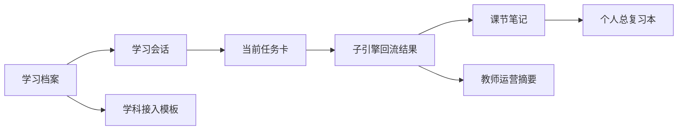

# AI主导学习平台-统一对象与接口契约

> 文档层级：平台层  
> 文档目的：统一定义平台活跃文档共同使用的核心对象、字段口径与接入上下文  
> 核心结论：平台真正稳定的前提，不只是有主线叙事，而是所有角色、阶段、学科和接入方都沿同一组对象和同一组字段协作  
> 目标读者：研发协作者、产品负责人、配置实施者、公开读者  
> 上游文档：[AI主导学习平台-角色主线与阶段地图.md](./AI主导学习平台-角色主线与阶段地图.md)  
> 下游引用：平台层、子引擎层、学科层、交付层全部现行主文档  
> 适用范围：核心对象、字段口径、接入字段、回流接口

## 与其他文档的边界

本文是以下对象与字段的唯一正式定义源：

- 学习档案
- 学习会话
- 当前任务卡
- 子引擎回流结果
- 课节笔记
- 个人总复习本
- 教师运营摘要
- 学科接入模板
- `visitor_biz_id`
- `custom_variables`
- `AppKey`
- `chapter_id`
- `role`

其他文档提到这些对象时，只负责承接、引用、举例，不再重复定义其字段本体。

## 一句话先记住

> 平台能不能长期成立，关键不只是叙事，而是这些对象能不能在平台层、子引擎层、学科层、产品接入层之间长期稳定流转。

## 1. 对象总览

### 图 1：对象主链

## 2. 学习档案

一句人话：

> 学习档案回答的是“这个学生是谁、从哪里起步、当前在走哪条学习路径”。

| 中文字段 | 说明 |
| --- | --- |
| 学生编号 | 平台内用于区分学生的标识 |
| 当前学科大类 | 当前学习所在的大类 |
| 当前学科 | 当前学习所属学科 |
| 初始阶段判断 | 当前从补桥、主线还是综合训练起步 |
| 学习目标 | 当前阶段性目标 |
| 当前状态摘要 | 当前总体推进状态 |

## 3. 学习会话

一句人话：

> 学习会话回答的是“这一轮学习是谁、接着哪一轮、围绕什么任务继续往前走”。

| 中文字段 | 说明 |
| --- | --- |
| 学习会话编号 | 当前轮次的唯一编号 |
| 学生编号 | 当前轮次属于哪个学生 |
| 当前学科 | 当前轮次关联的学科 |
| 当前阶段 | 当前轮次所在阶段 |
| 当前任务卡编号 | 本轮绑定的任务卡 |
| 当前状态 | 进行中、待回补、已完成等状态 |

## 4. 当前任务卡

一句人话：

> 当前任务卡回答的是“这一轮到底学什么、为什么是现在、怎么算过关、没过关回到哪里”。

| 中文字段 | 说明 |
| --- | --- |
| 当前任务卡编号 | 本轮任务的唯一编号 |
| 当前目标 | 本轮主要要完成什么 |
| 安排原因 | 为什么平台把这轮安排在现在 |
| 完成标准 | 什么情况下算本轮达标 |
| 回补条件 | 什么情况下触发回补 |
| 下一步衔接 | 达标后预期进入哪里 |

## 5. 子引擎回流结果

一句人话：

> 子引擎回流结果不是一句“学得还不错”，而是一份平台真能接住并继续推进的结构化结果。

| 中文字段 | 说明 |
| --- | --- |
| 学习会话编号 | 把本轮结果挂回正确轮次 |
| 当前任务卡编号 | 指向本轮围绕的任务 |
| 学习层级 | 当前学生理解层级 |
| 当前卡点 | 本轮最主要阻塞点 |
| 达标程度 | 平台推进或回补的核心依据 |
| 下一步动作 | 推进、回补或阶段复习建议 |
| 笔记增量 | 用于更新课节笔记与个人总复习本 |
| 风险标记 | 是否进入教师运营关注范围 |
| 本轮总结 | 供学生和平台共同引用的复盘结果 |

## 6. 课节笔记

一句人话：

> 课节笔记回答的是“这一节到底学到了什么、哪里容易错、接下来该怎么复习”。

| 中文字段 | 说明 |
| --- | --- |
| 学科 | 本节所属学科 |
| 阶段 | 本节所在阶段 |
| 模块 | 本节所在模块 |
| 课节 | 本节具体课节 |
| 本节核心概念 | 这一节最重要的概念 |
| 人话解释 | 面向学生的简明解释 |
| 关键示例 | 本节核心例子 |
| 易错点 | 本节高频错误 |
| 学生本节卡点 | 学生个人卡点 |
| 复习建议 | 下一次复习怎么做 |

## 7. 个人总复习本

一句人话：

> 个人总复习本回答的是“这个学生长期积累下来的学习资产长什么样，后面该怎么回看”。

| 中文字段 | 说明 |
| --- | --- |
| 学科目录索引 | 已学内容索引 |
| 已学章节摘要 | 已完成内容的长期摘要 |
| 高频错因 | 多轮出现的问题模式 |
| 待复习清单 | 后续必须回看的内容 |
| 已掌握清单 | 当前相对稳定掌握的内容 |
| 下一阶段目标 | 下一阶段建议 |

## 8. 教师运营摘要

一句人话：

> 教师运营摘要回答的是“老师现在最该关注谁、关注什么、能怎么干预”。

| 中文字段 | 说明 |
| --- | --- |
| 风险学生标记 | 哪些学生进入重点关注范围 |
| 推进停滞点 | 卡在哪一阶段、模块或课节 |
| 高频错因 | 群体或个人共性问题 |
| 趋势摘要 | 班级或群体层面的变化趋势 |
| 干预建议 | 教师侧可执行动作 |

## 9. 学科接入模板

一句人话：

> 学科接入模板回答的是“新学科要按什么槽位挂进平台，而不是再造一套平台”。

| 中文字段 | 说明 |
| --- | --- |
| 学科名称 | 新接入的具体学科 |
| 学科大类 | 归属的大类 |
| 学科定位 | 入门课、主线课、训练课、考证课等 |
| 目标人群 | 该学科服务的典型人群 |
| 目录结构 | 阶段、模块、课节结构 |
| 补桥逻辑 | 卡住时回到哪里 |
| 专属策略 | 讲解、练习、评估偏好 |
| 模板资产 | 学科资源、示范章节、图像、题库等 |

## 10. 接入上下文字段

### 10.1 固定字段

| 字段 | 含义 | 约束 |
| --- | --- | --- |
| `visitor_biz_id` | 终端用户唯一业务标识 | 必须稳定，用于跨轮次连续性 |
| `custom_variables` | 业务上下文透传容器 | 用于透传课程、班级、角色等业务边界 |
| `AppKey` | 调用应用能力的密钥 | 应由后端托管，不直接暴露前端 |
| `chapter_id` | 当前章节或课节边界标识 | 作为显式命名槽位保留 |
| `role` | 当前访问角色标识 | 作为显式命名槽位保留 |

### 10.2 默认约定

- `chapter_id` 与 `role` 保持显式命名，不塞回模糊字段
- `course_id` 与 `class_id` 继续作为推荐扩展字段保留在 `custom_variables` 语义内
- `custom_variables` 用来承接课程、班级、角色、接入来源等业务边界，而不是替代核心对象本体

## 11. 对象流转规则

| 从哪里来 | 到哪里去 | 为什么 |
| --- | --- | --- |
| 学习档案 | 学习会话 | 把学生总体起点转成当前轮次上下文 |
| 学习会话 | 当前任务卡 | 把当前轮次落到本轮任务 |
| 当前任务卡 | 子引擎回流结果 | 让子引擎围绕固定任务输出结构化结果 |
| 子引擎回流结果 | 课节笔记 / 个人总复习本 | 把单轮结果转成长短期学习资产 |
| 子引擎回流结果 | 教师运营摘要 | 把风险与趋势带给教师主线 |
| 学科接入模板 | 学习档案 / 当前任务卡 / 学科上下文 | 让新学科沿统一对象链工作 |

## 读完后你应该带走什么

- 对象契约是全仓库活跃文档的统一定义底座。
- 子引擎回流结果、教师运营摘要、接入字段现在都有明确正式定义源。
- 其他文档今后只承接，不重定义。

## 下一篇建议阅读

1. [AI主导学习平台-角色主线与阶段地图.md](./AI主导学习平台-角色主线与阶段地图.md)
2. [AI主导学习平台-学习生命周期与编排策略.md](./AI主导学习平台-学习生命周期与编排策略.md)
3. [AI教师子引擎-技术方案.md](../子引擎层/AI教师子引擎-技术方案.md)

## 本文不负责什么

- 不定义某个页面怎么展示
- 不定义子引擎内部模型绑定
- 不定义某门学科的实际章节内容
- 不代替比赛答辩稿
