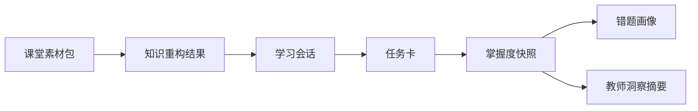

# AI主导学习平台-统一对象与接口契约

> 文档层级：平台层  
> 文档目的：统一比赛版与工程版共用的核心对象、固定字段和接口分组  
> 核心结论：平台要长期成立，必须让课堂资料、知识重构、伴学会话、错题复练和教师洞察沿同一套对象流转  
> 目标读者：后端开发、前端开发、接口联调人员、文档编写者  
> 上游真源：[AI主导学习平台-总体架构设计.md](./AI主导学习平台-总体架构设计.md)  
> 下游引用：[AI教师子引擎-PRD.md](../子引擎层/AI教师子引擎-PRD.md)、[AI教师子引擎-技术方案.md](../子引擎层/AI教师子引擎-技术方案.md)、[06-接口与API说明.md](../../作品文档/06-接口与API说明.md)

## 与其他文档的边界

本文只负责统一对象和接口契约。  
页面怎么展示，不在本文定义；算法如何实现，不在本文定义；比赛叙事如何表达，以作品文档和交付文档为准。

## 一句话先记住

> 如果没有统一对象，前端工作台、后端单体服务、AI 子引擎和比赛材料很快就会出现四套不同说法。

## 1. 正式公共对象

| 对象名 | 作用 | 典型来源 | 典型去向 |
| --- | --- | --- | --- |
| 课堂素材包 | 承载课件、讲义、题单、图片、转写文本及元数据 | 教师上传、管理导入 | 知识重构 |
| 知识重构结果 | 承载知识点、先修关系、例题、误区、任务建议 | 子引擎解析 | 学生伴学、教师洞察 |
| 学习会话 | 承载学生一次持续学习的上下文和状态 | 平台编排层 | 伴学会话页、评分、复盘 |
| 任务卡 | 承载当前学习目标、达标规则和下一步衔接 | 平台编排层 | 子引擎执行、前端展示 |
| 掌握度快照 | 承载知识点掌握评分、风险等级、阶段判断 | 评分与复盘 | 错题复练、教师洞察 |
| 错题画像 | 承载错因分类、变式建议、补桥任务 | 错题分析 | 错题与复习页 |
| 教师洞察摘要 | 承载班级风险聚合、热区知识点、干预建议 | 教师侧聚合 | 教师洞察页 |
| 访问凭证 | 承载账号、角色、权限、接入来源与有效期 | 管理配置 | 登录、访问校验、评委体验 |

## 2. 推荐最小字段

### 2.1 课堂素材包

| 字段 | 说明 |
| --- | --- |
| `materialPackId` | 素材包唯一标识 |
| `courseName` | 课程名 |
| `chapterName` | 章节名 |
| `sourceType` | 文件、图片、文本、转写等 |
| `fileList` | 素材文件集合 |
| `parseStatus` | 待解析、处理中、成功、失败 |
| `uploadedBy` | 上传人 |
| `uploadedAt` | 上传时间 |

### 2.2 知识重构结果

| 字段 | 说明 |
| --- | --- |
| `reconstructionId` | 重构结果标识 |
| `materialPackId` | 关联课堂素材包 |
| `knowledgePoints` | 知识点列表 |
| `prerequisiteGraph` | 先修关系图 |
| `exampleSet` | 例题集合 |
| `riskTips` | 易错点与误区 |
| `recommendedTasks` | 推荐任务 |
| `status` | 生成状态 |

### 2.3 学习会话

| 字段 | 说明 |
| --- | --- |
| `sessionId` | 会话唯一标识 |
| `studentId` | 学生标识 |
| `courseName` | 当前课程 |
| `chapterId` | 当前章节 |
| `reconstructionId` | 关联知识重构结果 |
| `currentTaskCardId` | 当前任务卡 |
| `status` | 进行中、待复练、已完成 |

### 2.4 任务卡

| 字段 | 说明 |
| --- | --- |
| `taskCardId` | 任务卡标识 |
| `goal` | 当前目标 |
| `whyNow` | 当前安排原因 |
| `passRule` | 达标条件 |
| `fallbackRule` | 回补条件 |
| `knowledgeScope` | 覆盖知识点 |
| `suggestedAction` | 推荐动作 |

### 2.5 掌握度快照

| 字段 | 说明 |
| --- | --- |
| `snapshotId` | 快照标识 |
| `sessionId` | 关联学习会话 |
| `knowledgeScores` | 知识点得分 |
| `masteryLevel` | 掌握等级 |
| `riskLevel` | 风险等级 |
| `nextAction` | 下一步动作 |
| `generatedAt` | 生成时间 |

### 2.6 错题画像

| 字段 | 说明 |
| --- | --- |
| `errorProfileId` | 错题画像标识 |
| `snapshotId` | 关联掌握度快照 |
| `errorTypes` | 错因分类 |
| `rootCause` | 根因摘要 |
| `variantExercises` | 变式题集合 |
| `reviewPlan` | 复习建议 |

### 2.7 教师洞察摘要

| 字段 | 说明 |
| --- | --- |
| `insightId` | 洞察摘要标识 |
| `classId` | 班级标识 |
| `riskStudents` | 风险学生列表 |
| `hotKnowledgePoints` | 高频风险知识点 |
| `trendSummary` | 趋势摘要 |
| `interventionSuggestions` | 干预建议 |
| `generatedAt` | 生成时间 |

### 2.8 访问凭证

| 字段 | 说明 |
| --- | --- |
| `credentialId` | 凭证标识 |
| `accountName` | 账号名 |
| `role` | 学生、教师、管理员、评委 |
| `accessScope` | 权限范围 |
| `expiresAt` | 过期时间 |
| `status` | 可用、停用、失效 |

## 3. 固定接入字段

以下字段为平台外部接入时的固定保留字段：

| 字段 | 含义 | 约束 |
| --- | --- | --- |
| `visitor_biz_id` | 终端用户业务标识 | 必须稳定，便于跨会话衔接 |
| `custom_variables` | 业务上下文透传容器 | 透传班级、课程、来源等 |
| `chapter_id` | 当前章节标识 | 显式保留 |
| `role` | 当前访问角色 | 显式保留 |

说明：

- `AppKey` 作为服务端托管凭证，不作为前端直传字段暴露
- `custom_variables` 用于扩展，不替代正式核心对象

## 4. 正式对象流转

主规则：

- 知识重构结果必须回链到课堂素材包
- 学习会话和任务卡必须能回链到知识重构结果
- 掌握度快照和错题画像必须能回链到具体会话
- 教师洞察摘要必须来自多个掌握度快照的聚合，而不是孤立对话

## 5. 正式接口分组

平台公开接口固定分为 7 组：

1. 素材上传与解析
2. 知识重构查询
3. 学习会话创建
4. 流式伴学对话
5. 作答提交与评分
6. 教师洞察查询
7. 管理配置与访问校验

输出协议：

- 查询和提交类接口使用 REST
- 伴学过程使用 SSE

## 6. 术语一致性原则

所有正式文档、页面文案、答辩材料统一使用以下术语：

- 外部作品名：知脉课堂：面向高校课堂的全模态知识重构与自适应伴学智能体
- 内部平台名：AI主导学习平台
- 子引擎名：AI教师子引擎
- 示例学科：高等数学

## 读完后你应该带走什么

- 8 个公共对象已经形成比赛版与工程版共用的正式底座。
- 接口已经固定为 REST + SSE 的混合模式。
- 之后的页面设计、PPT、视频和答辩口径都应回链到本文对象命名。

## 下一篇建议阅读

1. [AI教师子引擎-PRD.md](../子引擎层/AI教师子引擎-PRD.md)
2. [AI教师子引擎-技术方案.md](../子引擎层/AI教师子引擎-技术方案.md)
3. [06-接口与API说明.md](../../作品文档/06-接口与API说明.md)
