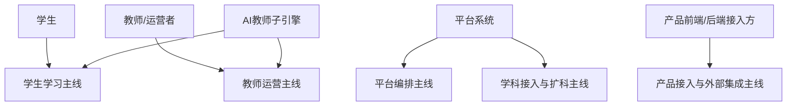
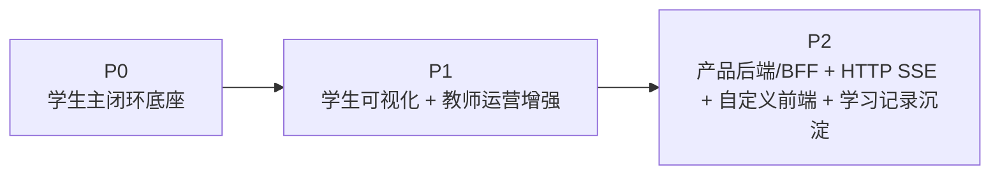

# AI主导学习平台-角色主线与阶段地图

> 文档层级：平台层  
> 文档目的：定义平台正式角色、5 条主线，以及各角色在 `P0 / P1 / P2` 的职责变化  
> 核心结论：平台不再按“某个比赛叙事角色”组织，而是按正式角色主线和阶段主线组织；学科接入与扩科属于平台能力主线，不再保留“学科设计者”正式角色  
> 目标读者：新成员、产品负责人、研发协作者、公开读者  
> 上游文档：[AI主导学习平台-产品总纲.md](./AI主导学习平台-产品总纲.md)  
> 下游引用：[AI主导学习平台-学习生命周期与编排策略.md](./AI主导学习平台-学习生命周期与编排策略.md)、[AI主导学习平台-总体架构设计.md](./AI主导学习平台-总体架构设计.md)、[AI主导学习平台-平台需求与验收.md](./AI主导学习平台-平台需求与验收.md)、[AI教师子引擎-PRD.md](../子引擎层/AI教师子引擎-PRD.md)  
> 适用范围：正式角色口径、阶段地图、主线分工

## 与其他文档的边界

本文是正式角色与阶段地图的唯一正式定义源。  
对象与字段定义不在本文展开，统一见 [AI主导学习平台-统一对象与接口契约.md](./AI主导学习平台-统一对象与接口契约.md)。

## 一句话先记住

> 平台当前固定只有 5 个正式角色：学生、教师/运营者、平台系统、AI教师子引擎、产品前端/后端接入方；学科接入与扩科不是第 6 个角色，而是平台能力主线。

## 1. 平台固定的 5 条主线

1. 学生学习主线
2. 教师运营主线
3. 平台编排主线
4. 学科接入与扩科主线
5. 产品接入与外部集成主线

### 图 1：主线与角色关系

## 2. 正式角色定义

| 角色 | 固定职责 | 不负责什么 |
| --- | --- | --- |
| 学生 | 完成学习、查看任务与沉淀结果、进入阶段复习 | 不负责平台编排与教师运营判断 |
| 教师/运营者 | 查看风险、趋势和干预入口，执行教师主线 | 不直接替学生走学生主闭环 |
| 平台系统 | 组织学习生命周期、统一对象契约、沉淀资产、扩科、转接外部接入 | 不替代子引擎完成单轮教学 |
| AI教师子引擎 | 承担学生教学执行线与教师运营支持线 | 不定义平台对象契约和平台总结构 |
| 产品前端/后端接入方 | 承接前端展示、后端透传、业务沉淀、外部系统集成 | 不重造平台本体和子引擎编排 |

## 3. 阶段地图

| 阶段 | 正式定位 | 阶段关键词 |
| --- | --- | --- |
| `P0` | 学生主闭环底座 | 学生推进、学习会话、当前任务卡、子引擎回流、双层笔记底座 |
| `P1` | 学生可视化 + 教师运营增强 | 结果可视化、风险识别、趋势聚合、干预建议 |
| `P2` | 产品后端/BFF + `HTTP SSE` + 自定义前端 + 学习记录沉淀 | 接入、透传、产品化、沉淀、聚合 |

### 图 2：阶段地图

## 4. 各角色在 P0 / P1 / P2 做什么

### 4.1 学生

| 阶段 | 做什么 | 依赖什么 | 输出什么 | 不承担什么 |
| --- | --- | --- | --- | --- |
| `P0` | 完成一轮轮学习任务与回补 | 学习会话、当前任务卡、子引擎教学闭环 | 学习结果、练习反馈、笔记增量 | 不承担教师运营或产品接入逻辑 |
| `P1` | 在学生主线下查看更清晰结果卡与复盘结果 | `P0` 底座 + 可视化结果 | 更容易理解的学习结果与复习路径 | 不承担教师判断 |
| `P2` | 在自定义前端或产品端继续学习 | `BFF`、`HTTP SSE`、接入连续性 | 更稳定的跨端学习体验 | 不承担后端沉淀逻辑 |

### 4.2 教师/运营者

| 阶段 | 做什么 | 依赖什么 | 输出什么 | 不承担什么 |
| --- | --- | --- | --- | --- |
| `P0` | 仅保留教师主线接口预留 | 学生主闭环底座 | 基础观察位 | 不阻塞学生主闭环 |
| `P1` | 查看风险学生、班级趋势、干预建议 | `TeacherOpsAgent`、教师运营摘要 | 干预动作、运营判断 | 不接管学生主答复 |
| `P2` | 在产品端或业务后台持续使用教师数据 | 学习记录沉淀、教师聚合输出 | 更稳定的运营入口 | 不重写平台编排 |

### 4.3 平台系统

| 阶段 | 做什么 | 依赖什么 | 输出什么 | 不承担什么 |
| --- | --- | --- | --- | --- |
| `P0` | 建档、续接学习会话、锁定当前任务卡、沉淀双层笔记 | 统一对象契约、子引擎回流结果 | 学生主闭环底座 | 不依赖重后端或教师运营增强 |
| `P1` | 增补学生结果展示与教师运营编排节点 | `P0` 底座 + 教师摘要回流 | 教师主线增强、学生可视化增强 | 不替代子引擎判断 |
| `P2` | 增补接入字段、`BFF`、沉淀、聚合接口 | 产品接入方、业务库、`HTTP SSE` | 接入与沉淀主线 | 不重造 ADP 编排系统 |

### 4.4 AI教师子引擎

| 阶段 | 做什么 | 依赖什么 | 输出什么 | 不承担什么 |
| --- | --- | --- | --- | --- |
| `P0` | 承接学生教学执行线：诊断、讲解、练习、测评、复盘 | 当前任务卡、学科上下文 | 子引擎回流结果 | 不接管平台编排 |
| `P1` | 增补教师运营支持线：风险识别、趋势聚合、干预建议 | 多轮学习结果与聚合信息 | 教师运营摘要 | 不阻塞学生主闭环 |
| `P2` | 面向接入接口稳定输出流式结果与结构化回流 | `HTTP SSE`、接入字段、产品接入方 | 可接入的教学与运营输出 | 不替代 `BFF` 与业务沉淀 |

### 4.5 产品前端/后端接入方

| 阶段 | 做什么 | 依赖什么 | 输出什么 | 不承担什么 |
| --- | --- | --- | --- | --- |
| `P0` | 只需知道后续有接入位 | 学生主闭环底座 | 接入预留 | 不作为当前前置依赖 |
| `P1` | 可开始承接轻量展示与教师侧视图 | `P1` 输出结构 | 初步产品视图 | 不要求产品后端前置 |
| `P2` | 正式承接自定义前端、产品后端/BFF、学习记录沉淀 | `AppKey`、`visitor_biz_id`、`custom_variables`、`HTTP SSE` | 产品接入与业务沉淀主线 | 不重造平台和子引擎 |

## 5. 学科接入与扩科为什么不单列角色

因为扩科不是“某个人在做什么”，而是平台系统在统一对象、统一模板和统一槽位下持续扩展学科能力。  
因此：

- 保留“学科接入与扩科主线”
- 不再保留“学科设计者”正式角色
- 学科层文档只承接模板、示范和配置，不主导平台角色体系

## 读完后你应该带走什么

- 正式角色只有 5 个，扩科不是第 6 个角色。
- `P0 / P1 / P2` 不是功能清单，而是角色分工逐步成立的阶段地图。
- `TeacherOpsAgent` 是子引擎内部增强节点，不是正式平台角色。

## 下一篇建议阅读

1. [AI主导学习平台-统一对象与接口契约.md](./AI主导学习平台-统一对象与接口契约.md)
2. [AI主导学习平台-总体架构设计.md](./AI主导学习平台-总体架构设计.md)
3. [AI教师子引擎-PRD.md](../子引擎层/AI教师子引擎-PRD.md)

## 本文不负责什么

- 不定义对象字段细节
- 不展开具体学科章节
- 不定义子引擎内部工作流
- 不代替比赛答辩稿
