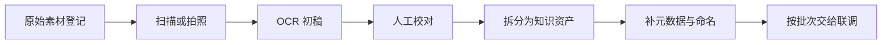

# OCR与资料电子化负责人-职责与执行手册

> 文档层级：团队执行手册
> 文档目的：说明 OCR 与资料电子化负责人在比赛阶段该怎样整理原始资料、控制质量，并把内容稳定交接给联调环节
> 核心结论：这个角色最重要的不是“扫了多少页”，而是让每份资料都能追溯来源、完成校对、拆成可检索知识资产，并顺利交给工作流使用
> 目标读者：OCR与资料电子化负责人、项目负责人、知识库协作者
> 推荐下一步：继续读 [高等数学-知识库接入与落库方案.md](../../学科层/高等数学-知识库接入与落库方案.md)

## 与其他文档的边界

一句人话：这篇说的是执行动作，不是知识库规范本体。

## 一句话先记住

一句人话：没有来源台账、人工校对和拆卡，OCR 结果就不能算正式知识资产。

> 你的工作不是“把图片变成文字”，而是把原始资料变成平台和智能体真正能用、能追溯、能交接的知识内容。

## 1. 这一轮主责是什么

一句人话：你负责把原始资料变成“可验证的输入物”，而不是丢给别人一堆 PDF 和 OCR 稿。

| 主责 | 你必须交什么 |
| --- | --- |
| 素材登记 | 每份资料的来源、类型、状态和负责人 |
| OCR 初稿 | 可进入人工校对的电子文本 |
| 人工校对 | 公式、题号、图表和上下标准确 |
| 结构化拆分 | 可检索的知识点卡、例题卡、课堂重构笔记等 |
| 元数据补齐 | 模块、章节、资源类型、来源引用、关键词 |
| 批次交接 | 能直接给联调负责人使用的一批正式资产 |

## 2. 你这一轮怎么推进最稳

一句人话：先把台账和命名守住，再谈数量和速度。

## 3. 你可以怎么用 AI

一句人话：AI 可以帮你提高初稿速度，但不能替你做质量负责。

- 用 AI 做 OCR 初稿和段落清洗。
- 用 AI 辅助拆分标题、关键词和别名。
- 用 AI 帮你整理批次说明和素材台账模板。
- 公式、题号、图像说明和来源引用必须人工复核。

## 4. 交给联调前必须补齐什么

一句人话：交接给联调负责人时，不要只给内容，要给上下文。

| 交接项 | 最低标准 |
| --- | --- |
| 来源信息 | 知道这条内容来自哪份教材、讲义或试卷 |
| 模块与章节 | 知道它属于哪门课、哪个模块、哪一章 |
| 资源类型 | 知道是知识点卡、例题卡还是课堂重构笔记 |
| 状态说明 | 知道它是草稿、已校对还是已入库 |
| 示例问法 | 知道联调时可以拿什么问题去测 |

## 5. 交付前你必须自查什么

一句人话：别让“看起来很多”掩盖“其实不可用”。

1. 每份资料是否都可追溯来源。
2. 公式和题号是否人工校对过。
3. 文件命名和字段是否符合高数落库规则。
4. 批次交付时是否附了示例问法。
5. 联调负责人能否直接拿去测试，而不是再返工整理。

## 读完后你应该带走什么

- 资料电子化的目标是可用和可交接，不是简单把纸变成字。
- 来源台账、人工校对和拆卡命名是这个角色的底线工作。
- 如果联调负责人接到你的内容后还要重新整理一遍，说明交付还没有完成。

## 本文不负责什么

- 不定义平台对象和统一字段
- 不代替高数知识库主规范
- 不代替智能体工作流联调
- 不代替比赛答辩稿
