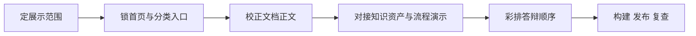

# 项目负责人-职责与执行手册

> 文档层级：团队执行手册
> 文档目的：说明项目负责人在比赛阶段具体要抓什么、怎么借助 AI 推进，以及最后如何把版本收口和发布
> 核心结论：项目负责人最重要的任务不是把所有细节亲自做完，而是确保首页入口、文档正文、智能体演示和答辩口径始终指向同一个版本
> 目标读者：项目负责人、协作成员、答辩准备者
> 推荐下一步：如果你已经在收版本，继续读 [比赛交付与答辩手册.md](../../交付层/比赛交付与答辩手册.md)

## 与其他文档的边界

一句人话：这篇只负责项目负责人怎么执行，不负责定义平台或流程本身。

## 一句话先记住

一句人话：项目负责人真正负责的是“最后打开给别人看的那个版本”。

> 你要确保首页入口清楚、正文口径一致、演示顺序顺畅、构建通过、代码推上去、页面真的能打开。

## 1. 这一轮主责是什么

一句人话：先定范围，再收路径，再做发布，不要从细枝末节开始忙。

| 主责 | 你必须盯住什么 |
| --- | --- |
| 范围收口 | 本轮展示什么、不展示什么 |
| 页面与入口 | 首页、`/platform`、`/math` 和代表文档是否好读 |
| 文档一致性 | 平台、子引擎、学科、交付层说的是不是同一件事 |
| 演示顺序 | 现场展示时先讲什么、后讲什么 |
| 版本发布 | 本地构建、提交、推送、Pages 发布是否完整 |

## 2. 你应该怎么安排这一轮节奏

一句人话：项目负责人要盯的是节奏切分，不是把所有任务堆在最后一天。

## 3. 你可以怎么用 AI

一句人话：AI 适合帮你压缩信息和检查一致性，不适合替你拍最后的板。

- 用 AI 压缩首页和文档首屏文案。
- 用 AI 对比不同文档的口径是否一致。
- 用 AI 生成演示顺序草稿和发布前核对清单。
- 最终由你确认“说法是否真实、页面是否可打开、版本是否真能上线”。

## 4. 你要收哪些交付物

一句人话：项目负责人手上最后必须有一份能直接给评委看的完整版本。

| 交付物 | 最低标准 |
| --- | --- |
| 首页与分类页 | 五大类入口清楚，阅读路径稳定 |
| 代表文档 | 至少平台、子引擎、高数、交付各有能直接打开的代表页 |
| 演示顺序 | 首页 -> 平台 -> 子引擎 -> 高数 -> 团队与发布 |
| 构建结果 | `npm run build` 通过 |
| 发布结果 | GitHub 推送成功，Pages 线上可访问 |

## 5. 交付前你必须自查什么

一句人话：别把“代码已经改完”和“版本已经准备好”混为一谈。

1. 首页入口和正文分类是否一致。
2. 真源文档和答辩话术是否一致。
3. 构建是否通过，链接是否可点。
4. 演示的关键页面是否都在站内能打开。
5. 推送和发布完成后，线上版本是否和本地一致。

## 读完后你应该带走什么

- 项目负责人负责的是最终版本的完成度，而不是单一模块的产量。
- 页面、正文、演示和发布必须同时收住，才算真正交付。
- 最后一天最重要的工作不是继续加内容，而是做一致性核查和上线复查。

## 本文不负责什么

- 不定义平台结构和对象字段
- 不代替知识资产整理规范
- 不代替智能体联调手册
- 不代替正式答辩稿
