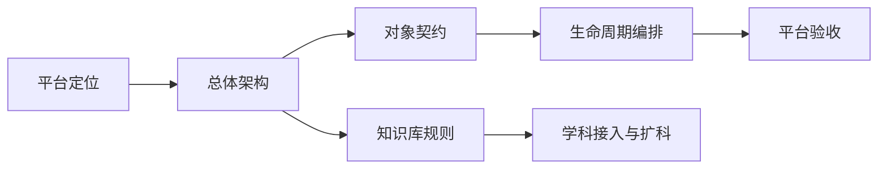

# 平台总纲与架构

> 文档层级：平台导读
> 文档目的：说明平台这一组文档解决什么问题，以及开发和答辩时该按什么顺序进入真源正文
> 核心结论：这篇只负责导航，不再重复平台背景；平台定位、架构、对象契约、知识库规则和扩科规范分别回到各自真源文档
> 目标读者：产品负责人、架构设计者、研发协作者、新成员
> 推荐下一步：先读 [AI主导学习平台-产品总纲.md](./AI主导学习平台-产品总纲.md)，再读 [AI主导学习平台-总体架构设计.md](./AI主导学习平台-总体架构设计.md)

## 与其他文档的边界

一句人话：这篇只告诉你平台层怎么读，不负责替平台真源发言。

平台层真源分工固定如下：

- 平台定位：`产品总纲`
- 平台总体分层：`总体架构设计`
- 平台验收：`平台需求与验收`
- 对象与字段：`统一对象与接口契约`
- 知识库规则：`知识库结构与契约`、`知识库建设与提示词规范`
- 生命周期和扩科：`学习生命周期与编排策略`、`学科大类与接入规范`

## 一句话先记住

一句人话：平台层最重要的不是文档多，而是每篇都只负责一类正式定义。

> 如果你想知道平台是什么、靠什么成立、数据和规则在哪定义，平台层就是唯一入口；但每件事都要回到对应真源页看，不要在导读页里找细节。

## 1. 这组文档到底解决什么

一句人话：平台层负责回答“平台为什么成立”和“平台的规则在哪里”。

| 你最关心的问题 | 应该看哪篇 |
| --- | --- |
| 这个项目为什么不是单学科作品 | [AI主导学习平台-产品总纲.md](./AI主导学习平台-产品总纲.md) |
| 平台按层、按角色、按阶段怎么组织 | [AI主导学习平台-总体架构设计.md](./AI主导学习平台-总体架构设计.md) |
| 学习档案、学习会话、任务卡等对象怎么定义 | [AI主导学习平台-统一对象与接口契约.md](./AI主导学习平台-统一对象与接口契约.md) |
| 知识库怎么分层、怎么命名、怎么回流 | [AI主导学习平台-知识库结构与契约.md](./AI主导学习平台-知识库结构与契约.md) |
| 提示词、资料电子化和知识卡怎么规范 | [AI主导学习平台-知识库建设与提示词规范.md](./AI主导学习平台-知识库建设与提示词规范.md) |
| 一门学科怎么接进来 | [AI主导学习平台-学科大类与接入规范.md](./AI主导学习平台-学科大类与接入规范.md) |

## 2. 平台层推荐阅读顺序

一句人话：先抓平台定义，再看规则，最后看验收和扩科，会比先翻字段表更稳。

1. [AI主导学习平台-产品总纲.md](./AI主导学习平台-产品总纲.md)
2. [AI主导学习平台-总体架构设计.md](./AI主导学习平台-总体架构设计.md)
3. [AI主导学习平台-统一对象与接口契约.md](./AI主导学习平台-统一对象与接口契约.md)
4. [AI主导学习平台-知识库结构与契约.md](./AI主导学习平台-知识库结构与契约.md)
5. [AI主导学习平台-知识库建设与提示词规范.md](./AI主导学习平台-知识库建设与提示词规范.md)
6. [AI主导学习平台-学习生命周期与编排策略.md](./AI主导学习平台-学习生命周期与编排策略.md)
7. [AI主导学习平台-平台需求与验收.md](./AI主导学习平台-平台需求与验收.md)
8. [AI主导学习平台-学科大类与接入规范.md](./AI主导学习平台-学科大类与接入规范.md)

## 3. 不同任务该直接跳哪篇

一句人话：导读页的价值，就是让你别在十篇平台文档里来回猜。

| 当前任务 | 直接跳去哪里 | 读完要拿走什么 |
| --- | --- | --- |
| 对外解释作品定位 | [AI主导学习平台-产品总纲.md](./AI主导学习平台-产品总纲.md) | 平台主张和竞争力路线 |
| 做系统设计 | [AI主导学习平台-总体架构设计.md](./AI主导学习平台-总体架构设计.md) | 按层、按角色、按阶段的架构边界 |
| 接接口、对字段 | [AI主导学习平台-统一对象与接口契约.md](./AI主导学习平台-统一对象与接口契约.md) | 对象链、字段口径、透传约束 |
| 做知识库建设 | [AI主导学习平台-知识库建设与提示词规范.md](./AI主导学习平台-知识库建设与提示词规范.md) | 资料电子化、拆卡、提示词和验收 |
| 做扩科方案 | [AI主导学习平台-学科大类与接入规范.md](./AI主导学习平台-学科大类与接入规范.md) | 学科大类、接入模板和边界 |
| 做验收清单 | [AI主导学习平台-平台需求与验收.md](./AI主导学习平台-平台需求与验收.md) | 平台 FR、AC 和统一验收方式 |

## 4. 平台层和其他层怎么接

一句人话：平台层不是单独存在的，它负责给子引擎、学科和交付层提供正式口径。

- 子引擎层从平台层拿对象契约、角色阶段和接入边界。
- 学科层从平台层拿学科接入模板、知识库规则和生命周期编排口径。
- 交付层从平台层拿平台定位、主线和验收标准，再翻译成答辩口径。

## 读完后你应该带走什么

- 平台层是整站所有正式定义的起点，不是背景介绍合集。
- 导读页只负责找路，真正干活必须回到真源文档。
- 想做平台重构时，先抓定位、架构、对象和规则，再去看子引擎与学科层。

## 本文不负责什么

- 不替代产品总纲和总体架构设计
- 不定义对象字段和知识库字段
- 不代替子引擎实现说明
- 不代替比赛答辩稿
