# 课堂知识重构与自适应伴学智能体技术方案（AI教师版）

> 版本：v1.1  
> 文档属性：技术方案版（研发 + 答辩兼容）  
> 主线模式：`Multi-Agent + 工作流编排`  
> 默认技术栈：`Vue 3 + Vite + ECharts + Element Plus` + `NestJS + Prisma + MySQL 8`

---

## 目录

1. 一页结论
2. 技术选型总表
3. 平台能力边界：ADP 应用开发 vs ClawPro Skills
4. 平台模式怎么选
5. 模型怎么选
6. Agent 怎么选、怎么分工
7. Skills / 自定义 Skill 怎么规划
8. 前端技术方案
9. 后端技术方案
10. 可视化数据方案
11. 阶段落地路线
12. 你现在到底怎么选最稳（纠偏版）
13. 风险与保底
14. 官方依据

---

## 1. 一页结论

如果只给一句最终建议：

`比赛主线就选腾讯云 ADP 的 Multi-Agent + 工作流编排，P0 先用官方发布链接跑通主闭环，P1 再补可视化和教师轻看板，P2 最后接 Vue 前端 + NestJS BFF。`

这份技术方案的核心结论有 6 条：

1. 比赛当前主战场是 `ADP 应用开发`，不是 `ClawPro Skills`。  
2. 平台模式主线固定选 `Multi-Agent + 工作流编排`，`Standard` 只作保底。  
3. 模型主线采用“平台预置/官方默认模型优先，第三方/自定义模型作为增强”。  
4. Agent 固定为 `1 主控 + 5 子 Agent`，但 `P0` 实际只依赖 `1 主控 + 4 个教学 Agent`。  
5. 前端默认推荐 `Vue 3 + Vite + Vue Router + Pinia + ECharts + Element Plus`，后端默认推荐 `NestJS + Prisma + MySQL 8`，接入协议默认选 `HTTP SSE`。  
6. `Skills` 在当前文档里作为并列探索分支规划；`Redis / MQ / 微服务拆分` 都不是 v1 必选项。  

这份文档不是写给企业架构评审会的，而是写给你自己和答辩现场的，所以它只回答一个最实际的问题：

`为了比赛稳、为了实现快、为了后续还能扩展，现在到底该怎么选。`

---

## 2. 技术选型总表

| 选型维度 | 默认推荐 | 备选 | 本项目定位 |
| --- | --- | --- | --- |
| 平台主线 | `Multi-Agent + 工作流编排` | `Standard` | 比赛主线 |
| 保底路线 | `Standard` | 无 | 演示兜底 |
| 平台能力主战场 | `ADP 应用开发` | `ClawPro Skills` | 当前比赛主线 |
| 模型主线 | `平台预置/官方默认模型优先` | 第三方/自定义模型 | 比赛稳妥优先 |
| Agent 编组 | `1 主控 + 5 子 Agent` | `1 主控 + 4 子 Agent` | 正式推荐 |
| 前端 | `Vue 3 + Vite + Vue Router + Pinia + ECharts + Element Plus` | `React + Vite + ECharts` | 默认实现栈 |
| 后端 | `NestJS + Prisma + MySQL 8` | `FastAPI + MySQL` | 默认实现栈 |
| 接入协议 | `HTTP SSE` | `WebSocket` | 默认接入协议 |
| 官方访问方式 | ADP 官方发布链接 | 分享链接 / 二维码 | `P0` 默认 |
| 自定义接入方式 | 前端 + BFF + ADP | 纯前端直连 | `P2` 推荐 |
| 技能扩展方式 | `插件/API` | `自定义 Skill` | 主线优先插件/API |
| 可视化方案 | 学生卡片 + 教师轻看板 + 系统状态页 | 纯聊天展示 | `P1/P2` 推荐 |
| 中间件 | 暂不引入 | `Redis / MQ` | v1 不必做 |

### 2.1 为什么技术方案要先锁表

- 因为你现在最容易卡住的不是“不会写”，而是“每个点都想选”。
- 一旦平台模式、Agent 结构、前后端栈没锁住，后面的 PRD、架构、页面、接口都会互相打架。
- 所以先锁一套默认方案，再保留少量备选，是最适合比赛节奏的做法。

---

## 3. 平台能力边界：ADP 应用开发 vs ClawPro Skills

### 3.1 平台能力边界图（图 1）

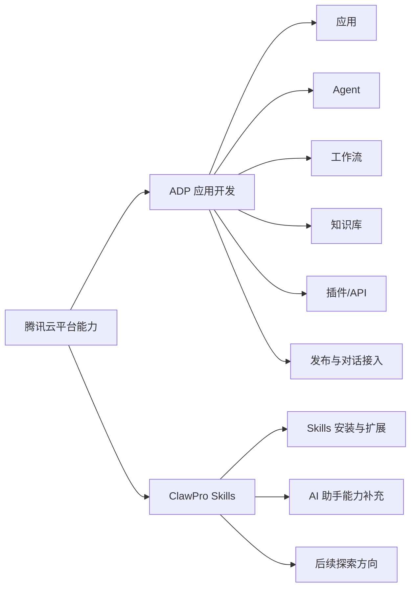

这张图想说明什么：

- 腾讯云平台不是只有一条能力路线。
- 但你当前比赛项目真正直接要用的是 `ADP 应用开发` 这条主线。
- `Skills` 现在更适合作为并列探索分支，而不是比赛当前实现主链路。

### 3.2 能力边界对比表

| 能力路径 | 更适合做什么 | 在本项目里的定位 |
| --- | --- | --- |
| `ADP 应用开发` | 应用、Agent、工作流、知识库、插件/API、发布、对话接入 | 当前比赛主线 |
| `Skills / Skill 广场` | 对 AI 助手补能力、通用能力扩展、后续探索 | 并列探索分支 |
| `插件/API` | 把外部能力接进主闭环 | 当前最实用的增强方式 |
| `自定义 Skill` | 当现成能力和插件/API都不够时，再做定制扩展 | `P2` 后续候选 |

### 3.3 当前技术主线结论

- 比赛当前实现主线优先用：`Agent + 工作流 + 知识库 + 插件/API`
- `Skills` 在这份文档里要写，但写成“探索支线”
- 你现在不要把 `Skills` 当作比赛当前主实现方式

---

## 4. 平台模式怎么选

### 4.1 三种路线对比图（图 2）

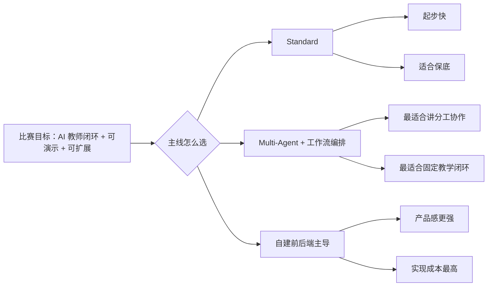

这张图想说明什么：

- 你不是没有选择，而是有 3 条技术路线。
- 但在这个项目里，真正最平衡的不是 `Standard`，也不是“上来就自建前后端”，而是 `Multi-Agent + 工作流编排`。
- 它正好兼顾了比赛亮点、教育闭环和后续扩展能力。

### 4.2 平台模式选型矩阵

| 路线 | 适合什么场景 | 优势 | 风险 | 在本项目中的定位 |
| --- | --- | --- | --- | --- |
| `Standard` | 时间紧、先保住可演示版本 | 配置最轻、起步最快 | 难讲“多角色协作” | 保底路线 |
| `Multi-Agent + 工作流编排` | 要冲比赛亮点、强调教学分工和闭环 | 分工清晰、流程稳定、最像 AI 教师团队 | 配置和调试门槛更高 | 主线方案 |
| 自定义前后端主导 | 已经有稳定产品栈、想做产品化接入 | 产品感强、扩展空间大 | 开发量大、容易拖慢比赛节奏 | `P2` 增强层 |

### 4.3 为什么主线不是 `Standard`

不是因为 `Standard` 不好，而是因为它在你这个题上不够“有辨识度”。

你的题目是 `AI教师智能体`，而不是通用问答。  
评委更容易被这些点打动：

- 多角色协作
- 稳定教学流程
- 诊断、讲解、练习、测评、复盘一整套闭环

这些点，`Multi-Agent + 工作流编排` 更容易讲得出来。

### 4.4 为什么不推荐“自由转交”做主线

- 因为比赛更看重稳定、可控、可复现。
- 自由转交虽然灵活，但现场更容易跑偏。
- 对你现在这个项目来说，固定工作流比“让模型临场自由发挥”更稳。

---

## 5. 模型怎么选

### 5.1 模型选型先看什么

你不要先看“平台里模型很多”，而要先看：

1. 这个任务是不是学生主闭环的核心环节  
2. 它是不是需要强推理  
3. 它是不是需要多模态  
4. 它是不是已经超出了平台默认模型的稳定能力  

也就是说，模型不是越多越好，而是越“贴任务边界”越好。

### 5.2 模型选型流程图（图 3）

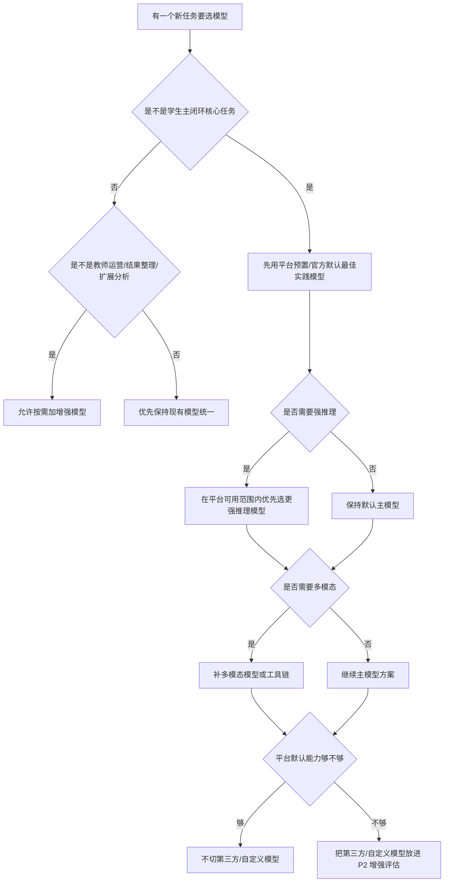

这张图想说明什么：

- 模型选型应该有顺序，而不是看见模型多就换。
- `P0` 主闭环最重要的是稳，所以先用平台默认最佳实践模型。
- 第三方/自定义模型只有在平台默认能力确实不够时，才进入 `P2` 评估。

### 5.3 模型能力分层

| 模型类别 | 在项目里负责什么 | 当前推荐策略 |
| --- | --- | --- |
| 通用生成/对话模型 | 主控汇总、讲解、自然语言输出 | `P0` 主线默认 |
| 推理/思考模型 | 学习诊断、复杂归因、策略判断 | 平台默认可用时优先增强 |
| 多模态模型 | 图片/语音/文档理解 | 按需启用，不强行全场景上 |
| 向量/Embedding 模型 | 知识向量化、语义召回 | 用平台默认向量能力优先 |
| 重排/Rerank 模型 | 提升知识检索结果排序质量 | `P1/P2` 再增强 |

### 5.4 模型选型矩阵

| 场景 | 默认主线 | 增强备选 | 不建议现在做 |
| --- | --- | --- | --- |
| 学生主对话 | 平台默认/预置主模型 | 平台更强推理模型 | 第三方模型直接主线化 |
| 学习诊断 | 平台默认主模型 + 提示词约束 | 平台更强推理模型 | 为诊断单独接外部模型 |
| 分层讲解 | 平台默认主模型 | 讲解专用增强模型 | 多模型并行生成讲解 |
| 练习与测评 | 平台默认主模型 | 判题增强模型 | 上来就拆独立评分服务 |
| 复盘与计划 | 平台默认主模型 | 强推理增强模型 | 自定义模型先行 |
| 教师运营分析 | `TeacherOpsAgent` + 平台默认模型 | 增强分析模型 | 把教师分析独立成外部 AI 服务 |
| 多模态输入解析 | 平台默认多模态能力/工具 | 多模态增强模型 | 先接复杂第三方多模态管线 |

### 5.5 为什么第三方/自定义模型不直接进主线

- 因为官方文档对“第三方模型在 Multi-Agent 场景下的支持边界”存在表述不一致。
- 因为比赛当前策略是“稳妥优先”，不是“模型炫技优先”。
- 所以文档里的固定结论应该是：

1. 主线先走平台默认最佳实践模型  
2. 第三方/自定义模型只写成增强项  
3. 若后续控制台逐项验证通过，再纳入 `P2` 或附录补充  

---

## 6. Agent 怎么选、怎么分工

### 6.1 总体 Agent 分工图（图 4）

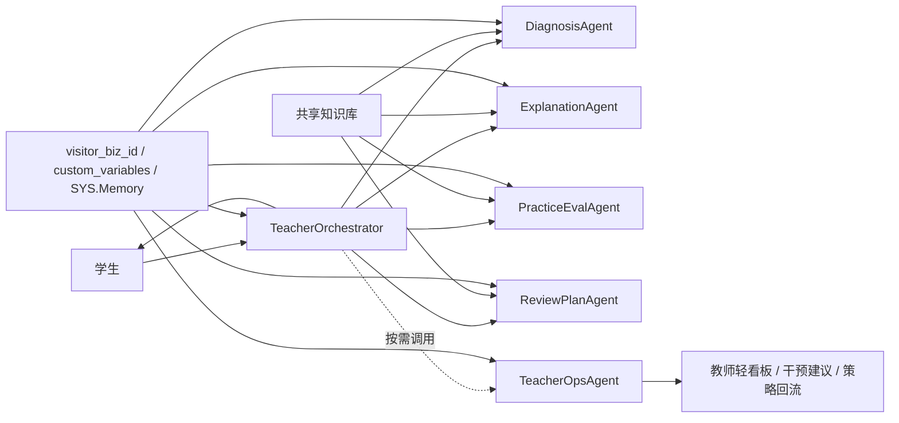

这张图想说明什么：

- 真正直接面向学生的入口只有 `TeacherOrchestrator`。
- `Diagnosis / Explanation / PracticeEval / ReviewPlan` 是学生主闭环的 4 个教学 Agent。
- `TeacherOpsAgent` 是教师侧增强能力，从 `P1` 开始进入，不阻塞 `P0`。

### 6.2 固定角色表

| Agent | 核心职责 | 阶段定位 |
| --- | --- | --- |
| `TeacherOrchestrator` | 识别任务类型、调度子 Agent、汇总最终回复 | `P0/P1/P2` |
| `DiagnosisAgent` | 判断学生水平、卡点、学习路径 | `P0/P1/P2` |
| `ExplanationAgent` | 分层讲解、拆步骤、举例子 | `P0/P1/P2` |
| `PracticeEvalAgent` | 出题、判题、给出达标判断 | `P0/P1/P2` |
| `ReviewPlanAgent` | 错因归因、复盘总结、学习计划 | `P0/P1/P2` |
| `TeacherOpsAgent` | 班级趋势聚合、风险识别、干预建议、策略回流 | `P1/P2` |

### 6.3 哪些东西不单独做成 Agent

| 对象 | 为什么不单独做成 Agent |
| --- | --- |
| 知识库 | 它是共享底座，不是“会思考的角色” |
| 长期记忆 | 它是系统能力，不是“会回复的角色” |
| OCR / ASR | 它们是工具能力，不是角色分工 |
| 发布入口 | 它是访问方式，不是 Agent |

### 6.4 P0 和 P1 的 Agent 边界

- `P0` 实际主链路依赖的是：`TeacherOrchestrator + 4 个教学 Agent`
- `P1` 才把 `TeacherOpsAgent` 作为增强层纳入
- 所以“1 主控 + 5 子 Agent”是总体架构说法，但你实施时要分阶段看

---

## 7. Skills / 自定义 Skill 怎么规划

### 7.1 Skills 判断流程图（图 5）

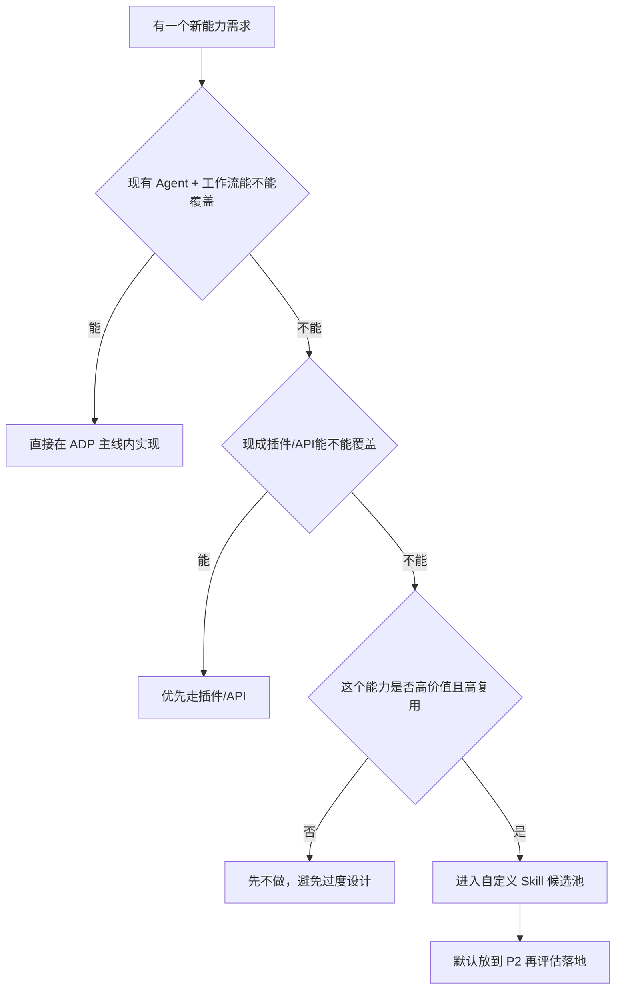

这张图想说明什么：

- 不是一有新需求就做 Skill。
- 比赛主闭环里，优先级永远是：`Agent/工作流` -> `插件/API` -> `自定义 Skill`
- `自定义 Skill` 应该是最后一层，而不是第一反应。

### 7.2 现成 Skills 能做什么

- 更适合做通用能力补充
- 更适合作为 AI 助手能力扩展
- 更适合后续探索，而不是当前比赛主链路

### 7.3 哪些需求更适合插件/API

| 需求类型 | 为什么优先插件/API |
| --- | --- |
| 题库查询 | 接口边界清晰、可复用 |
| 学情数据聚合 | 结构化输入输出更适合 API |
| 外部课程资源接入 | 系统集成天然适合插件/API |
| 教师侧业务系统联动 | 可控、易解释、好维护 |

### 7.4 哪些能力值得自定义 Skill

| 候选能力 | 业务价值 | 当前是否必须 | 建议阶段 |
| --- | --- | --- | --- |
| 教学策略模板化能力 | 统一不同课程、不同学生层级的教学风格 | 否 | `P2` |
| 错因分类标准化能力 | 提高复盘和教师干预的一致性 | 否 | `P2` |
| 课程知识重构后处理能力 | 把课堂资料整理成更稳定的结构化结果 | 否 | `P1` 预留、`P2` 评估 |
| 教师运营洞察整理能力 | 强化教师轻看板的可读性和建议质量 | 否 | `P2` |

### 7.5 当前结论

- `P0` 不做自定义 Skill
- `P1` 只预留 Skill 扩展位置
- `P2` 再评估是否真的要落地自定义 Skill

---

## 8. 前端技术方案

### 8.1 前端默认推荐栈

| 层 | 默认推荐 |
| --- | --- |
| 构建工具 | `Vite` |
| 框架 | `Vue 3` |
| 路由 | `Vue Router` |
| 状态管理 | `Pinia` |
| UI 组件 | `Element Plus` |
| 图表 | `ECharts` |

### 8.2 为什么默认推荐这一套

- `Vue 3 + Vite` 起步快，最适合比赛期快速出页面。
- `Element Plus` 很适合做表单、卡片、结果页、轻看板。
- `ECharts` 对折线图、柱状图、环图、趋势图支持成熟。
- 你这个项目要展示“结构化学习结果”和“教师看板”，这套栈非常顺手。

### 8.3 前端页面结构图（图 6）

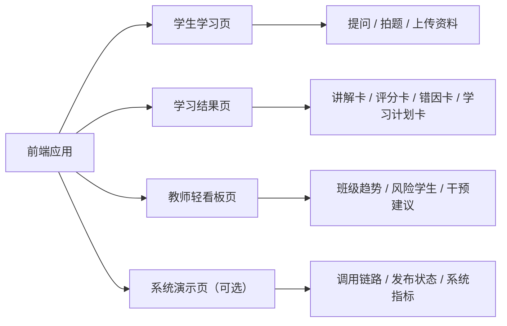

这张图想说明什么：

- 你前端不是只做一个聊天页。
- 这个项目最值得做的是“学生页 + 结果页 + 教师页”三件套。
- `系统演示页` 是可选增强，不必抢在前面做。

### 8.4 前端在三个阶段里的定位

| 阶段 | 前端定位 |
| --- | --- |
| `P0` | 可没有自定义前端，先用 ADP 官方发布链接 |
| `P1` | 开始做学生侧可视化和教师轻看板 |
| `P2` | 接入自定义前端入口，形成完整产品页面 |

### 8.5 前端与模型/Skills 的关系

- 前端不直接决定主模型选型
- 前端不决定要不要做 Skill
- 前端负责把学生侧、教师侧、系统侧结果结构化展示出来

### 8.6 为什么不推荐先做“很重的前端”

- 因为你的评委首先看的是闭环能不能跑通。
- 如果主链路没稳，页面再漂亮也救不了答辩。
- 所以前端正确节奏是：`先能展示 -> 再更像产品`。

---

## 9. 后端技术方案

### 9.1 后端默认推荐栈

| 层 | 默认推荐 |
| --- | --- |
| 框架 | `NestJS` |
| ORM | `Prisma` |
| 数据库 | `MySQL 8` |
| 接入协议 | `HTTP SSE` |

### 9.2 为什么默认推荐这一套

- `NestJS` 非常适合做 BFF、代理层、接口聚合层。
- `Prisma` 对数据表、学习记录、教师看板聚合非常友好。
- `MySQL 8` 足够应对比赛版的数据沉淀，不需要先上分布式存储。
- `HTTP SSE` 最适合把 ADP 的流式结果接给前端。

### 9.3 后端接入总图（图 7）

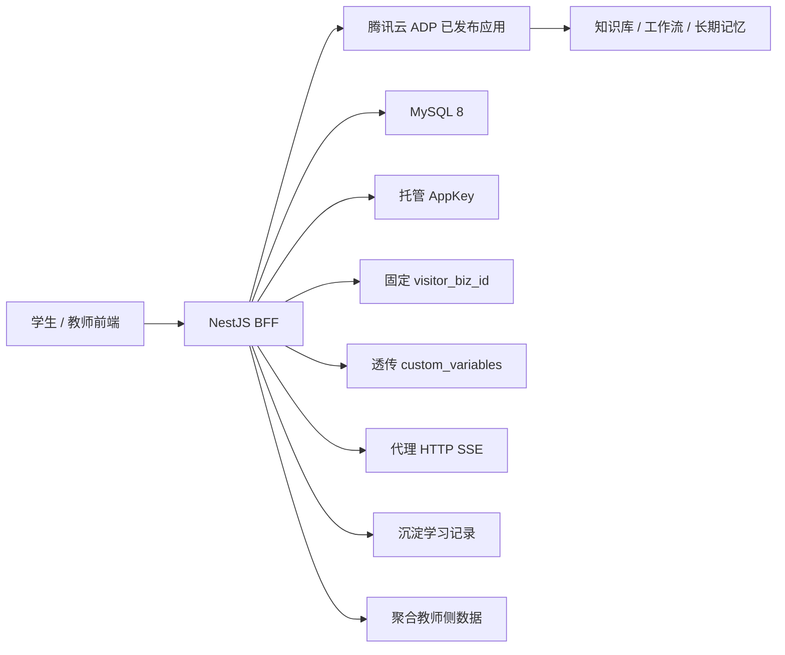

这张图想说明什么：

- 后端不是用来替代 ADP 的，而是用来把 ADP 更安全、更产品化地接出来。
- 你真正需要的是 `BFF`，不是再造一套“智能体后端平台”。
- 学习记录和教师侧聚合数据，应该沉淀在你自己的数据库里。

### 9.4 后端固定职责

| 职责 | 说明 |
| --- | --- |
| `AppKey` 托管 | 不让前端直接持有调用密钥 |
| `visitor_biz_id` 固定 | 保证同一学生的连续记忆 |
| `custom_variables` 透传 | 保证课程、班级、章节、角色边界 |
| `HTTP SSE` 代理 | 给前端稳定输出流式结果 |
| 学习记录沉淀 | 保存诊断、评分、错因、学习计划 |
| 教师聚合输出 | 给教师轻看板提供数据 |

### 9.5 后端与模型/Skills 的关系

- 后端不负责重写 ADP 的 Agent 编排逻辑
- 后端不负责决定主模型路线
- 后端主要负责接入、保护、透传、沉淀、聚合
- 后端也不应该在 `P0` 就演化成独立 AI 平台

### 9.6 为什么不默认上 `Redis / MQ`

- 你当前不是高并发生产系统，而是比赛作品。
- 这两个中间件的“讲起来很高级”，但第一版未必真正给你加分。
- 反而会拉高部署、排错和答辩解释成本。

所以文档里的默认结论是：

`先别上。`

---

## 10. 可视化数据方案

### 10.1 可视化数据总图（图 8）

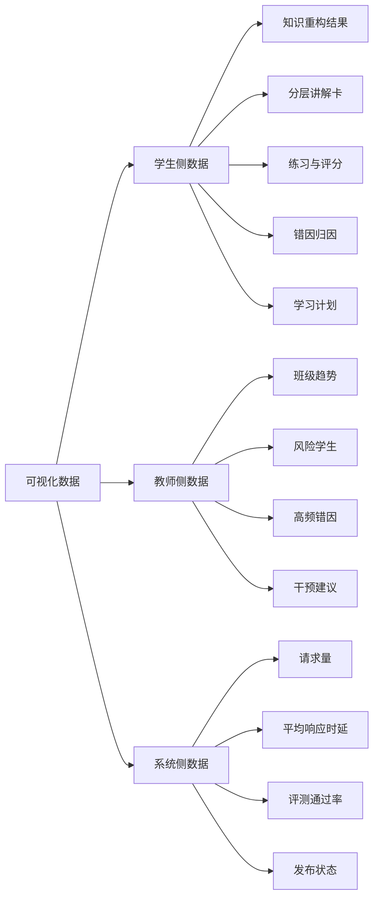

这张图想说明什么：

- 你的可视化不只是一类数据，而是三类。
- 学生侧看“我的学习结果”，教师侧看“班级和风险”，系统侧看“这套系统稳不稳”。
- 三层一起讲，评委才更容易感受到这不是单点功能，而是一套完整系统。

### 10.2 学生侧数据怎么展示

| 数据 | 为什么展示它 | 最适合的图表/形式 |
| --- | --- | --- |
| 课堂知识重构结果 | 体现你项目不是普通答疑，而是知识重构 | 知识卡片 / 结构卡 |
| 分层讲解卡 | 体现 AI 教师分层教学 | 卡片 |
| 练习与评分 | 体现练习闭环和测评能力 | 卡片 + 柱状评分 |
| 错因归因 | 体现诊断深度 | 标签卡 / 分类卡 |
| 学习计划 | 体现“答完就走”之外的复盘能力 | 计划卡 / 时间线 |

### 10.3 教师侧数据怎么展示

| 数据 | 为什么展示它 | 最适合的图表/形式 |
| --- | --- | --- |
| 班级趋势 | 体现教师运营价值 | 折线图 |
| 风险学生 | 体现干预入口 | 风险列表 |
| 高频错因 | 体现群体教学痛点 | 柱状图 / 环图 |
| 干预建议 | 体现 TeacherOpsAgent 的作用 | 建议卡片 |

### 10.4 系统侧数据怎么展示

| 数据 | 为什么展示它 | 最适合的图表/形式 |
| --- | --- | --- |
| 请求量 | 体现系统被使用的规模 | 折线图 |
| 平均响应时延 | 体现体验稳定性 | 折线图 / 指标卡 |
| 评测通过率 | 体现效果优化 | 环图 / 指标卡 |
| 发布状态 | 体现可访问性与可交付性 | 状态卡 / 流程状态图 |

### 10.5 教师侧看板流程图（图 9）

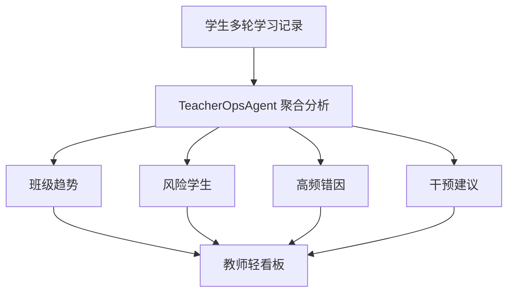

这张图想说明什么：

- 教师侧看板不是凭空画图，而是建立在学习记录和 `TeacherOpsAgent` 聚合之上的。
- 这样讲，评委才能理解你的看板不是“静态页面”，而是和 AI 主链路联动的。

### 10.6 哪些图表来自哪里

| 图表来源 | 说明 |
| --- | --- |
| 主模型输出 | 学生侧讲解、评分、复盘、计划等结构化内容 |
| `TeacherOpsAgent` 聚合 | 教师侧趋势、风险、高频错因、干预建议 |
| 系统状态数据 | 请求量、时延、评测通过率、发布状态 |

- 系统状态类图表不应该伪装成“模型能力”
- 教师侧图表也不该被误讲成“单轮对话直接生成”
- 这样答辩时口径会更稳

---

## 11. 阶段落地路线

### 11.1 阶段技术路线图（图 10）

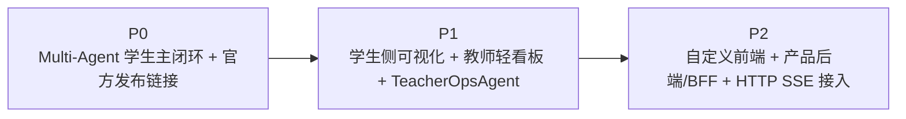

这张图想说明什么：

- 这是最适合你当前项目的技术推进顺序。
- 每一阶段都建立在上一阶段稳定的前提上。
- 这条路线比“一上来全做”更稳，也更适合比赛节奏。

### 11.2 各阶段技术目标

#### 11.2.1 模型与 Skills 策略

| 阶段 | 模型策略 | Skills/扩展策略 |
| --- | --- | --- |
| `P0` | 平台预置/官方默认最佳实践模型优先 | 不做自定义 Skill |
| `P1` | 主模型保持稳定，按需对教师运营分析做增强 | 只预留自定义 Skill 位置 |
| `P2` | 再评估第三方/自定义模型接入 | 再评估是否落地自定义 Skill |

#### 11.2.2 阶段技术目标与输出

| 阶段 | 技术目标 | 关键输出 |
| --- | --- | --- |
| `P0` | 跑通主闭环 | 已发布可访问的 AI 教师应用 |
| `P1` | 提升展示与教师运营能力 | 学生结果页、教师轻看板、TeacherOpsAgent |
| `P2` | 完成产品化接入 | Vue 前端、NestJS BFF、`HTTP SSE` 接入 |

---

## 12. 你现在到底怎么选最稳（纠偏版）

### 12.1 比赛优先建议

如果你现在时间有限，就按下面的顺序做：

1. 先锁 `ADP 应用开发 + Multi-Agent + 工作流编排`。  
2. 先用平台默认/预置模型把 `P0` 跑稳。  
3. 用插件/API补平台现成能力不足的地方。  
4. `P1` 再补 `TeacherOpsAgent` 和可视化。  
5. `P2` 再讨论第三方模型、自定义模型、自定义 Skill。  

### 12.2 当前最值得做的技术点

- `TeacherOrchestrator + 4 个教学 Agent` 主链路
- 平台默认/预置主模型
- 课程知识库和标签隔离
- `visitor_biz_id`
- `custom_variables`
- 插件/API
- 官方发布入口
- 学生侧结构化结果展示

### 12.3 当前不值得先做的技术点

- 为了炫技先切第三方模型主线
- 把 `Skills` 当成比赛当前主实现方式
- 还没跑通 `P0` 就去做自定义 Skill
- `Redis`
- `MQ`
- 微服务拆分
- 复杂权限系统
- 自建知识库系统
- 自建工作流编排系统

如果你现在在犹豫要不要做某个技术点，可以用一句话判断：

`它会不会直接提升闭环稳定性、展示效果或产品接入能力。`

如果不会，第一版就先别做。

---

## 13. 风险与保底

### 13.1 风险与保底图（图 11）

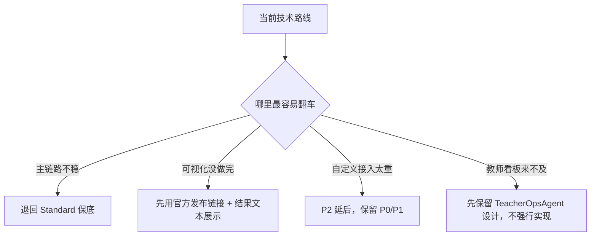

这张图想说明什么：

- 这套方案不是“非做全不可”。
- 真正的技术保底逻辑，是优先保主闭环、再保展示、最后才保产品化接入。
- 这样你在比赛前不会因为一个增强功能拖垮整个项目。

### 13.2 最终保底顺序

| 优先级 | 要保住什么 |
| --- | --- |
| 1 | `P0` 主闭环 |
| 2 | 知识库与长期记忆 |
| 3 | 官方发布入口 |
| 4 | 学生侧结构化结果 |
| 5 | 教师轻看板 |
| 6 | 自定义前端与产品后端 |

---

## 14. 官方依据

- 《产品概述》  
  https://cloud.tencent.com/document/product/1759/104193
- 《应用设置概述》  
  https://cloud.tencent.com/document/product/1759/104206
- 《模型广场》  
  https://cloud.tencent.com/document/product/1759/122575
- 《什么是 Multi-Agent？》  
  https://cloud.tencent.com/document/product/1759/118325
- 《工作流编排》  
  https://cloud.tencent.com/document/product/1759/122556
- 《Agent 节点》  
  https://cloud.tencent.com/document/product/1759/122554
- 《Skills 介绍》  
  https://cloud.tencent.com/document/product/1759/135332
- 《长期记忆说明》  
  https://cloud.tencent.com/document/product/1759/122458
- 《知识检索相关设置》  
  https://cloud.tencent.com/document/product/1759/112704
- 《应用发布概述》  
  https://cloud.tencent.com/document/product/1759/104209
- 《对话接口总体概述》  
  https://cloud.tencent.com/document/product/1759/109380
- 《对话端接口文档（HTTP SSE）》  
  https://cloud.tencent.com/document/product/1759/105561
- 《对话端接口文档V2（HTTP SSE）》  
  https://cloud.tencent.com/document/product/1759/129202
