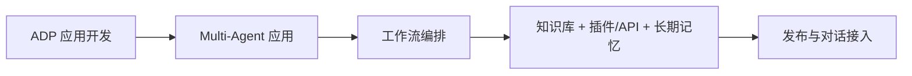
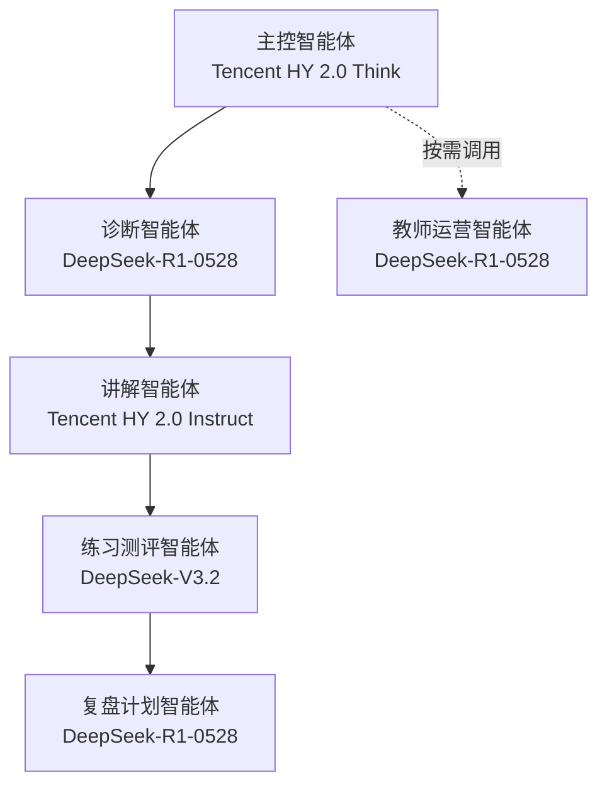
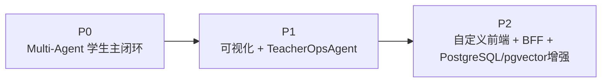

# 课堂知识重构与自适应伴学智能体技术方案（AI教师版）

> 版本：v2.0  
> 文档属性：技术方案版  
> 主线：`ADP 应用开发 + Multi-Agent + 工作流编排`

---

## 1. 一页结论

这版方案只保留结论：

- 平台主线：`ADP 应用开发 + Multi-Agent + 工作流编排`
- 数据库：`PostgreSQL`
- 向量策略：`P0/P1 不引 pgvector 主链路，P2 可选`
- 前端：`Vue 3 + Vite + Vue Router + Pinia + Element Plus + ECharts`
- 后端：`NestJS + Prisma + PostgreSQL`
- 接入协议：`HTTP SSE`
- 扩展方式：`优先 Agent + 工作流 + 知识库 + 插件/API，不用 Skills 作为当前主链路`

模型定版：

- `TeacherOrchestrator -> Tencent HY 2.0 Think`
- `DiagnosisAgent -> DeepSeek-R1-0528`
- `ExplanationAgent -> Tencent HY 2.0 Instruct`
- `PracticeEvalAgent -> DeepSeek-V3.2`
- `ReviewPlanAgent -> DeepSeek-R1-0528`
- `TeacherOpsAgent -> DeepSeek-R1-0528`
- `Kimi -> 不进当前主线，仅作 P2 长上下文探索`

---

## 2. 方案定版表

| 维度 | 定版 |
| --- | --- |
| 平台 | `ADP 应用开发` |
| 智能体模式 | `Multi-Agent` |
| 协同方式 | `工作流编排` |
| Agent 编组 | `1 主控 + 5 子 Agent` |
| 前端 | `Vue 3 + Vite + Vue Router + Pinia + Element Plus + ECharts` |
| 后端 | `NestJS + Prisma + PostgreSQL` |
| 数据库 | `PostgreSQL` |
| 向量数据库 | `P0/P1 不引 pgvector 主链路，P2 可选` |
| 接入协议 | `HTTP SSE` |
| 扩展策略 | `插件/API 优先，自定义 Skill 仅 P2 评估` |

---

## 3. 平台主线

这张图想说明什么：

- 当前比赛主线只走 `ADP 应用开发`
- `Skills` 不进入当前主链路
- 主能力固定为：`Agent + 工作流 + 知识库 + 插件/API`

| 项 | 当前结论 |
| --- | --- |
| `Skills` | 不作为当前实现主链路 |
| `插件/API` | 当前最优扩展方式 |
| `自定义 Skill` | 只放 `P2` 评估 |

---

## 4. 模型定版

| 角色/任务 | 推荐模型 | 用法 |
| --- | --- | --- |
| 主控调度 | `Tencent HY 2.0 Think` | 调度、汇总、最终输出 |
| 学习诊断 | `DeepSeek-R1-0528` | 判断卡点、路径、难度 |
| 分层讲解 | `Tencent HY 2.0 Instruct` | 中文讲解、步骤拆解、举例 |
| 练习与测评 | `DeepSeek-V3.2` | 出题、判题、达标判断 |
| 复盘与计划 | `DeepSeek-R1-0528` | 错因归因、复盘总结、学习计划 |
| 教师运营分析 | `DeepSeek-R1-0528` | 风险识别、班级趋势、干预建议 |
| 长上下文探索 | `Kimi 2.5` | 仅 `P2` 评估，不进主线 |

补充结论：

- 主控和讲解偏 `混元`
- 诊断、测评、复盘、教师运营偏 `DeepSeek`
- `Kimi` 只保留成长上下文探索选项，不进当前主线

---

## 5. Agent 输入输出与模型绑定

这张图想说明什么：

- 主链路只用 5 个教学节点
- `TeacherOpsAgent` 是增强层旁路
- 每个 Agent 的模型直接定版，不再留空

| Agent | 输入 | 输出 |
| --- | --- | --- |
| 主控智能体（`TeacherOrchestrator`） | 学生问题、上下文、`visitor_biz_id`、`custom_variables`、子智能体结果 | 调度决策、最终回复 |
| 诊断智能体（`DiagnosisAgent`） | 学生问题、课程标签、历史作答、记忆摘要 | 学习阶段、卡点、建议路径 |
| 讲解智能体（`ExplanationAgent`） | 诊断结果、知识库片段、知识点关系 | 分层讲解、步骤说明、例子、易错点 |
| 练习测评智能体（`PracticeEvalAgent`） | 讲解结果、题库、学生作答 | 练习题、评分、达标判断 |
| 复盘计划智能体（`ReviewPlanAgent`） | 错题、评分、知识点标签、历史记录 | 错因归因、复盘、学习计划 |
| 教师运营智能体（`TeacherOpsAgent`） | 班级聚合数据、多轮学习记录、风险标签、教师策略 | 趋势、高频错因、风险学生、干预建议 |

---

## 6. Skills / 插件 / 自定义 Skill 策略

| 场景 | 处理方式 |
| --- | --- |
| 现有 Agent + 工作流能覆盖 | 直接在 ADP 主线内实现 |
| 需要接外部题库、课程资源、教师业务系统 | 优先走 `插件/API` |
| 现成能力和插件/API都不够，且复用价值高 | `P2` 再评估自定义 Skill |
| Skills 广场能力 | 当前不作为比赛主链路 |

固定结论：

- 当前比赛主线不用 `Skills` 作为实现主链路
- 优先：`Agent + 工作流 + 知识库 + 插件/API`
- 自定义 Skill 只放 `P2` 候选

---

## 7. 前端技术栈

| 层 | 选型 |
| --- | --- |
| 构建工具 | `Vite` |
| 框架 | `Vue 3` |
| 路由 | `Vue Router` |
| 状态管理 | `Pinia` |
| UI 组件 | `Element Plus` |
| 图表 | `ECharts` |
| 页面 | 学生学习页、学习结果页、教师轻看板页 |

结论：

- `P0` 可不用自定义前端
- `P1` 开始做学生结果页和教师轻看板
- `P2` 再接自定义前端入口

---

## 8. 后端技术栈

| 项 | 选型 |
| --- | --- |
| 框架 | `NestJS` |
| ORM | `Prisma` |
| 数据库 | `PostgreSQL` |
| 向量能力 | `pgvector` 仅 `P2` 可选 |
| 协议 | `HTTP SSE` |

| 后端职责 | 说明 |
| --- | --- |
| `AppKey` 托管 | 不让前端直接持有密钥 |
| `visitor_biz_id` 固定 | 保证同一学生连续记忆 |
| `custom_variables` 透传 | 保证课程/班级/章节/角色边界 |
| `HTTP SSE` 代理 | 给前端输出流式结果 |
| 学习记录沉淀 | 保存诊断、评分、错因、计划 |
| 教师侧聚合输出 | 给教师轻看板提供数据 |

补充结论：

- `PostgreSQL` 是主业务库
- `pgvector` 不进 `P0/P1` 主链路
- `P2` 如果要做自建语义检索/相似案例召回，再评估 `pgvector`

---

## 9. 可视化数据清单

| 侧别 | 展示数据 |
| --- | --- |
| 学生侧 | 课堂知识重构结果、分层讲解、练习评分、错因归因、学习计划 |
| 教师侧 | 班级趋势、风险学生、高频错因、干预建议 |
| 系统侧 | 请求量、平均响应时延、评测通过率、发布状态 |

结论：

- 学生侧看“我学得怎么样”
- 教师侧看“班级哪里有风险”
- 系统侧看“系统稳不稳”

---

## 10. 阶段路线

这张图想说明什么：

- `P0` 先跑主闭环
- `P1` 再补学生结果页和教师轻看板
- `P2` 最后接产品后端与可选 `pgvector`

| 阶段 | 关键动作 |
| --- | --- |
| `P0` | 跑通 `TeacherOrchestrator + 4 个教学 Agent`，用 ADP 官方发布链接演示 |
| `P1` | 补 `TeacherOpsAgent`、学生结果页、教师轻看板 |
| `P2` | 接自定义前端、BFF、`PostgreSQL`，按需评估 `pgvector`、`Kimi`、自定义 Skill |

---

## 11. 官方依据

- 《应用设置概述》  
  https://cloud.tencent.com/document/product/1759/104206
- 《模型介绍》  
  https://cloud.tencent.com/document/product/1759/112876
- 《什么是 Multi-Agent？》  
  https://cloud.tencent.com/document/product/1759/118325
- 《工作流编排》  
  https://cloud.tencent.com/document/product/1759/122556
- 《Agent 节点》  
  https://cloud.tencent.com/document/product/1759/122554
- 《Skills 介绍》  
  https://cloud.tencent.com/document/product/1759/135332
- 《数据库》  
  https://cloud.tencent.com/document/product/1759/119291
- 《知识处理模型设置》  
  https://cloud.tencent.com/document/product/1759/127312
- 《对话接口总体概述》  
  https://cloud.tencent.com/document/product/1759/109380
- 《对话端接口文档（HTTP SSE）》  
  https://cloud.tencent.com/document/product/1759/105561
