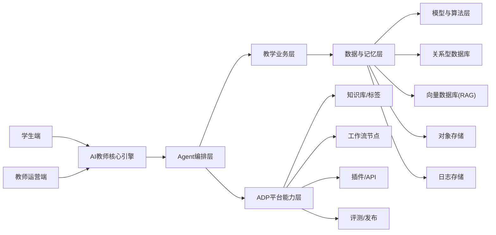
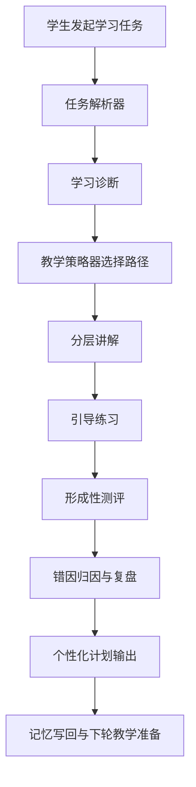
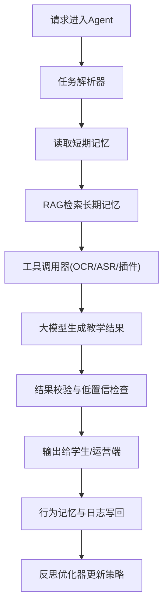
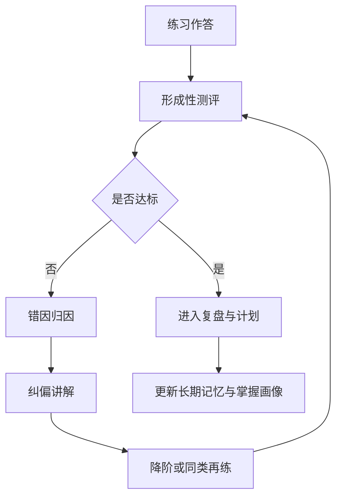
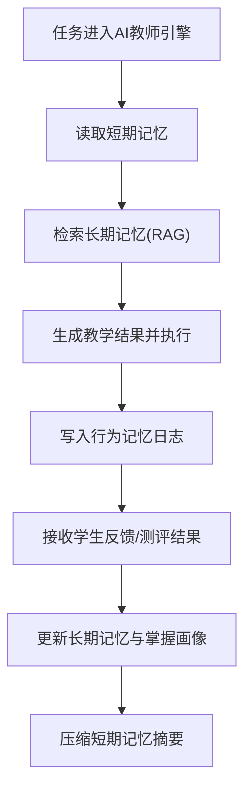
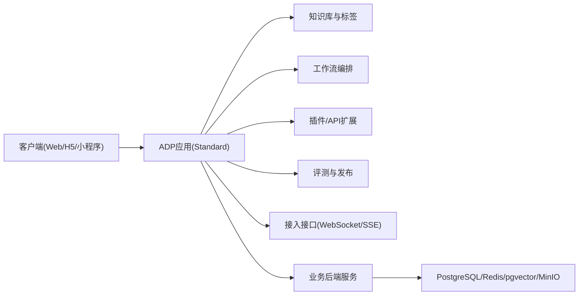

# 课堂智能体架构设计方案（AI教师版）

> 版本：v1.0  
> 文档属性：研发规格版（可实施 + 可答辩）  
> 平台基线：腾讯云智能体开发平台（Tencent Cloud ADP）`Standard` 模式  
> 角色基线：AI充当教师，学生为主用户，教师为运营与干预角色

## 目录（TOC）

1. 项目定位
2. 总体架构
3. 分层设计
4. 核心流程
5. 记忆系统
6. 技术与平台选型
7. 部署形态
8. 数据与接口设计
9. 项目亮点
10. 一句话总结

## 阅读指引

- 实现优先：第 3、4、5、8 章。
- 答辩优先：第 1、2、4、9、10 章。
- 联动优先：与需求文档共享同一闭环阶段命名与模块命名。

## 0. 文档约定接口（Public Interfaces / Conventions）

| 约定项 | 规范 |
| --- | --- |
| 图表规范 | 仅使用 `mermaid flowchart`；系统/映射图 `LR`，流程图 `TD` |
| 术语白名单 | `AI教师`、`Agent`、`RAG`、`短期记忆`、`长期记忆`、`行为记忆`、`P0/P1/P2` |
| 闭环阶段命名 | `诊断 -> 讲解 -> 练习 -> 测评 -> 复盘 -> 记忆更新 -> 下轮教学` |
| 模块命名基线 | 学习诊断、教学讲解、练习与测评、复盘与计划、教师运营 |
| 跨文档一致性 | 架构模块必须可反查到需求侧 FR 与 AC |

> 下一步建议：将本章规范同步到开发 Wiki 和答辩讲稿模板。

---

## 1. 项目定位

本系统定位为面向高校学习场景的 AI 教师智能体。系统不以“被动问答”为核心，而是以“主动教学闭环”为核心，通过学习诊断、分层讲解、引导练习、形成性测评、复盘计划和记忆更新，持续提升学生学习效果。

### 1.1 建设目标

- 以 AI 教师主导学习流程，学生以任务驱动方式学习。
- 以 RAG 和记忆系统保障教学内容一致性与可追溯性。
- 以教师运营位实现策略干预与班级层面调优。

### 1.2 成功判定

- 学生侧：可连续完成“讲解-练习-测评-复盘”闭环。
- 运营侧：教师可通过看板配置策略并观察干预结果。
- 系统侧：链路可观测、故障可降级、结果可复盘。

> 下一步建议：先用 1 个课程做端到端样板，再扩展到多课程场景。

---

## 2. 总体架构

总体主线改为：`AI教师核心引擎 + RAG记忆 + 教学评估 + 运营干预`，在 ADP 平台能力上组合实现。

### 2.1 总体架构图（图 1）

#### 触发条件

- 学生发起学习任务或教师发起运营调整。

#### 输入输出

- 输入：多模态学习输入、课程知识库、策略配置、历史记忆。
- 输出：教学结果、评估结果、运营洞察、策略更新。

#### 失败兜底

- 平台高级能力不可用时，回退最小闭环链路。
- 运营端异常时，学生主链路继续可用。

> 下一步建议：先打通“学生端 -> AI教师核心引擎 -> RAG 检索”的主路径。

---

## 3. 分层设计

### 3.1 接入层

- 学生端：文本、图片、语音、文件输入。
- 教师端：策略配置、看板查看、干预动作提交。
- 接入方式：平台内页面 + API 接入（WebSocket/HTTP SSE）。

### 3.2 业务层（AI教师业务模块）

- 学习诊断模块：识别当前水平与薄弱点。
- 教学讲解模块：分层解释和步骤化指导。
- 练习与测评模块：出题训练、形成性测评、掌握度更新。
- 复盘与计划模块：错因分析与个性化学习计划。
- 教师运营模块：班级趋势、风险预警、干预策略。

### 3.3 Agent 编排层

- 任务解析器：将学习请求转为结构化任务。
- 教学策略器：选择讲解深度、题型、测评节奏。
- 工具调用器：调度 OCR/ASR/检索/插件/API。
- 反思优化器：根据反馈优化后续策略。
- 记忆写回器：更新短期记忆、长期记忆、行为记忆。

### 3.4 数据与记忆层

- 关系库：用户、课程、任务、测评结果、运营策略。
- 向量库：知识片段、历史问答、错因案例。
- 对象存储：课件、图片、音频、报告产物。
- 日志存储：调用链路、策略决策、异常追踪。

### 3.5 模型与算法层

- 大模型：诊断、讲解、复盘、计划生成。
- Embedding：RAG 检索向量化。
- OCR/ASR：多模态内容解析。
- 教学评估算法：掌握度、错因、学习路径推荐。

> 下一步建议：先为每个业务模块定义 1 条“可运行主流程”，避免早期过度扩张。

---

## 4. 核心流程

### 4.1 教学编排流程图（图 2）

#### 触发条件

- 学生提问、练习提交、复盘请求。

#### 输入输出

- 输入：学习任务、知识库片段、历史记忆、策略配置。
- 输出：讲解结果、测评结果、复盘计划、记忆更新。

#### 失败兜底

- 诊断置信度低时先进行澄清提问再进入讲解。
- 测评失败时回退到“讲解加强 + 降难训练”。

### 4.2 Agent 执行链图（图 3）

#### 触发条件

- 任一需推理、检索或工具调用的学习任务。

#### 输入输出

- 输入：任务上下文、记忆片段、工具状态。
- 输出：教学结果、策略更新、执行日志。

#### 失败兜底

- 工具不可用时按优先级切备选工具或规则模式。
- 低置信结果直接触发“来源不足提示 + 引导补充”。

### 4.3 测评纠偏闭环图（图 4）

#### 触发条件

- 学生完成练习并提交作答。

#### 输入输出

- 输入：作答结果、评分要点、历史错因记录。
- 输出：达标结论、纠偏动作、计划更新。

#### 失败兜底

- 评分不稳定时回退规则评分并标记人工复核。
- 连续不达标时触发“学习负载减压”策略。

> 下一步建议：优先落地图 2 与图 3，再叠加图 4 的纠偏迭代。

---

## 5. 记忆系统

### 5.1 记忆类型与职责

| 类型 | 作用 | 典型内容 | 建议存储 |
| --- | --- | --- | --- |
| 短期记忆 | 会话与当前任务上下文 | 当前提问、最近操作、任务状态 | Redis |
| 长期记忆 | 跨会话学习资产 | 历史问答、测评结果、学习画像 | MySQL + 向量库 |
| 行为记忆 | 系统执行可追踪 | 工具调用、策略决策、异常记录 | 日志表 + ES/Loki |

### 5.2 记忆读写流程图（图 5）

#### 触发条件

- 任务开始执行或任务完成后反馈回流。

#### 输入输出

- 输入：任务内容、检索结果、测评反馈。
- 输出：更新后的多层记忆与策略信号。

#### 失败兜底

- 长期记忆检索为空时使用课程基础包回答。
- 写回失败时进入异步重试队列，不阻塞主链路。

### 5.3 记忆治理策略

- 高置信结果写长期记忆，低置信结果仅写行为日志。
- 定期摘要压缩，控制上下文成本。
- 按课程周期归档，减少检索噪声。

> 下一步建议：先定义“长期记忆写入门槛”，保证记忆质量。

---

## 6. 技术与平台选型

### 6.1 ADP 选型策略

- 一期：`Standard` 模式（知识库 + 工作流 + 插件/API + 发布）。
- 二期：引入 `Multi-Agent` 分工协作（非一期强依赖）。

### 6.2 技术建议（与 ADP 配套）

| 层级 | 建议 |
| --- | --- |
| 后端服务 | Spring Boot + MyBatis-Plus |
| AI 编排 | Spring AI / LangChain4j（服务侧辅助） |
| 数据层 | PostgreSQL + pgvector + Redis + MinIO |
| 异步任务 | Kafka + XXL-JOB |
| 前端 | 学生端 H5/小程序，教师运营端 Vue3 |

### 6.3 ADP 部署接入图（图 6）

#### 触发条件

- 进入联调、部署、发布阶段。

#### 输入输出

- 输入：应用配置、知识库、工作流、接入参数。
- 输出：可访问应用、稳定接口、可观测链路。

#### 失败兜底

- 接口不稳定时先使用平台内访问链路保障演示。
- 插件异常时启用后端 API 备份实现。

> 下一步建议：先打通平台内访问，再做外部接口联调，降低发布风险。

---

## 7. 部署形态

### 7.1 阶段部署策略

- `P0`：模块化单体 + ADP Standard，保证闭环稳定。
- `P1`：增加评测、运营看板、检索控制精细化。
- `P2`：按性能瓶颈拆分微服务并引入 Multi-Agent。

### 7.2 模块化建议

- `teacher-ai-engine`
- `learning-diagnosis`
- `teaching-explain`
- `practice-assessment`
- `review-planner`
- `teacher-ops`
- `memory-rag`
- `observability`

> 下一步建议：先按模块化单体交付，避免在比赛周期过早拆服务。

---

## 8. 数据与接口设计

### 8.1 核心数据实体

| 实体 | 关键字段 |
| --- | --- |
| 学习任务 `learning_task` | `task_id, user_id, goal, status, created_at` |
| 诊断结果 `diagnosis_result` | `diag_id, task_id, weak_points, level, confidence` |
| 讲解结果 `teaching_output` | `output_id, task_id, steps, sources, confidence` |
| 练习测评 `assessment_record` | `assess_id, task_id, score, mastery, error_type` |
| 学习计划 `learning_plan` | `plan_id, user_id, objectives, schedule, update_time` |
| 运营策略 `ops_policy` | `policy_id, class_id, strategy, enabled, update_time` |

### 8.2 跨文档映射（架构模块 -> FR/AC）

| 架构模块 | 需求映射 | 验收映射 |
| --- | --- | --- |
| 学习诊断模块 | FR-03 | AC-04 |
| 教学讲解模块 | FR-04 | AC-05, AC-06 |
| 练习与测评模块 | FR-05, FR-06 | AC-07, AC-08 |
| 复盘与计划模块 | FR-07, FR-08 | AC-09, AC-10 |
| 教师运营模块 | FR-09 | AC-11 |
| 检索控制模块 | FR-10 | AC-12 |
| 评测与发布模块 | FR-11, FR-12 | AC-13, AC-14 |

### 8.3 接口约束

- 对话接口优先采用 WebSocket/SSE 流式返回。
- 检索范围通过 `custom_variables` 与标签映射控制。
- 关键调用必须记录 trace_id 以支持链路追踪。

> 下一步建议：先实现映射表中的 `FR-03` 到 `FR-08`，覆盖主教学闭环。

---

## 9. 项目亮点

1. 角色重心明确：AI教师主导闭环，学生主任务驱动学习。
2. 教学路径可执行：从诊断到复盘全链路结构化。
3. 平台映射清晰：ADP 能力与需求/架构一一对应。
4. 可追踪可验收：FR/NFR/AC 与架构模块可反查闭环。

> 下一步建议：答辩时按“角色重构 -> 闭环能力 -> 平台落地 -> 验收闭环”四段叙事。

---

## 10. 一句话总结

本系统以 `AI教师` 为核心执行者，基于腾讯云 ADP `Standard` 模式构建“诊断-讲解-练习-测评-复盘-记忆更新-下轮教学”的可持续学习闭环，实现从需求、架构到验收的一体化落地。

### 官方参考链接

- ADP 产品总览：[https://www.tencentcloud.com/document/product/1254/69956](https://www.tencentcloud.com/document/product/1254/69956)
- 对话接口与 `custom_variables`：[https://www.tencentcloud.com/document/product/1254/69978](https://www.tencentcloud.com/document/product/1254/69978)
- 工作流节点能力：[https://www.tencentcloud.com/document/product/1254/72506](https://www.tencentcloud.com/document/product/1254/72506)
- 应用分析能力：[https://www.tencentcloud.com/document/product/1254/72572](https://www.tencentcloud.com/document/product/1254/72572)
- 计费公告（2026-03-06 后订阅）：[https://www.tencentcloud.com/announce/detail/100971](https://www.tencentcloud.com/announce/detail/100971)

> 下一步建议：与需求 AI教师版联合评审后，直接生成答辩讲稿和演示脚本。
