# 腾讯云ADP-Multi-Agent版AI教师智能体从0到1新手闭环指南

> 版本：v1.0  
> 文档定位：竞赛升级版使用手册  
> 适用对象：完全没做过腾讯云 ADP 的新手  
> 主线方案：`Multi-Agent 模式 + 工作流编排`  
> 保底方案：保留现有 `Standard` 路线，不替换  
> 当前整理时间：2026-03-30  

> 重要说明  
> 1. 这是一篇独立竞赛升级文档，不改动你现有的 `Standard` 方案文档。  
> 2. 本文优先引用腾讯云官方文档，再给出“比赛建议配置”。  
> 3. 由于腾讯云接口文档同时存在新旧两套写法，正文先用控制台里最常见、最容易理解的说法讲清楚，再在附录补充字段对应关系。  

---

## 目录

1. 先看这一页：新手怎么理解 ADP
2. 三种模式怎么选
3. 为什么这篇教程选 `Multi-Agent + 工作流编排`
4. AI 教师比赛版总览
5. 开始前准备
6. 从 0 到 1 实操主线
7. 专业术语白话词典
8. 比赛演示脚本、常见翻车点与保底方案
9. 自检与验收
10. 官方依据速查表
11. 附录：API 接入入门和新旧字段对照

---

## 1. 先看这一页：新手怎么理解 ADP

如果用一句最通俗的话来讲：

`腾讯云 ADP = 一个把大模型、知识库、工作流、调试、评测、发布都装好的“智能体工地”。`

你不需要从零写后端，也不需要先自己搭一堆中间件。你更多是在做这几件事：

- 决定这个 AI 应该扮演谁。
- 决定它需要知道什么。
- 决定它遇到问题时要按什么步骤处理。
- 决定它怎么调试、怎么评测、怎么发布出去给别人试用。

### 1.1 你可以先记住 3 句话

- `标准模式` 最像“先做出一个能回答问题的 AI 老师”。
- `单工作流模式` 最像“让 AI 严格按固定流程办事”。
- `Multi-Agent 模式` 最像“让一个 AI 教研小组分工合作”。

### 1.2 ADP 的闭环本质

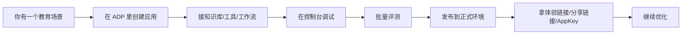

### 1.3 本节主要依据

- 《产品概述》｜最近更新时间：2025-12-19 14:12:42  
  https://cloud.tencent.com/document/product/1759/104193
- 《平台架构》｜最近更新时间：2025-12-31 17:07:32  
  https://cloud.tencent.com/document/product/1759/104194
- 《使用流程》｜最近更新时间：2025-12-15 09:38:21  
  https://cloud.tencent.com/document/product/1759/126433

---

## 2. 三种模式怎么选

### 2.1 三种模式对比图

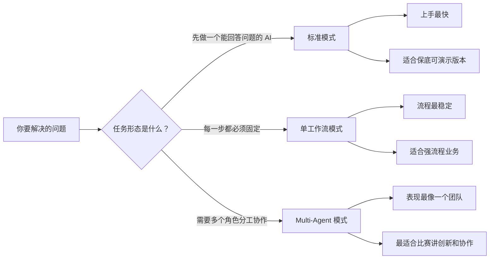

### 2.2 三种模式对比表

| 模式 | 你可以把它想成什么 | 优点 | 缺点 | 最适合什么 |
| --- | --- | --- | --- | --- |
| `标准模式` | 1 个 AI 老师 | 最容易上手，最适合先做出版本 | 对复杂分工的表达没那么强 | 知识问答、答疑、轻量教学助手 |
| `单工作流模式` | 固定脚本老师 | 稳定、可控、流程一致 | 灵活性差 | 审批式、流程式、固定业务任务 |
| `Multi-Agent 模式` | AI 教研组 | 可以拆成主控、讲解、测评、复盘等角色 | 配置和调试门槛更高 | 复杂教育任务、比赛展示、团队协作型智能体 |

### 2.3 新手怎么选最不容易走弯路

| 你的目标 | 最推荐路线 |
| --- | --- |
| 先做一个稳妥能演示的版本 | `标准模式` |
| 要冲比赛亮点，强调“分工协作 + 教学闭环” | `Multi-Agent 模式` |
| 你的任务完全像固定表单流程 | `单工作流模式` |

### 2.4 为什么本文还是选 `Multi-Agent`

因为你的比赛题不是“普通问答机器人”，而是“AI 教师智能体”。  
AI 教师天然就适合拆成多个角色协作，例如：

- 一个负责判断学生卡在哪。
- 一个负责讲知识点。
- 一个负责出题和判题。
- 一个负责总结错因和给复习计划。

这正是 `Multi-Agent` 最容易讲出价值的地方。

### 2.5 本节主要依据

- 《产品概述》｜最近更新时间：2025-12-19 14:12:42  
  https://cloud.tencent.com/document/product/1759/104193
- 《新建应用》｜最近更新时间：2025-11-05 11:22:32  
  https://cloud.tencent.com/document/product/1759/122982
- 《什么是 Multi-Agent？》｜最近更新时间：2025-12-08 17:50:52  
  https://cloud.tencent.com/document/product/1759/118325

---

## 3. 为什么这篇教程选 `Multi-Agent + 工作流编排`

### 3.1 先讲结论

本文不走“自由转交”主线，而走 `工作流编排` 主线，原因很简单：

- 比赛更看重可演示、可控、可复现。
- 新手最怕“这次能跑、下次跑偏”。
- 工作流编排更适合把“诊断 -> 讲解 -> 练习 -> 测评 -> 复盘”固定成稳定教学链路。

### 3.2 这条路线的真实含义

它不是说“AI 完全没有自主性”，而是说：

- Agent 自己仍然可以用提示词、工具、知识库做思考和处理。
- 但谁先执行、谁后执行、什么时候进入下一步，由工作流来管。

这就像：

- `自由转交` 更像老师们开会时临场接话。
- `工作流编排` 更像先定好上课流程表，再让每个老师在自己的环节发挥。

### 3.3 两条路的区别图

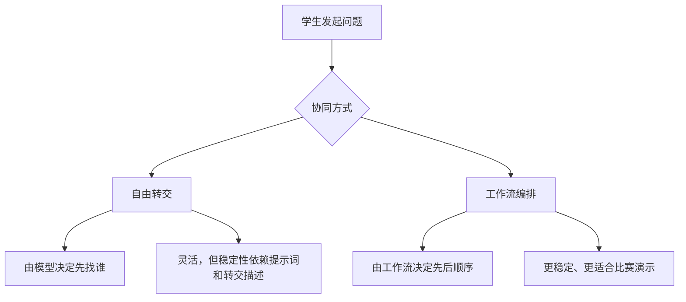

### 3.4 这一点非常重要

根据腾讯云较新的官方文档：

- 《工作流编排》（2026-01-22）明确写了：创建 `Multi-Agent` 应用后，可以把协同方式切到 `工作流编排`，并选择唯一工作流响应用户所有对话。
- 《Agent 节点》（2026-02-12）明确写了：工作流里可以引用本应用内已经配置好的 Agent。

所以，本文的实现基线是：

`先在 Multi-Agent 应用里把 Agent 配好，再在工作流里用 Agent 节点把它们串起来。`

### 3.5 本节主要依据

- 《什么是 Multi-Agent？》｜最近更新时间：2025-12-08 17:50:52  
  https://cloud.tencent.com/document/product/1759/118325
- 《工作流编排》｜最近更新时间：2026-01-22 09:48:21  
  https://cloud.tencent.com/document/product/1759/122556
- 《Agent 节点》｜最近更新时间：2026-02-12 10:37:21  
  https://cloud.tencent.com/document/product/1759/122554

---

## 4. AI 教师比赛版总览

### 4.1 官方 7 步生命周期

这是腾讯云官方《使用流程》给出的主闭环，可以直接当成你比赛搭建的大框架：

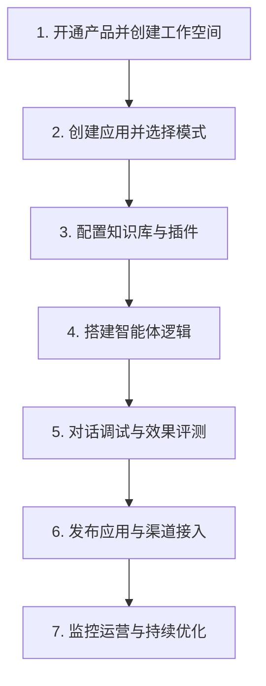

### 4.2 你的 AI 教师比赛闭环

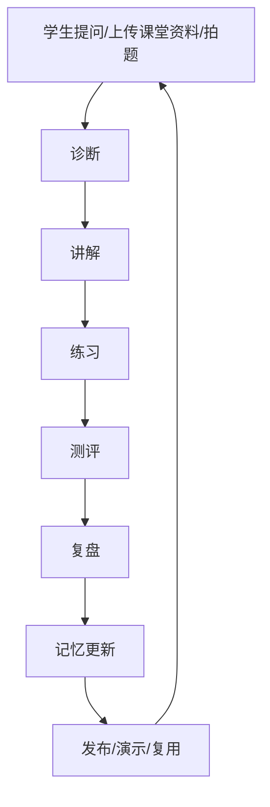

### 4.3 Multi-Agent 团队分工图

这里我把你的比赛版 AI 教师固定成 `1 个主控 + 4 个教学子 Agent`。

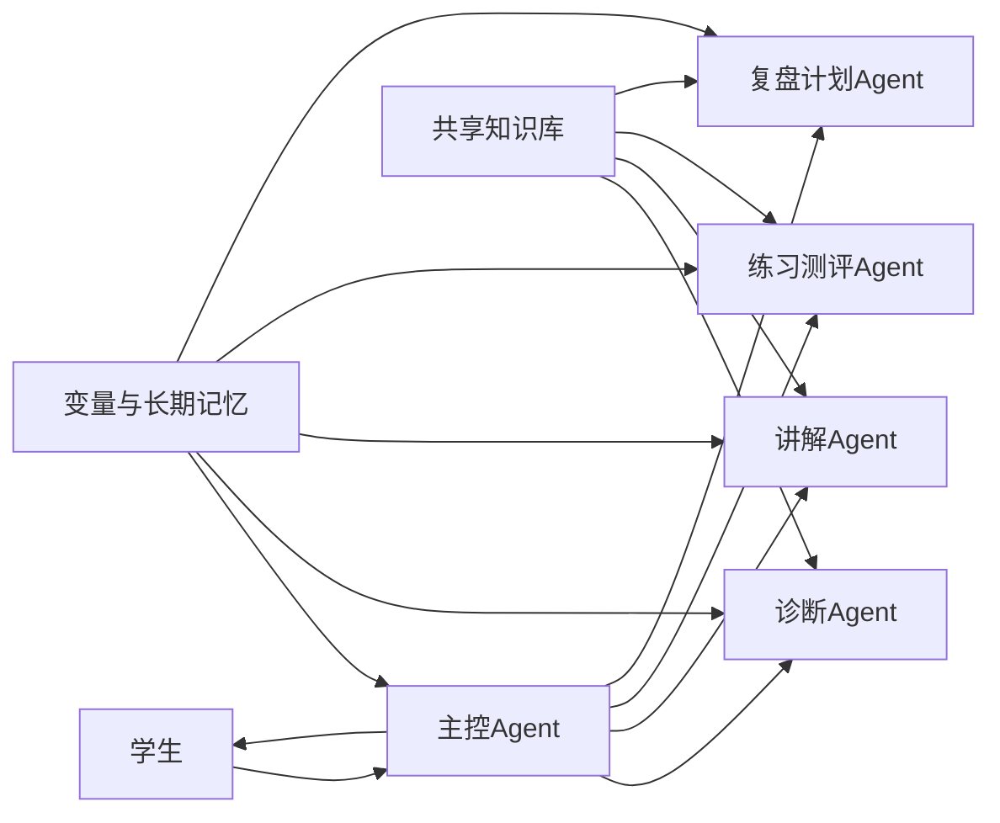

### 4.4 每个 Agent 干什么

| Agent | 角色定位 | 主要输入 | 主要输出 | 是否直接面向学生 |
| --- | --- | --- | --- | --- |
| `主控Agent` | 总调度员 | 学生问题、历史上下文、变量、长期记忆 | 汇总结果、决定下一步走向 | 是 |
| `诊断Agent` | 学情判断员 | 学生问题、当前课程标签、上下文 | 学生当前水平、卡点、建议路径 | 否 |
| `讲解Agent` | 知识讲解员 | 诊断结果、课程知识库、知识检索结果 | 分层讲解、步骤说明、例子 | 否 |
| `练习测评Agent` | 出题判题员 | 讲解结果、题库、学生回答 | 练习题、评分、达标情况 | 否 |
| `复盘计划Agent` | 复习规划员 | 错题、评分、记忆、课程标签 | 错因归纳、下次学习计划、记忆总结 | 否 |

> 本文固定约束  
> 1. `知识库` 是共享底座，不单独做成子 Agent。  
> 2. `教师运营` 是扩展能力，不单独做成主线 Agent。  
> 3. 第一版先把学生侧闭环跑通，再把教师看板和运营分析放进答辩扩展。  

### 4.5 工作流编排图

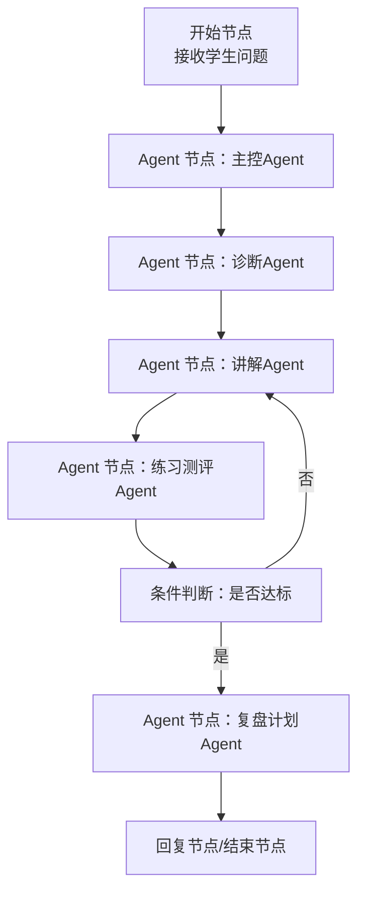

### 4.6 知识库与变量流转图

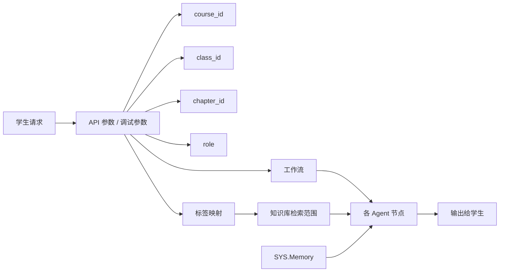

### 4.7 RAG 到底是什么，用人话解释

很多新手一听 `RAG` 就紧张。你把它理解成：

`先翻资料，再回答。`

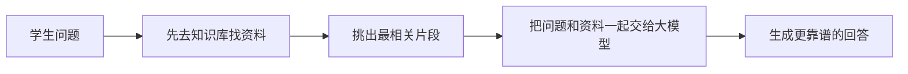

### 4.8 本节主要依据

- 《使用流程》｜最近更新时间：2025-12-15 09:38:21  
  https://cloud.tencent.com/document/product/1759/126433
- 《什么是 Multi-Agent？》｜最近更新时间：2025-12-08 17:50:52  
  https://cloud.tencent.com/document/product/1759/118325
- 《工作流编排》｜最近更新时间：2026-01-22 09:48:21  
  https://cloud.tencent.com/document/product/1759/122556
- 《Agent 节点》｜最近更新时间：2026-02-12 10:37:21  
  https://cloud.tencent.com/document/product/1759/122554

---

## 5. 开始前准备

### 5.1 平台前置条件

| 你要准备什么 | 为什么要先准备 | 备注 |
| --- | --- | --- |
| 腾讯云账号 | 没账号进不了平台 | 官方要求 |
| 实名认证 | 不实名认证，很多能力开不了 | 官方快速开始前置条件 |
| 主账号或已授权子账号 | 需要有企业和工作空间权限 | 子账号需要被拉进工作空间 |
| 1 个工作空间 | 你的应用、知识库、插件都放这里 | 小团队先用默认工作空间就够 |

### 5.2 比赛资料清单

| 资料类型 | 你至少准备什么 | 用来干什么 |
| --- | --- | --- |
| 课堂资料 | 1 份 PPT + 1 份讲义 PDF | 建知识库 |
| 题目素材 | 1 道拍题图片 + 1 组题库 | 练习和测评 |
| 学生案例 | 1 个学生画像 + 1 段错题记录 | 做诊断和复盘 |
| 演示素材 | 1 段课堂摘要 + 1 次完整提问 | 现场演示 |

### 5.3 新手最稳的演示范围

第一次不要贪大。最推荐你只做：

- 1 门课
- 1 个章节
- 1 类学生
- 1 条端到端链路

例如：

`高等数学 -> 极限 -> 基础薄弱学生 -> 拍题答疑 -> 讲解 -> 出 2 题 -> 判题 -> 复盘`

### 5.4 推荐命名规范

| 对象 | 推荐命名 |
| --- | --- |
| 应用名 | `AI教师-高数极限伴学` |
| 主控 Agent | `TeacherOrchestrator` |
| 诊断 Agent | `DiagnosisAgent` |
| 讲解 Agent | `ExplanationAgent` |
| 练习测评 Agent | `PracticeEvalAgent` |
| 复盘计划 Agent | `ReviewPlanAgent` |
| API 参数 | `API.CourseId`、`API.ClassId`、`API.ChapterId`、`API.Role` |
| 应用变量 | `APP.Diagnosis`、`APP.Explanation`、`APP.Score`、`APP.ReviewPlan` |

### 5.5 本节主要依据

- 《平台架构》｜最近更新时间：2025-12-31 17:07:32  
  https://cloud.tencent.com/document/product/1759/104194
- 《使用流程》｜最近更新时间：2025-12-15 09:38:21  
  https://cloud.tencent.com/document/product/1759/126433
- 《基于“Multi-Agent 模式”创建“脱口秀素材创作助手”》｜最近更新时间：2025-12-03 11:21:21  
  https://cloud.tencent.com/document/product/1759/122573

---

## 6. 从 0 到 1 实操主线

这一章是全文最重要的部分。  
每个步骤都固定用同一个 5 段式格式：

- `你现在在做什么`
- `为什么做`
- `控制台点哪里`
- `做完应看到什么`
- `常见坑`

### 步骤 1：开通产品并进入工作空间

- 你现在在做什么：完成账号实名认证，首次进入 ADP，确认自己已经在正确的工作空间里。
- 为什么做：ADP 采用“企业 -> 工作空间 -> 应用”的层级结构。你后面所有应用、知识库、插件都要挂在工作空间里。
- 控制台点哪里：进入腾讯云 ADP 控制台，首次进入时让系统自动创建默认工作空间；如果你是团队协作，就让主账号把你加到对应工作空间。
- 做完应看到什么：你能看到 1 个默认工作空间，或者已经被加入目标项目空间。
- 常见坑：子账号经常不是“进不去平台”，而是“进得去但没有工作空间权限”；这时不是继续乱点，而是让主账号分配权限。

### 步骤 2：新建 Multi-Agent 应用

- 你现在在做什么：创建一个新的智能体应用，并明确选择 `Multi-Agent 模式`。
- 为什么做：如果你一开始选错模式，后面整条教程都会不顺。
- 控制台点哪里：`应用开发 -> 新建应用 -> 填写名称和简介 -> 选择 Multi-Agent 模式 -> 新建`。
- 做完应看到什么：进入应用设置页，页面已经是 Multi-Agent 相关配置界面。
- 常见坑：很多新手以为“先用标准模式搭完再改成 Multi-Agent”更省事；不建议这样做。你这篇文档的主线就是 Multi-Agent，直接按主线起应用更清晰。

### 步骤 3：先把应用级基础配置补齐

- 你现在在做什么：先把应用名、简介、欢迎语、模型、语气这些“外壳”补齐。
- 为什么做：这一步看起来不“炫技”，但它决定了你后面调试时是否容易看懂问题，比赛时第一页展示是否像个正式产品。
- 控制台点哪里：`应用设置 -> 编辑应用`、`模型设置`、`角色指令`、`欢迎语`。
- 做完应看到什么：应用首页已经像一个“AI 教师产品”，不是默认空壳。
- 常见坑：官方在《应用设置概述》里明确提醒，新建应用时 ADP 展示的默认推荐模型是经过大量场景验证的最佳实践模型，新手不建议一开始就乱改默认模型。

### 步骤 4：配置主控 Agent

- 你现在在做什么：创建 `主控Agent`，让它负责总调度和最终汇总。
- 为什么做：没有主控 Agent，整个教学团队就像没有班主任，大家会各做各的。
- 控制台点哪里：在 Multi-Agent 应用内新建 Agent，填写名称、描述、提示词、模型和必要工具。
- 做完应看到什么：你能在 Agent 列表里看到 1 个“总调度”角色，它可以理解学生问题，并决定下一步交给哪一类 Agent。
- 常见坑：主控 Agent 不要写得太像“百科全书”。它的核心职责不是自己把所有事情都做完，而是“决定该让谁做什么，再把结果收束成学生看得懂的话”。

### 步骤 5：配置 4 个教学子 Agent

- 你现在在做什么：把 `诊断`、`讲解`、`练习测评`、`复盘计划` 4 个角色建出来。
- 为什么做：这一步决定你的比赛作品是否真正有“分工协作”的味道。
- 控制台点哪里：在 Multi-Agent 应用中继续新建 Agent，分别填写各自的名称、转交描述、提示词和工具。
- 做完应看到什么：应用内至少有 5 个 Agent：1 个主控 + 4 个教学子 Agent。
- 常见坑：不要把“知识库”也单独做成一个 Agent。本文固定把知识库作为共享能力接入，让所有教学 Agent 共同读取。

#### 5.1 本文推荐的 Agent 分工模板

| Agent | 你可以怎么写它的转交描述 | 你要它重点做什么 |
| --- | --- | --- |
| `TeacherOrchestrator` | 当需要判断教学路径、汇总结果、对学生输出最终回复时交给我 | 做总调度和收口 |
| `DiagnosisAgent` | 当需要判断学生薄弱点、题目难度、学习阶段时交给我 | 做学习诊断 |
| `ExplanationAgent` | 当需要讲知识点、拆步骤、举例子时交给我 | 做分层讲解 |
| `PracticeEvalAgent` | 当需要出题、判题、判断是否达标时交给我 | 做练习与测评 |
| `ReviewPlanAgent` | 当需要总结错因、给复习建议、更新学习计划时交给我 | 做复盘与计划 |

#### 5.2 你可以直接套用的提示词写法思路

| Agent | 提示词重点 |
| --- | --- |
| 主控Agent | 先识别任务类型，再决定调用哪个 Agent，最后把结果汇总成学生看得懂的教学回复 |
| 诊断Agent | 优先判断“不会的是概念、步骤还是计算”，输出难度与建议路径 |
| 讲解Agent | 用“定义 -> 直觉 -> 步骤 -> 例子 -> 易错点”的结构讲解 |
| 练习测评Agent | 基于讲解内容出 1 到 3 道题，难度逐步递进，并给出评分和达标判断 |
| 复盘计划Agent | 把错误分类成“概念不清 / 步骤遗漏 / 计算错误 / 审题错误”，输出下一轮学习计划 |

### 步骤 6：导入共享知识库

- 你现在在做什么：把课程 PPT、讲义、题库等导入知识库，让各个 Agent 有“教材可查”。
- 为什么做：没有知识库，AI 很容易变成“泛泛而谈的老师”；有知识库，才更像“这门课的老师”。
- 控制台点哪里：`知识管理 / 知识库 -> 导入文档`，上传 PDF、DOCX、PPT、TXT 等课程资料；按需要使用默认知识库或共享知识库。
- 做完应看到什么：文档完成导入与解析，应用可以基于这些课程资料进行检索与问答。
- 常见坑：官方《文档概述》明确提醒，应用评测进行时，知识库内容不能修改。所以别一边跑评测一边删文档，不然你会以为平台坏了。

### 步骤 7：把协同方式切到 `工作流编排`

- 你现在在做什么：从 Multi-Agent 的协同方式里选择 `工作流编排`。
- 为什么做：这样任务顺序就不再完全依赖模型临场发挥，而是由你设计的教学流程来控制。
- 控制台点哪里：在 Multi-Agent 应用中找到 `Agent 协同方式`，切换为 `工作流编排`。
- 做完应看到什么：应用开始以“唯一工作流”响应所有用户对话。
- 常见坑：官方《工作流编排》明确写了，选择 `工作流编排` 后，当前应用只支持选择 `一个` 工作流作为运行工作流。所以不要以为你能同时挂很多主流程。

### 步骤 8：新建工作流，并用 Agent 节点把 5 个 Agent 串起来

- 你现在在做什么：进入工作流画布，把前面建好的 Agent 作为节点放进流程。
- 为什么做：这一步才是真正把“AI 团队”变成“能执行的教学闭环”。
- 控制台点哪里：`应用设置 -> 选择工作流 / 工作流管理 -> 新建工作流 -> 在画布中添加 Agent 节点 -> 分别引用前面建好的 Agent`。
- 做完应看到什么：你能在工作流里看到主控、诊断、讲解、练习测评、复盘计划这些节点，并把它们连接起来。
- 常见坑：官方《Agent 节点》明确写了，工作流里只能“引用” Agent，不能直接在工作流内部修改 Agent 的名称、描述、提示词和插件。要改 Agent，请回到应用设置里改。

### 步骤 9：给工作流补上条件判断和异常兜底

- 你现在在做什么：在工作流中补上“是否达标”的分支、超时重试、异常输出等兜底设计。
- 为什么做：真正比赛演示时，最怕的不是模型回答得一般，而是流程中断。
- 控制台点哪里：在工作流中增加条件判断节点、回复节点、结束节点，并为关键 Agent 节点开启异常处理。
- 做完应看到什么：学生答得不好时可以回到讲解或再练；节点超时或失败时不会整条链路直接崩掉。
- 常见坑：如果你把所有节点都串成“只许成功不许失败”的单一路径，一旦某个节点超时，现场演示会非常危险。官方 `Agent 节点` 支持超时触发处理、重试和异常处理方式，建议开。

### 步骤 10：配置变量、长期记忆和知识检索边界

- 你现在在做什么：配置 `API.*`、`APP.*`、`ENV.*` 和 `SYS.Memory` 的使用方式，并把 `custom_variables` 和知识标签对应起来。
- 为什么做：这一步决定你的应用能不能做到“同一个人连续学习”和“不同课程不串知识”。
- 控制台点哪里：`应用设置 -> 变量与记忆` 开启长期记忆；`知识库设置 -> 知识检索相关设置` 配置 API 参数与标签映射。
- 做完应看到什么：你能看到应用级变量、长期记忆开关，以及知识检索范围映射配置。
- 常见坑：如果你不传 `visitor_biz_id`，长期记忆就无法正常按用户连续命中；如果你不做 `custom_variables -> 标签` 映射，不同课程或章节的知识可能会串在一起；另外腾讯云官方明确写了，`未打标签的知识` 也可能被检索到，所以要做强隔离时，别把无关资料留成“未打标签”状态。

#### 10.1 这一步你最该配的变量

| 变量类型 | 推荐变量 | 用途 |
| --- | --- | --- |
| `API.*` | `API.CourseId` | 课程隔离 |
| `API.*` | `API.ClassId` | 班级隔离 |
| `API.*` | `API.ChapterId` | 章节隔离 |
| `API.*` | `API.Role` | 区分学生/教师 |
| `APP.*` | `APP.Diagnosis` | 存诊断结果 |
| `APP.*` | `APP.Explanation` | 存讲解摘要 |
| `APP.*` | `APP.Score` | 存测评分数 |
| `APP.*` | `APP.ReviewPlan` | 存复盘计划 |
| `ENV.*` | `ENV.SomeSecret` | 存密钥等敏感信息 |
| `SYS.Memory` | 系统自动生成 | 存长期记忆内容 |

#### 10.2 长期记忆要点

| 记忆点 | 你要知道什么 |
| --- | --- |
| 唯一性 | 长期记忆由“终端用户 + 应用”共同决定 |
| 存储位置 | 持久化存到 `SYS.Memory` |
| 使用前提 | 调用接口时必须传 `visitor_biz_id` |
| 在工作流/Agent 中 | 只能读，不能直接改 |
| 时效 | 控制台可配，官方文档写的是 `1~999 天`，默认 `30 天` |

### 步骤 11：先做单 Agent 调试，再做全局调试

- 你现在在做什么：先单独调每个 Agent，再调整条教学流程。
- 为什么做：这是官方 `工作流编排` 文档明确推荐的顺序，能大幅降低排错难度。
- 控制台点哪里：先在应用设置对话界面切到 `单 Agent 调试`；各 Agent 调好后，再去工作流右上角调试；最后切回 `全局调试` 验证整个 Multi-Agent 应用。
- 做完应看到什么：每个 Agent 单独看起来都合理，整条闭环也能跑通。
- 常见坑：新手最容易犯的错，是 5 个 Agent 一个都没调好，就直接开始调总流程。这样一旦输出不好，你根本不知道问题是出在诊断、讲解、题目还是复盘。

### 步骤 12：利用调试窗口测试多模态能力

- 你现在在做什么：在调试窗口里测试图片、文件、语音等多模态输入。
- 为什么做：你的比赛题和课堂资料、拍题、音频密切相关，不能只测文本。
- 控制台点哪里：在右侧 `对话调试窗口` 中上传图片、文档，必要时开启语音和形象。
- 做完应看到什么：Multi-Agent 应用可以处理拍题图、课堂文件等输入；如果 Agent 配了对应能力，也能处理更多文件。
- 常见坑：官方《对话调试窗口说明》明确写了，“支持上传”不等于“Agent 一定会处理”；如果没有给 Agent 配对应工具或能力，上传了也不代表能理解。

### 步骤 13：建立最小评测集并跑评测

- 你现在在做什么：把最关键的比赛场景做成评测集，然后跑基准评测或对比评测。
- 为什么做：比赛答辩时，你不能只说“我感觉它挺好用”，你最好能说“我批量测过”。
- 控制台点哪里：`应用评测 -> 上传评测集 -> 新建评测任务`。
- 做完应看到什么：你能看到评测集和评测任务，至少跑出一轮基准评测结果。
- 常见坑：如果你只靠手工测试，很难发现“有些问题答得好，有些问题答偏了”；评测的意义就是批量找短板。

#### 13.1 新手最小评测集建议

| 场景 | 测什么 |
| --- | --- |
| 课堂资料问答 | 能否从课程资料中命中正确知识点 |
| 拍题讲解 | 能否识别题目并按步骤讲解 |
| 练习判题 | 能否根据学生答案给合理评分 |
| 复盘输出 | 能否生成错因分类与学习建议 |
| 记忆连续 | 同一用户第二轮对话是否能命中长期记忆 |
| 检索隔离 | 切换不同课程参数后是否不会串知识 |

### 步骤 14：发布应用并拿到体验链接、分享链接和 AppKey

- 你现在在做什么：把测试环境里的应用配置、知识库和设置一次性发布到正式环境。
- 为什么做：不发布，你就只有控制台里的“开发态”；发布后才有对外体验入口和接口接入信息。
- 控制台点哪里：`应用发布 -> 待发布 -> 发布 -> 服务状态`。
- 做完应看到什么：你能看到 `体验链接`、`分享链接/二维码` 和 `API 管理` 里的 `AppKey`。
- 常见坑：很多人以为“控制台里能聊就算上线了”，这不对。腾讯云官方把“测试环境”和“正式环境”分开管理；你必须发布后，发布渠道和服务状态才真正生效。

### 步骤 15：决定你的比赛现场怎么演示

- 你现在在做什么：选择你现场是走“网页体验链接演示”，还是“分享链接演示”，还是“展示 AppKey 接口接入能力”。
- 为什么做：演示形式不同，现场节奏完全不同。
- 控制台点哪里：`应用发布 -> 服务状态` 看 `立即体验`、`分享链接` 和 `API 管理`；如有渠道需求，再看 `发布渠道`。
- 做完应看到什么：你已经明确比赛当天打开哪个入口、谁来登录、需不需要邮箱验证码、要不要展示 API 接入说明。
- 常见坑：如果你打算对外给评委试用，`分享链接` 通常比“让评委登录腾讯云账号”更省事；但如果是现场展示自己操作，`立即体验` 更稳。

### 6.1 调试与评测闭环图

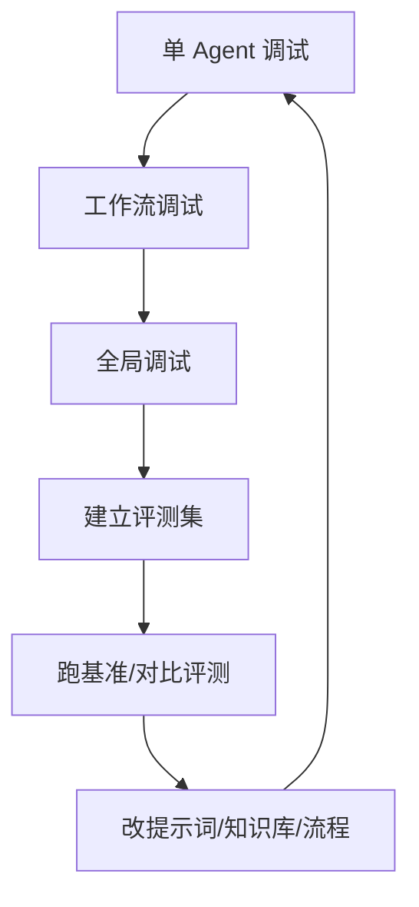

### 6.2 发布与运营入口图

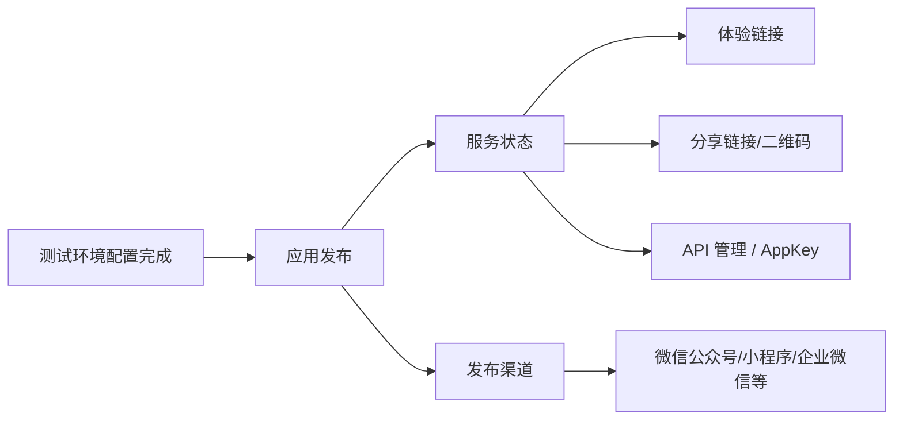

### 6.3 本章主要依据

- 《平台架构》｜最近更新时间：2025-12-31 17:07:32  
  https://cloud.tencent.com/document/product/1759/104194
- 《使用流程》｜最近更新时间：2025-12-15 09:38:21  
  https://cloud.tencent.com/document/product/1759/126433
- 《新建应用》｜最近更新时间：2025-11-05 11:22:32  
  https://cloud.tencent.com/document/product/1759/122982
- 《基于“Multi-Agent 模式”创建“脱口秀素材创作助手”》｜最近更新时间：2025-12-03 11:21:21  
  https://cloud.tencent.com/document/product/1759/122573
- 《工作流编排》｜最近更新时间：2026-01-22 09:48:21  
  https://cloud.tencent.com/document/product/1759/122556
- 《Agent 节点》｜最近更新时间：2026-02-12 10:37:21  
  https://cloud.tencent.com/document/product/1759/122554
- 《应用设置概述》｜最近更新时间：2026-01-13 11:20:12  
  https://cloud.tencent.com/document/product/1759/104206
- 《变量说明》｜最近更新时间：2025-11-18 17:21:52  
  https://cloud.tencent.com/document/product/1759/122457
- 《长期记忆说明》｜最近更新时间：2025-12-30 17:25:52  
  https://cloud.tencent.com/document/product/1759/122458
- 《文档概述》｜最近更新时间：2026-02-06 12:09:21  
  https://cloud.tencent.com/document/product/1759/112702
- 《知识检索相关设置》｜最近更新时间：2026-02-26 16:30:41  
  https://cloud.tencent.com/document/product/1759/112704
- 《对话调试窗口说明》｜最近更新时间：2025-12-04 12:09:44  
  https://cloud.tencent.com/document/product/1759/122607
- 《应用评测》｜最近更新时间：2026-01-20 14:12:41  
  https://cloud.tencent.com/document/product/1759/104208
- 《应用发布概述》｜最近更新时间：2025-12-17 17:53:01  
  https://cloud.tencent.com/document/product/1759/104209

---

## 7. 专业术语白话词典

### 7.1 一张图先看懂“变量家族”

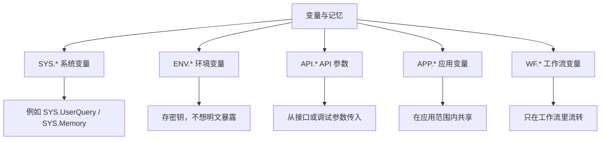

### 7.2 白话解释表

| 术语 | 通俗解释 | 你在这个项目里怎么用 |
| --- | --- | --- |
| `Agent` | 一个有分工的 AI 角色 | 比如诊断老师、讲解老师、判题老师 |
| `Multi-Agent` | 多个 AI 角色合作 | 用来做 AI 教师团队 |
| `工作流编排` | 先把流程顺序定好 | 让教学链路稳定、可控 |
| `Agent 节点` | 工作流里的“调用某个 Agent”按钮 | 把前面建好的 Agent 串起来 |
| `RAG` | 先查资料再回答 | 让 AI 依据课程资料讲课 |
| `知识库` | AI 的教材和资料库 | 存 PPT、讲义、题库、FAQ |
| `AppKey` | 应用调用密钥 | 发布后给网页或系统接入用 |
| `visitor_biz_id` | 终端用户唯一 ID | 用来区分“这是哪个学生” |
| `custom_variables` | 运行时传入的自定义参数 | 用来传课程、班级、章节等边界 |
| `SYS.Memory` | 系统维护的长期记忆 | 记住学生画像、薄弱点、偏好 |
| `API.*` | 通过接口传进来的变量 | 如 `API.CourseId` |
| `APP.*` | 应用内部共享变量 | 如 `APP.Score`、`APP.ReviewPlan` |
| `ENV.*` | 加密环境变量 | 存敏感密钥 |

### 7.3 你最需要懂的 4 个术语

#### `RAG`

不是“模型自己想出来”，而是“模型先去知识库找资料，再结合资料回答”。

#### `AppKey`

不是产品名字，也不是账号密码。  
它更像“这个应用对外开放接口时的调用钥匙”。

#### `visitor_biz_id`

你可以把它理解成：

`这是哪个学生的学号/唯一编号。`

如果没有它，平台就很难稳定判断“这是同一个学生的连续学习”。

#### `custom_variables`

你可以把它理解成：

`这次对话随身带进来的小纸条。`

比如这张小纸条上写着：

- 这是高数课
- 这是极限章节
- 这个人是学生

那 AI 就更容易只在对应课程范围里讲，不会乱串。

### 7.4 本节主要依据

- 《变量说明》｜最近更新时间：2025-11-18 17:21:52  
  https://cloud.tencent.com/document/product/1759/122457
- 《长期记忆说明》｜最近更新时间：2025-12-30 17:25:52  
  https://cloud.tencent.com/document/product/1759/122458
- 《知识检索相关设置》｜最近更新时间：2026-02-26 16:30:41  
  https://cloud.tencent.com/document/product/1759/112704
- 《对话端接口文档（HTTP SSE）》｜最近更新时间：2026-03-23 17:08:21  
  https://cloud.tencent.com/document/product/1759/105561

---

## 8. 比赛演示脚本、常见翻车点与保底方案

### 8.1 10 分钟比赛演示脚本

| 时间 | 你演示什么 | 评委会看到什么 |
| --- | --- | --- |
| 第 1 分钟 | 介绍问题场景 | 课堂资料碎片化，学生复习低效 |
| 第 2 分钟 | 展示应用首页 | 不是通用聊天，而是 AI 教师产品 |
| 第 3 分钟 | 上传课堂资料或展示已有知识库 | 应用绑定课程知识 |
| 第 4 分钟 | 学生拍题或上传题目 | Multi-Agent 开始处理真实问题 |
| 第 5 分钟 | 展示诊断结果 | 系统知道学生卡在哪 |
| 第 6 分钟 | 展示分层讲解 | 系统像老师一样分步骤讲 |
| 第 7 分钟 | 展示练习与测评 | 系统会出题、判题、判断是否达标 |
| 第 8 分钟 | 展示复盘计划 | 系统会归纳错因并给学习建议 |
| 第 9 分钟 | 展示长期记忆或课程隔离 | 第二轮提问能延续上下文，不串课 |
| 第 10 分钟 | 展示发布入口 | 已经不是 Demo，而是可发布应用 |

### 8.2 评委最容易看懂的亮点

| 亮点 | 你该怎么讲 |
| --- | --- |
| 教育闭环 | 不是只会答题，而是诊断、讲解、练习、测评、复盘一整套 |
| 多角色协作 | 不只是一个大模型，而是一个 AI 教师团队 |
| 课程知识对齐 | 回答来自课堂资料和课程知识库 |
| 记忆连续 | 同一个学生第二轮提问还能记得前情 |
| 可发布可接入 | 有体验链接、分享链接和 AppKey |

### 8.3 常见翻车点

| 翻车点 | 发生原因 | 你怎么预防 |
| --- | --- | --- |
| 现场回答飘 | 没做知识库和提示词约束 | 先用课程资料构建知识库 |
| 流程跑偏 | 只靠自由转交 | 用 `工作流编排` 固定主链路 |
| 第二轮不记得学生 | 没传 `visitor_biz_id` | 调试和接口里固定传唯一 ID |
| 不同课程串知识 | 没做 `custom_variables + 标签` | 建立课程/章节标签映射 |
| 发布后无法给别人试 | 没真正发布 | 先走 `应用发布 -> 服务状态` |
| 演示时突然超时 | 没做异常兜底 | 给关键节点开异常处理和重试 |

### 8.4 保底方案

如果你比赛前发现 `Multi-Agent + 工作流编排` 实在来不及完全磨稳，最稳的保底方式是：

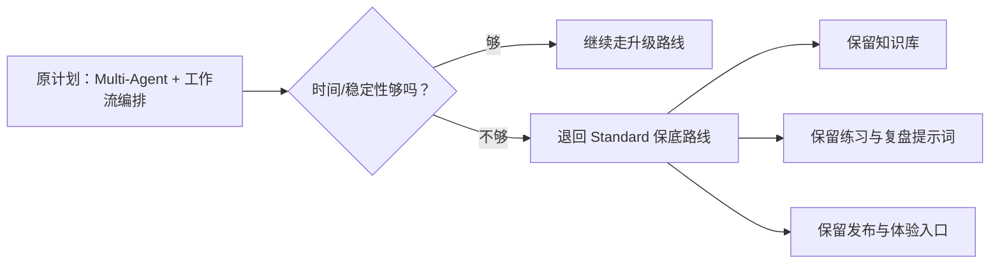

保底不是失败，而是确保你“至少有一个完整闭环能演示”。

### 8.5 本节主要依据

- 《使用流程》｜最近更新时间：2025-12-15 09:38:21  
  https://cloud.tencent.com/document/product/1759/126433
- 《应用评测》｜最近更新时间：2026-01-20 14:12:41  
  https://cloud.tencent.com/document/product/1759/104208
- 《应用发布概述》｜最近更新时间：2025-12-17 17:53:01  
  https://cloud.tencent.com/document/product/1759/104209

---

## 9. 自检与验收

### 9.1 这份文档的 6 条验收标准

| 验收项 | 通过标准 |
| --- | --- |
| 模式理解 | 0 经验读者 1 分钟内能讲清三种模式差异 |
| 建应用 | 能从工作空间一路走到“已创建 Multi-Agent 应用” |
| 团队理解 | 能理解 1 个主控 + 4 个教学子 Agent 的分工 |
| 变量理解 | 知道为什么长期记忆依赖 `visitor_biz_id`，为什么课程隔离依赖 `custom_variables` |
| 闭环理解 | 能说清“调试 -> 评测 -> 发布”的完整关系 |
| 比赛落地 | 能按文档准备出一条完整演示脚本 |

### 9.2 你自己应该做的最小测试

| 测试编号 | 测试场景 | 你希望看到什么 |
| --- | --- | --- |
| T1 | 上传课程资料后问知识点 | 能命中课程资料并给出讲解 |
| T2 | 拍一道题 | 能先诊断，再讲解 |
| T3 | 回答练习题 | 能给评分和是否达标 |
| T4 | 第二轮继续追问 | 能利用上下文和记忆继续讲 |
| T5 | 切换课程参数 | 不会串到别的课程知识 |
| T6 | 发布后打开体验链接 | 能在正式环境访问 |

---

## 10. 官方依据速查表

| 页面标题 | 最近更新时间 | 本文用它来说明什么 | 链接 |
| --- | --- | --- | --- |
| 产品概述 | 2025-12-19 14:12:42 | ADP 是什么、三种模式是什么 | https://cloud.tencent.com/document/product/1759/104193 |
| 平台架构 | 2025-12-31 17:07:32 | 企业、工作空间、应用的关系 | https://cloud.tencent.com/document/product/1759/104194 |
| 使用流程 | 2025-12-15 09:38:21 | 官方 7 步生命周期 | https://cloud.tencent.com/document/product/1759/126433 |
| 新建应用 | 2025-11-05 11:22:32 | 创建应用和模式选择 | https://cloud.tencent.com/document/product/1759/122982 |
| 基于“Multi-Agent 模式”创建“脱口秀素材创作助手” | 2025-12-03 11:21:21 | Multi-Agent 新手起步流程 | https://cloud.tencent.com/document/product/1759/122573 |
| 什么是 Multi-Agent？ | 2025-12-08 17:50:52 | Multi-Agent 概念、协同方式 | https://cloud.tencent.com/document/product/1759/118325 |
| 工作流编排 | 2026-01-22 09:48:21 | Multi-Agent 切到工作流编排的官方操作 | https://cloud.tencent.com/document/product/1759/122556 |
| Agent 节点 | 2026-02-12 10:37:21 | 在工作流中引用 Agent | https://cloud.tencent.com/document/product/1759/122554 |
| 应用设置概述 | 2026-01-13 11:20:12 | 模型、欢迎语、变量与记忆入口 | https://cloud.tencent.com/document/product/1759/104206 |
| 变量说明 | 2025-11-18 17:21:52 | `SYS.* / ENV.* / API.* / APP.* / WF.*` | https://cloud.tencent.com/document/product/1759/122457 |
| 长期记忆说明 | 2025-12-30 17:25:52 | `SYS.Memory`、`visitor_biz_id` 和长期记忆逻辑 | https://cloud.tencent.com/document/product/1759/122458 |
| 文档概述 | 2026-02-06 12:09:21 | 文档导入和知识库使用 | https://cloud.tencent.com/document/product/1759/112702 |
| 知识检索相关设置 | 2026-02-26 16:30:41 | `custom_variables` 与标签映射 | https://cloud.tencent.com/document/product/1759/112704 |
| 对话调试窗口说明 | 2025-12-04 12:09:44 | 多模态调试、调试参数、VisitorBizId | https://cloud.tencent.com/document/product/1759/122607 |
| 应用评测 | 2026-01-20 14:12:41 | 基准评测与对比评测 | https://cloud.tencent.com/document/product/1759/104208 |
| 应用发布概述 | 2025-12-17 17:53:01 | 体验链接、分享链接、AppKey、发布渠道 | https://cloud.tencent.com/document/product/1759/104209 |
| 对话接口总体概述 | 2025-08-27 15:25:02 | WebSocket 与 HTTP SSE 接入方式 | https://cloud.tencent.com/document/product/1759/109380 |
| 对话端接口文档（HTTP SSE） | 2026-03-23 17:08:21 | `visitor_biz_id`、`custom_variables`、AppKey 用法 | https://cloud.tencent.com/document/product/1759/105561 |
| 对话端接口文档V2（HTTP SSE） | 2026-03-23 17:08:21 | 新版 V2 接口字段写法 | https://cloud.tencent.com/document/product/1759/129202 |

---

## 11. 附录：API 接入入门和新旧字段对照

这部分不是正文主线。  
如果你现在只想做比赛演示，可以先略过。  
如果你后面想把应用接进网页、小程序或自己的系统，再看这一章。

### 11.1 两种常见接入方式

| 方式 | 适合什么场景 | 你怎么理解 |
| --- | --- | --- |
| `WebSocket` | 需要双向连接、实时交互更强的场景 | 更像“持续连着聊” |
| `HTTP SSE` | 前端流式展示、实现成本较低 | 更像“发一次请求，持续接收流式回复” |

### 11.2 接口接入前你必须先有的东西

| 项 | 说明 |
| --- | --- |
| 已发布应用 | 不发布没有正式环境接口信息 |
| `AppKey` | 从 `应用发布 -> 服务状态 -> API 管理` 获取 |
| 用户唯一 ID | 旧文档常写 `visitor_biz_id` |
| 课程隔离参数 | 通过 `custom_variables` 传入 |

### 11.3 新手最关心的 3 个字段

| 字段 | 作用 | 你在 AI 教师里怎么用 |
| --- | --- | --- |
| `AppKey` | 调接口时证明你在调用哪个应用 | 接网页或自研前端时必填 |
| `visitor_biz_id` | 证明“这是哪个学生” | 做长期记忆和用户隔离 |
| `custom_variables` | 对话时携带课程边界参数 | 传 `course_id/class_id/chapter_id/role` |

### 11.4 新旧字段对照表

这张表是为了帮新手看懂“为什么有的腾讯云文档写法不一样”。  
这不是平台冲突，而是文档同时存在旧版接口和新版 V2 接口。

| 旧版常见写法 | 新版 V2 常见写法 | 你怎么理解 |
| --- | --- | --- |
| `bot_app_key` | `AppKey` | 都是在说应用密钥 |
| `session_id` | `ConversationId` | 都是在说会话 ID |
| `visitor_biz_id` | `VisitorId` | 都是在说终端用户唯一 ID |
| `content` | `Contents` 里的 `text` 内容 | 新版把消息结构化了 |
| `custom_variables` | `Contents` 中 `Type=custom_variables` 的 `CustomVariables` | 新版把自定义参数也变成消息内容的一种 |

### 11.5 你在比赛阶段怎么处理最稳

- 如果你只是做控制台演示：先不用管 V2，先把控制台链路跑通。
- 如果你要补一个“后续可接入系统”的说明：正文继续用 `visitor_biz_id`、`custom_variables` 这套说法最容易讲清楚。
- 如果你真的开始写代码接最新版接口：优先看 `对话端接口文档V2（HTTP SSE）` 和 `对话端接口文档V2（WebSocket）`。

### 11.6 这一章主要依据

- 《对话接口总体概述》｜最近更新时间：2025-08-27 15:25:02  
  https://cloud.tencent.com/document/product/1759/109380
- 《对话端接口文档（HTTP SSE）》｜最近更新时间：2026-03-23 17:08:21  
  https://cloud.tencent.com/document/product/1759/105561
- 《对话端接口文档V2（HTTP SSE）》｜最近更新时间：2026-03-23 17:08:21  
  https://cloud.tencent.com/document/product/1759/129202

---

## 最后一句给新手

如果你现在还是觉得信息很多，不要慌。  
你真正要做的只有三件事：

1. 先把 `Multi-Agent` 应用建起来。  
2. 再把 `诊断 -> 讲解 -> 练习 -> 测评 -> 复盘` 工作流串起来。  
3. 最后把 `知识库 + 长期记忆 + 发布链接` 补齐。  

做到这三件事，你的 AI 教师比赛版闭环就已经成型了。
